# IT3212 Assignment 1: Data Preprocessing

---

## Table of Contents

1. [Data Exploration](#1-data-exploration)

   - [a. Explore the dataset](#a-explore-the-dataset-by-displaying-the-first-few-rows-summary-statistics-and-data-types-of-each-column)
   - [b. Identify missing values, outliers, and unique values](#b-identify-missing-values-outliers-and-unique-values-in-categorical-columns)

2. [Data Cleaning](#2-data-cleaning)

   - [a. Handling Missing Values](#a-handling-missing-values)
   - [b. Methods to Handle Missing Values](#b-choose-appropriate-methods-to-handle-missing-values-eg-meanmedian-imputation-for-numerical-data-mode-imputation-for-categorical-data-or-deletion-of-rowscolumns)
   - [c. Justification for Handling Missing Data](#c-justify-your-choices-for-handling-missing-data)

3. [Handling Outliers](#3-handling-outliers)

   - [a. Detecting Outliers](#a-detect-outliers-using-methods-such-as-the-iqr-method-or-z-score)
   - [b. Outlier Treatment and Justification](#b-decide-whether-to-remove-cap-or-transform-the-outliers-justify-your-decisions)

4. [Data Transformation](#4-data-transformation)

   - [a. Encoding Categorical Data](#a-encoding-categorical-data)
     - [i. Apply encoding](#i-apply-label-encoding-or-one-hot-encoding-to-transform-categorical-data-into-numerical-form)
     - [ii. Justification of encoding method](#ii-justify-your-choice-of-encoding-method)
   - [b. Feature Scaling](#b-feature-scaling)
     - [i. Apply scaling technique](#i-apply-feature-scaling-techniques-such-as-normalization-min-max-scaling-or-standardization-z-score-normalization-to-the-dataset)
     - [ii. Importance of scaling](#ii-explain-why-feature-scaling-is-necessary-and-how-it-impacts-the-model)

5. [Data Splitting](#5-data-splitting)

   - [a. Split into training/testing sets](#a-split-the-preprocessed-dataset-into-training-and-testing-sets-typically-an-80-20-or-70-30-split-is-used)
   - [b. Importance of data splitting](#b-explain-the-importance-of-splitting-the-data-and-how-it-prevents-overfitting)

6. [Dimensionality Reduction](#6-apply-dimensionality-reduction-techniques-such-as-principal-component-analysis-pca-and-discuss-how-it-affects-the-dataset)

---

## 1. Data Exploration

### a. Explore the dataset by displaying the first few rows, summary statistics, and data types of each column.

We have chosen the Stock market dataset. The dataset contains contains the following columns:

- `Date`: The date the stock was traded (datetime)
- `Open`: Price of the first stock that was traded on that date (float)
- `High`: Highest price of the stock was traded on that date (float)
- `Low`: Lowest price of the stock that was traded on that date (float)
- `Close`: Last price of the stock that was traded on that date (float)
- `Volume`: Number of traded stocks on that date (integer)
- `OpenInt`: Open contract, number of stocks that are still open to be traded on that date (integer)
- `Symbol`: Stock symbol, abbreviation used to identify a stock (string)

<p align="center">
  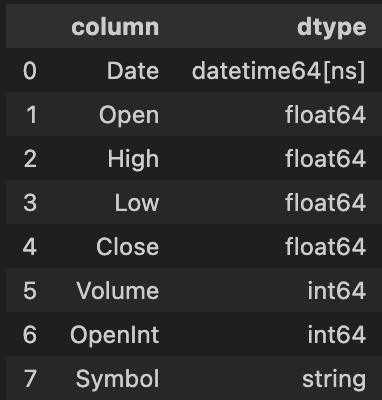<br>
  <em>Figure 1: Data types for each column</em>
</p>

<p align="center">
  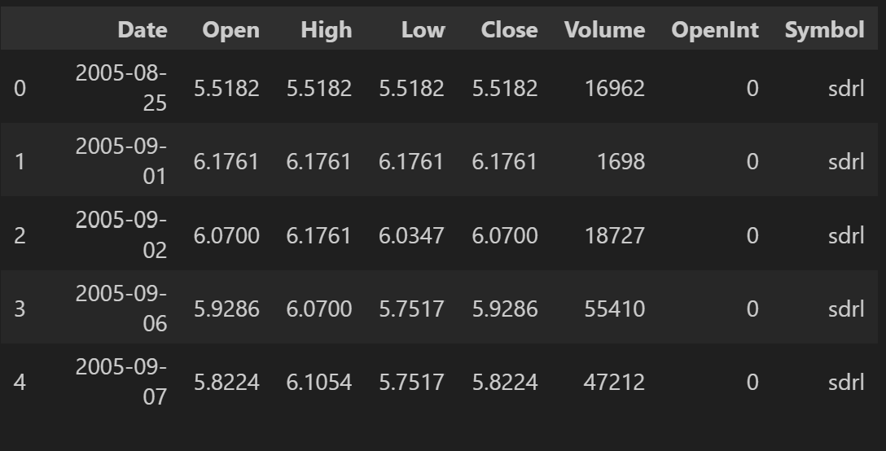<br>
  <em>Figure 2: First few rows of the dataset</em>
</p>

Below are a few figures describing some summary statistics of the dataset.

<p align="center">
  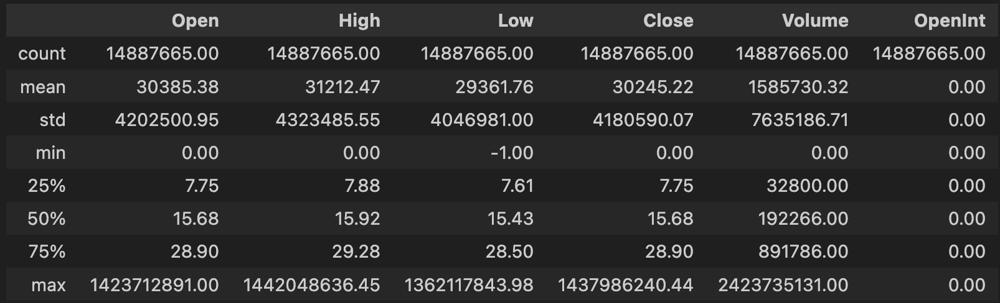<br>
  <em>Figure 3: Initial statistics of the dataset</em>
</p>

In the initial analysis, we observed that the open, high, low, and close prices of the stocks were relatively similar in terms of their mean and average values (see Figures 4–8).

<p align="center">
  <br>
  <em> Figure 4: Open price over time before forward filling with count</em>
</p>

<p align="center">
  <br>
  <em>Figure 5: High price over time before forward filling with  count</em>
</p>

<p align="center">
  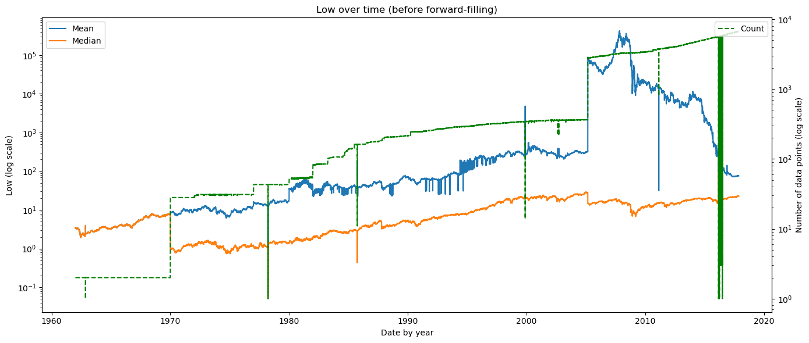<br>
  <em>Figure 6: Low price over time before forward filling with count</em>
</p>

<p align="center">
  <br>
  <em>Figure 7: Close price over time before forward filling with count</em>
</p>

<p align="center">
  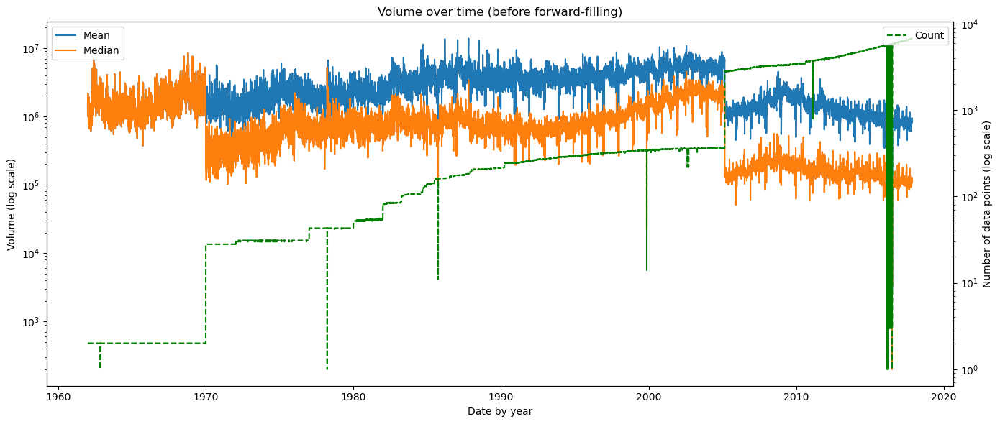<br>
  <em>Figure 8: Volume over time before forward filling with count</em>
</p>

We observe a massive increase in available stock data around 1970 and 2005 in Figure 9.\
The rise around 1970 follows the launch of NASDAQ, introducing electronic quotations, while the surge around 2005 reflects major data digitization and consolidation efforts.

<p align="center">
  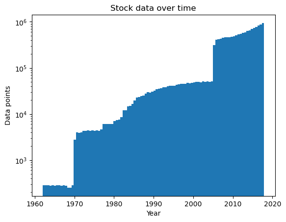<br>
  <em>Figure 9: Number of stock data over time</em>
</p>

### b. Identify missing values, outliers, and unique values in categorical columns.

We observe unusual fluctuations in the mean and median values across all price columns, correlating with changes in available stock data and missing values (see Figures 4–8).\
These anomalies will be addressed in the data cleaning process in the next section.\
In total, stock data was collected for 7,196 companies, of which 32 files were empty and therefore unusable.

Boxplots for each column (Figure 10) reveal many high outliers, though they do not fully explain their causes.\
It is also important to note that market trends vary, and sharp drops do not always indicate unrealistic prices but can reflect real economic events, such as the 2008 financial crisis observed in Figures 4–8.\
This will be further examined in the handling outliers section.

<p align="center">
  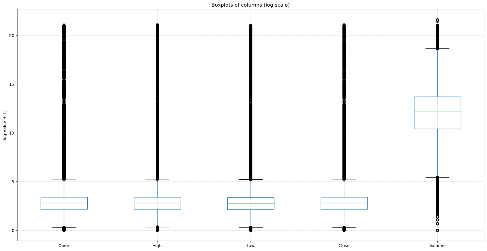<br>
  <em>Figure 10: Boxplots for each column</em>
</p>

The unique values in categorial columns are the stock symbols, i.e., the identifiers for the different companies. See figure 11.

<p align="center">
  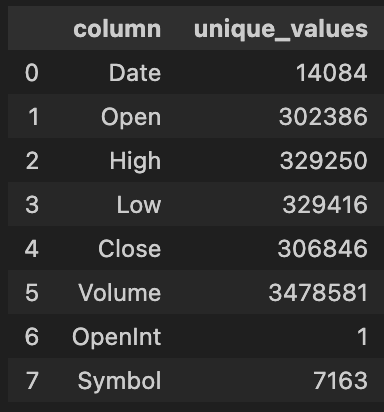<br>
  <em>Figure 11: Unique values for each column</em>
</p>

In total, stock data was collected for 7195 companies. Of these, 32 files were empty and therefore unusable.\
For the retrieved companies, the collected rows (date with given stock prices for a company) contained no missing data as shown in figure 12, but figures 4-8 suggest that there might be some missing days of stock data.\
To handle this we will use forward fill and exclude weekends and market holidays.\
Filling inn with average values would be wrong since the market could vary, so it is reasonable to fill in with the previous stock data.\
If there are missing stock data on Monday, we forward fill with data from Friday.

<p align="center">
  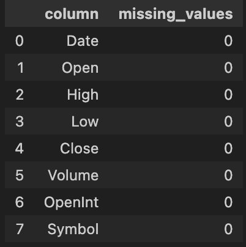<br>
  <em>Figure 12: Missing values for each column</em>
</p>

## 2. Data Cleaning

### a. Handling Missing Values

<p align="center">
  
  <br>
  <em>Figure 13a: Open price over time after forward filling  Figure 13b: Open price over time with count</em>
</p>

<p align="center">
  
  <br>
  <em>Figure 14a: High price over time after forward filling  Figure 14b: High price over time with count</em>
</p>

<p align="center">
  
  <br>
  <em>Figure 15a: Low price over time after forward filling  Figure 15b: Low price over time with count</em>
</p>

<p align="center">
  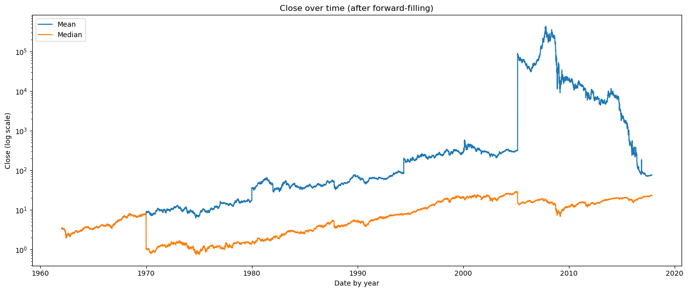
  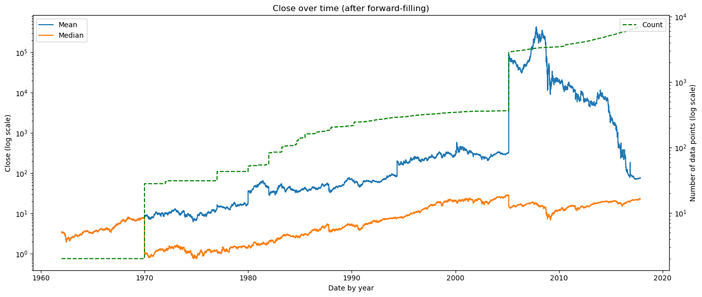<br>
  <em>Figure 16a: Close price over time after forward filling  Figure 16b: Close price over time with count</em>
</p>

<p align="center">
  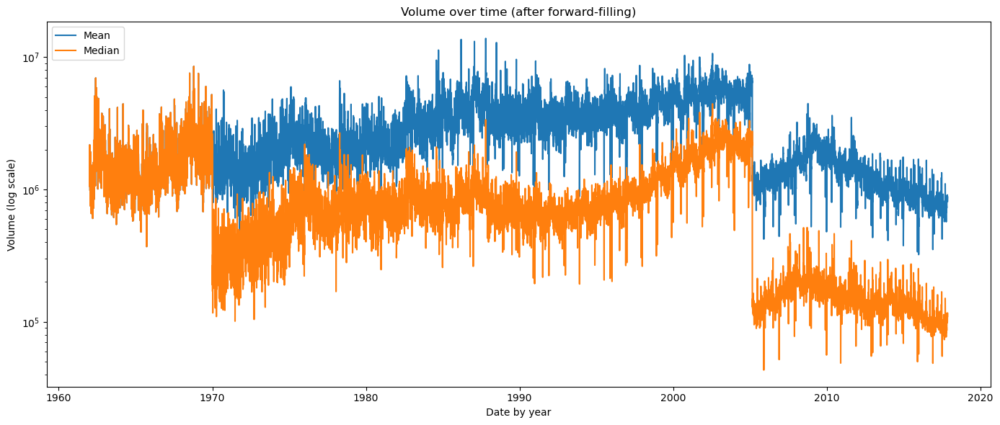
  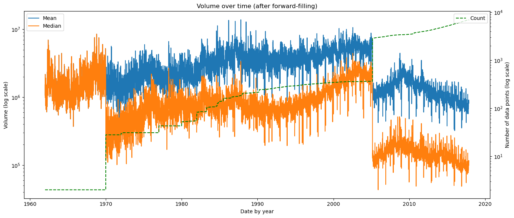<br>
  <em>Figure 17a: Volume over time after forward filling  Figure 17b: Volume over time with count</em>
</p

After handling missing values, the fluctuations seen in Figures 4–8 are resolved, leaving only the major shifts around 1970 and 2005, which correlate with the previously discussed increases in available stock data.

<p align="center">
  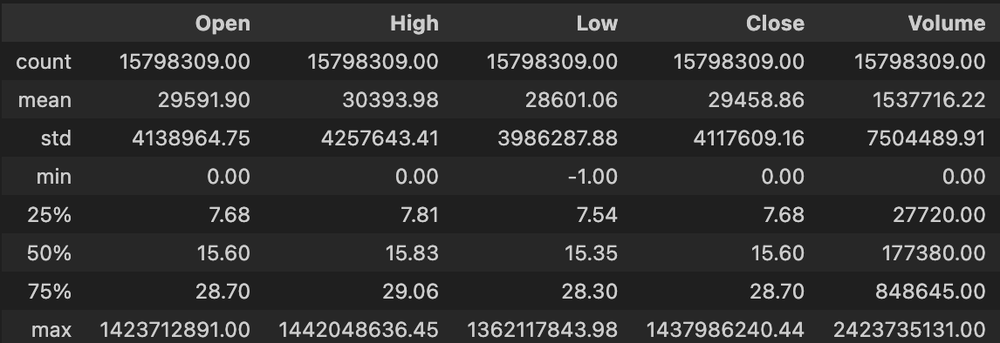<br>
  <em>Figure 17: Statistics of dataset after forward-filling.</em>
</p>

<p>
  <br>
  <em>Figure 18: Boxplots for each column after forward-filling</em>
</p>

Despite forward filling resolving the price fluctuations, outliers remain visible in Figures 17 and 18, which will be addressed in the next section.

### b. Choose appropriate methods to handle missing values (e.g., mean/median imputation for numerical data, mode imputation for categorical data, or deletion of rows/columns).

We ignore the 32 companies with empty stock data, drop the open interest column, and apply forward fill for missing values in price columns.

### c. Justify your choices for handling missing data.

The 32 companies represent a very small share of the dataset. The open interest column is excluded since it contains only zeros for all entries (see Figures 3 and 9), indicating no reported open contracts and adding no useful information for prediction while introducing unnecessary computation overhead. Forward fill is used because missing prices are most likely close to the previous trading day’s values, providing realistic continuity, while mean or median imputation would be inaccurate due to large price fluctuations over decades.

## 3. Handling Outliers

### a. Detect outliers using methods such as the IQR method or Z-score.

We have decided to use the **_IQR / minimum maximum / Z-index_** method to detect and remove outliers.

Detected outliers with boxplot which show many high outliers, but these figures dont give a lot of reason to why a data it an outlier, so this issue will be further explored in the next handlig outliers section

### b. Decide whether to remove, cap, or transform the outliers. Justify your decisions.

```py

```

## 4. Data Transformation

### a. Encoding Categorical Data

#### i. Apply label encoding or one-hot encoding to transform categorical data into numerical form.


# TODO: Add figures with statistics of dataset and first few rows after label encoding, but outliers must be handled before applying these operations to the dataset
<p align="center">
  <br>
  <em>Figure 19: Statistics of dataset after label encoding.</em>
</p>

<p align="center">
  <br>
  <em>Figure 20: First few rows of dataset after label encoding</em>
</p>

We applied label encoding to the symbol column. Since encoding starts from 0, the count in Figure 19 is 7162, despite there being 7163 unique companies.

#### ii. Justify your choice of encoding method.

With 7,162 unique companies, one-hot encoding would introduce 7,162 extra features, making the model unnecessarily complex. Label encoding is thus more suitable in this case, as it assigns each unique company a numeric value, reducing dimensionality while preserving category distinction.

### b. Feature Scaling

#### i. Apply feature scaling techniques such as normalization (Min-Max scaling) or standardization (Z-score normalization) to the dataset.

## TODO: Min-Max scaling!

#### ii. Explain why feature scaling is necessary and how it impacts the model.

Feature scaling is important because raw features often have very different ranges, and this can cause models to give more weight to features with larger values. By scaling, we ensure that all features contribute equally, which improves fairness and accuracy.

## 5. Data Splitting

### a. Split the preprocessed dataset into training and testing sets. Typically, an 80-20 or 70-30 split is used.

## TODO: Split data into training and testing sets

### b. Explain the importance of splitting the data and how it prevents overfitting.

Splitting the data allows the model to be trained on one set and evaluated on another, ensuring that performance is measured on unseen data. The training set adjusts model parameters, while the test set checks generalization. This prevents overfitting by forcing the model to learn patterns instead of memorizing the training data. A validation set is often used during training to tune hyperparameters and monitor performance.

## 6. Apply dimensionality reduction techniques such as Principal Component Analysis (PCA) and discuss how it affects the dataset.

## TODO: Apply PCA?

Applying Principal Component Analysis (PCA) to our stock dataset — which includes features such as Open, High, Low, Close, Volume, and OpenInt — helps reduce dimensionality by transforming the original correlated features into a smaller set of uncorrelated components. Since stock prices (Open, High, Low, Close) are often highly correlated, PCA captures most of their shared variance in the first few principal components.

This dimensionality reduction simplifies the dataset while retaining the majority of the information. As a result, the model becomes less complex, less prone to multicollinearity, and easier to visualize. However, interpretability decreases since the new principal components are linear combinations of the original features rather than directly meaningful attributes like “Open” or “Close” price.