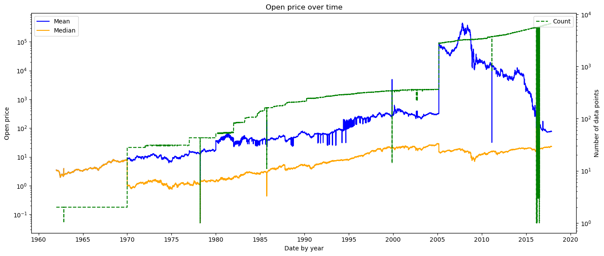
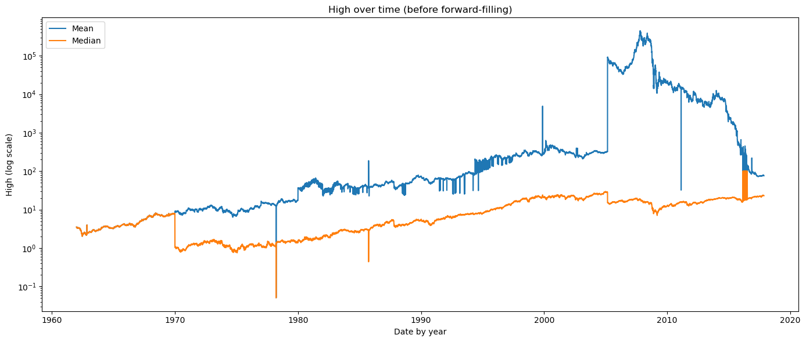
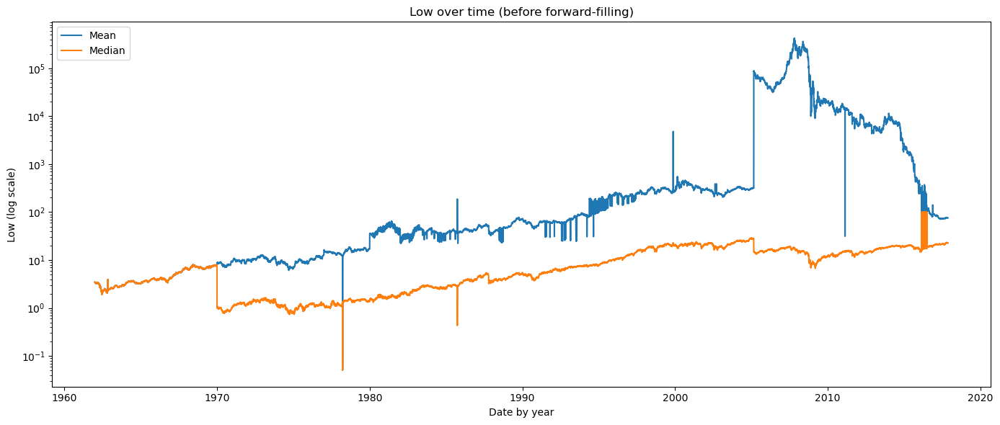
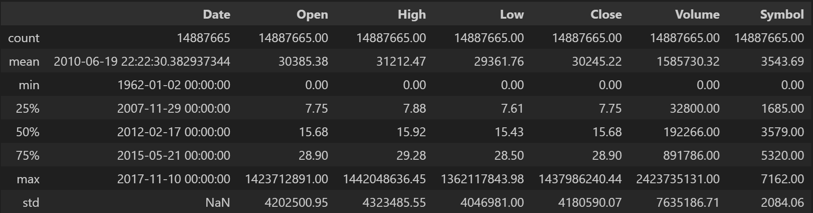

# IT3212 Assignment 1: Data Preprocessing

----------

## Table of Contents

1. [Data Exploration](#1-data-exploration)  
   - [a. Explore the dataset](#a-explore-the-dataset-by-displaying-the-first-few-rows-summary-statistics-and-data-types-of-each-column)  
   - [b. Identify missing values, outliers, and unique values](#b-identify-missing-values-outliers-and-unique-values-in-categorical-columns)

2. [Data Cleaning](#2-data-cleaning)  
   - [a. Handling Missing Values](#a-handling-missing-values)  
   - [b. Methods to Handle Missing Values](#b-choose-appropriate-methods-to-handle-missing-values-eg-meanmedian-imputation-for-numerical-data-mode-imputation-for-categorical-data-or-deletion-of-rowscolumns)  
   - [c. Justification for Handling Missing Data](#c-justify-your-choices-for-handling-missing-data)

3. [Handling Outliers](#3-handling-outliers)  
   - [a. Detecting Outliers](#a-detect-outliers-using-methods-such-as-the-iqr-method-or-z-score)  
   - [b. Outlier Treatment and Justification](#b-decide-whether-to-remove-cap-or-transform-the-outliers-justify-your-decisions)

4. [Data Transformation](#4-data-transformation)  
   - [a. Encoding Categorical Data](#a-encoding-categorical-data)  
     - [i. Apply encoding](#i-apply-label-encoding-or-one-hot-encoding-to-transform-categorical-data-into-numerical-form)  
     - [ii. Justification of encoding method](#ii-justify-your-choice-of-encoding-method)  
   - [b. Feature Scaling](#b-feature-scaling)  
     - [i. Apply scaling technique](#i-apply-feature-scaling-techniques-such-as-normalization-min-max-scaling-or-standardization-z-score-normalization-to-the-dataset)  
     - [ii. Importance of scaling](#ii-explain-why-feature-scaling-is-necessary-and-how-it-impacts-the-model)

5. [Data Splitting](#5-data-splitting)  
   - [a. Split into training/testing sets](#a-split-the-preprocessed-dataset-into-training-and-testing-sets-typically-an-80-20-or-70-30-split-is-used)  
   - [b. Importance of data splitting](#b-explain-the-importance-of-splitting-the-data-and-how-it-prevents-overfitting)

6. [Dimensionality Reduction](#6-apply-dimensionality-reduction-techniques-such-as-principal-component-analysis-pca-and-discuss-how-it-affects-the-dataset)

----------

## 1. Data Exploration

### a. Explore the dataset by displaying the first few rows, summary statistics, and data types of each column.

We have chosen the Stock market dataset. The dataset contains contains the following columns:

- ``Date``: The date the stock was traded (datetime)
- ``Open``: Price of the first stock that was traded on that date (float)
- ``High``: Highest price the stock was traded for on that date (float)
- ``Low``: Lowest price the stock was traded for on that date (float)
- ``Close``: Last price the stock was traded for on that date (float)
- ``Volume``: Number of traded stocks that (integer)
- ``OpenInt``: Open contract, number of stocks that are still open to be traded that date (integer)
- ``Symbol``: Stock symbol, abbreviation used to identify a stock (string)

<p>
  <br>
  <em align="center">Figure 1: First few rows of the dataset</em>
</p>

<p>
  <br>
  <em align="center">Figure 2: Initial statistics of the dataset.</em>
</p>

<p>
  <br>
  <em align="center">Figure 3: Number of stock data over time.</em>
</p>

<p>
  <br>
  <em align="center">Figure 4: Open price over time</em>
</p>

<p>
  <br>
  <em align="center">Figure 5: High price over time</em>
</p>

<p>
  <br>
  <em align="center">Figure 6: Low price over time</em>
</p>

<p>
  <br>
  <em align="center">Figure 7: Close price over time</em>
</p>

In the initial analysis, we observed that the open-, high-, low- and close price for the stocks were relative the same in terms of mean and average value.

The initial summary statistics reveal two significant drops, around 1978 and 2010, which later stabilized.\
However, when comparing the price trends with the number of recorded stock entries, we found that these drops were not caused by actual market movements but rather by missing data during those periods.\
Since the model is trained on individual stocks rather than on aggregated averages, a drop in the total amount of data for a given day will not affect the model’s performance.

We also observe a significant shift in stock prices around 2005. As illustrated in Figure 3, this aligns with a substantial increase in the number of recorded stocks from that period until 2017.\
The correlation between the surge in available stock data and the change in price statistics suggests that the shift was primarily driven by the expansion of the dataset rather than by underlying market dynamics.

### b. Identify missing values, outliers, and unique values in categorical columns.

In Figure 2, we identify outliers such as extremely high values in the open, high, low, and close prices, as well as instances of negative low prices. <!-- using which method? -->

In total, the dataset contains stock data for 7196 different companies where 32 companies contain empty data and are therefore unusable.

The unique values in categorial columns are the stock symbols, i.e., the identifiers for the different companies.

## 2. Data Cleaning

### a. Handling Missing Values

The OpenInt column was consistently set to 0 across all records, so we will ignore it completely in further analysis.

Regarding the 32 companies with empty data, they only represent a very small fraction of the total dataset, so we chose to exclude these companies from the analysis rather than attempting to manipulate their data since the successfully collected data contained no missing colums.

### b. Choose appropriate methods to handle missing values (e.g., mean/median imputation for numerical data, mode imputation for categorical data, or deletion of rows/columns).

We chose to ignore the 32 companies and therefore delete these records from the dataset and ignore the OpenInt completely.

### c. Justify your choices for handling missing data.

Given that the 32 companies with missing stock data represent a very small fraction of the total dataset, we chose to exclude them from the analysis rather than attempting to manipulate or reconstruct their data.\
Moreover, we had no basis for generating replacement values, as the files were empty.\
Furthermore, there was no reasonable basis for generating replacement values, as the corresponding files were entirely empty. The situation would have been different if only specific columns had been missing, in which case imputation methods could have been appropriately applied.\
The OpenInt column consistently contained only zeros, making it non-informative. This column was therefore dropped entirely.

## 3. Handling Outliers

### a. Detect outliers using methods such as the IQR method or Z-score.

We have decided to use the ***IQR / minimum maximum / Z-index*** method to detect and remove outliers. <!-- TBD-->


### b. Decide whether to remove, cap, or transform the outliers. Justify your decisions.

```py
```

Outliers that are outside of known financial crises are removed, while outliers in know financial crises are transformed. <!-- to be determined, specify why -->


## 4. Data Transformation

### a. Encoding Categorical Data

#### i. Apply label encoding or one-hot encoding to transform categorical data into numerical form.

<p>
  <br>
  <em align="center">Figure 8: Applying label encoding to the Symbol column</em>
</p>

#### ii. Justify your choice of encoding method.

With 7,162 unique companies, one-hot encoding would introduce 7,162 extra features, making the model unnecessarily complex.\
Label encoding is thus more suitable in this case.

### b. Feature Scaling

#### i. Apply feature scaling techniques such as normalization (Min-Max scaling) or standardization (Z-score normalization) to the dataset.


#### ii. Explain why feature scaling is necessary and how it impacts the model.

Feature scaling is important because raw features often have very different ranges, and this can cause models to give more weight to features with larger values.\
By scaling, we ensure that all features contribute equally, which improves fairness and accuracy.

## 5. Data Splitting

### a. Split the preprocessed dataset into training and testing sets. Typically, an 80-20 or 70-30 split is used.

We choose to keep the opening price as the y value (the value that we're trying to predict).

```py
# Split into 80% training and 20% testing
df_train, df_test = train_test_split(df_filled, test_size=0.2, random_state=42)

print("Training set shape:", df_train.shape)
print("Testing set shape:", df_test.shape)
```
**``Outputs:``**
```
>>> Training set shape: (11910132, 7)
>>> Testing set shape: (2977533, 7)
```

### b. Explain the importance of splitting the data and how it prevents overfitting.

Splitting the data allows the model to be trained on one set and evaluated on another, ensuring that performance is measured on unseen data.\
The training set adjusts model parameters, while the test set checks generalization. This prevents overfitting by forcing the model to learn patterns instead of memorizing the training data.\
A validation set is often used during training to tune hyperparameters and monitor performance.


## 6. Apply dimensionality reduction techniques such as Principal Component Analysis (PCA) and discuss how it affects the dataset.

```py
```