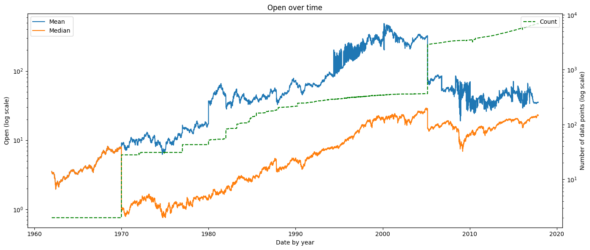
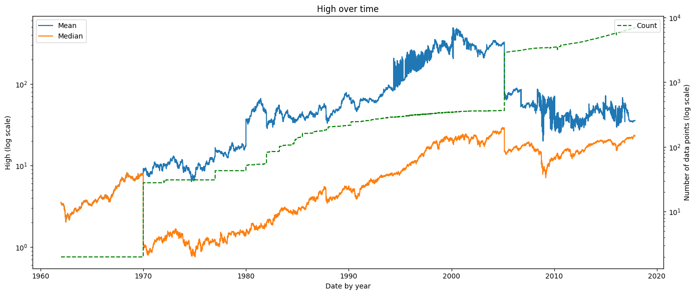
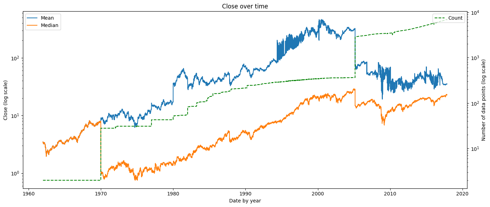

# IT3212 Assignment 1: Data Preprocessing

## Table of Contents

1. [Data Exploration](#1-data-exploration)

   - [a. Explore the dataset](#a-explore-the-dataset-by-displaying-the-first-few-rows-summary-statistics-and-data-types-of-each-column)
   - [b. Identify missing values, outliers, and unique values](#b-identify-missing-values-outliers-and-unique-values-in-categorical-columns)

2. [Data Cleaning](#2-data-cleaning)

   - [a. Handling Missing Values](#a-handling-missing-values)
   - [b. Methods to Handle Missing Values](#b-choose-appropriate-methods-to-handle-missing-values-eg-meanmedian-imputation-for-numerical-data-mode-imputation-for-categorical-data-or-deletion-of-rowscolumns)
   - [c. Justification for Handling Missing Data](#c-justify-your-choices-for-handling-missing-data)

3. [Handling Outliers](#3-handling-outliers)

   - [a. Detecting Outliers](#a-detect-outliers-using-methods-such-as-the-iqr-method-or-z-score)
   - [b. Outlier Treatment and Justification](#b-decide-whether-to-remove-cap-or-transform-the-outliers-justify-your-decisions)

4. [Data Transformation](#4-data-transformation)

   - [a. Encoding Categorical Data](#a-encoding-categorical-data)
     - [i. Apply encoding](#i-apply-label-encoding-or-one-hot-encoding-to-transform-categorical-data-into-numerical-form)
     - [ii. Justification of encoding method](#ii-justify-your-choice-of-encoding-method)
   - [b. Feature Scaling](#b-feature-scaling)
     - [i. Apply scaling technique](#i-apply-feature-scaling-techniques-such-as-normalization-min-max-scaling-or-standardization-z-score-normalization-to-the-dataset)
     - [ii. Importance of scaling](#ii-explain-why-feature-scaling-is-necessary-and-how-it-impacts-the-model)

5. [Data Splitting](#5-data-splitting)

   - [a. Split into training/testing sets](#a-split-the-preprocessed-dataset-into-training-and-testing-sets-typically-an-80-20-or-70-30-split-is-used)
   - [b. Importance of data splitting](#b-explain-the-importance-of-splitting-the-data-and-how-it-prevents-overfitting)

6. [Dimensionality Reduction](#6-apply-dimensionality-reduction-techniques-such-as-principal-component-analysis-pca-and-discuss-how-it-affects-the-dataset)

## 1. Data Exploration

### a. Explore the dataset by displaying the first few rows, summary statistics, and data types of each column.

We have chosen the Stock market dataset. The dataset contains contains the following columns:

- `Date`: The date the stock was traded (datetime)
- `Open`: Price of the first stock that was traded on that date (float)
- `High`: Highest price of the stock was traded on that date (float)
- `Low`: Lowest price of the stock that was traded on that date (float)
- `Close`: Last price of the stock that was traded on that date (float)
- `Volume`: Number of traded stocks on that date (integer)
- `OpenInt`: Open contract, number of stocks that are still open to be traded on that date (integer)
- `Symbol`: Stock symbol, abbreviation used to identify a stock (string)

   
  <em>Figure 1: Data types for each column</em>

   
  <em>Figure 2: First few rows of the dataset</em>

Below are a few figures describing some summary statistics of the dataset.

   
  <em>Figure 3: Initial statistics of the dataset</em>

The initial summary statistics also revealed several sudden significant changes in mean and median price.

   
  <em> Figure 4: Open price over time</em>

   
  <em>Figure 5: High price over time</em>

   
  <em>Figure 6: Low price over time</em>

   
  <em>Figure 7: Close price over time</em>

   
  <em>Figure 8: Volume over time</em>

### b. Identify missing values, outliers, and unique values in categorical columns.

When comparing the price trends with the number of recorded stock entries, we found that these drops were not caused by actual market movements but rather by missing data during those periods.

In the initial analysis, we observed that the open, high, low, and close prices of the stocks were relatively similar in terms of their mean and average values (see Figures 4–8).

We also observed a significant shift in stock prices around 1970 and 2005. As illustrated in Figure 9, this aligns with substantial increases in the number of recorded stocks.\
The correlation between the surge in available stock data (Visualized by the dotted green count line) and the change in price statistics suggests that the shift was primarily driven by the expansion of the dataset rather than by underlying market dynamics.

   
  <em>Figure 9: Number of stock data points over time</em>

Boxplots for each column (Figure 10) reveal many high outliers, though they do not fully explain their causes.\
It is also important to note that market trends vary, and sharp drops do not always indicate unrealistic prices but can reflect real economic events, such as the 2008 financial crisis observed in Figures 4–8.

   
  <em>Figure 10: Boxplots for each column</em>

The unique values in categorial columns are the stock symbols, i.e., the identifiers for the different companies. See figure 11.\
The OpenInt column has the value 0 for every row.

   
  <em>Figure 11: Unique values for each column</em>

In total, stock data was collected for 7195 companies. Of these, 32 files were empty and therefore unusable.\
For the retrieved companies, the collected rows (date with given stock prices for a company) contained no missing data as shown in figure 12, but figures 4-8 suggest that there might be some missing days of stock data.

   
  <em>Figure 12: Missing values for each column</em>

The dataset also contains some cells with negative values, this will be treated as invalid data as the price of a stock can't be below 0.

## 2. Data Cleaning

### a. Handling Missing Values

Below are the same figures as in Task 1, but now with forward-filling applied to the dataset.

   
  <em>Figure 13: Open price over time after forward-filling</em>

   
  <em>Figure 14: High price over time after forward-filling</em>

   
  <em>Figure 15: Low price over time after forward-filling</em>

   
  <em>Figure 16: Close price over time after forward-filling</em>

   
  <em>Figure 17: Volume over time after forward-filling</em>

   
  <em>Figure 18: Statistics of the dataset after forward-filling</em>

Despite forward-filling resolving the price fluctuations, outliers remain visible (Figure 19).

   
  <em>Figure 19: Boxplots for each column after forward-filling</em>

### b. Choose appropriate methods to handle missing values (e.g., mean/median imputation for numerical data, mode imputation for categorical data, or deletion of rows/columns).

As stated above, we used forward-fill to handle missing values.\
Filling in with average values would be wrong since the market could vary, so it is reasonable to fill in with the previous stock data.\
If there are missing stock data on Monday, we forward-fill with data from Friday.

We also decided to exclude weekends and market holidays.

The OpenInt column was completely dropped.

We ignore the 32 companies with empty stock data, dropped the open interest column, and apply forward-fill for missing values in price columns.

### c. Justify your choices for handling missing data.

The 32 companies represent a very small share of the dataset. We chose to ignore these companies to avoid creating stock data with nothing to base it on.\
The open interest column is excluded since it contains only zeros for all entries (see Figures 2 and 3), indicating no reported open contracts and adding no useful information for prediction while introducing unnecessary computation overhead.\
Forward-fill is used because missing prices are more likely close to the previous day's data rather than to mean or median price.\
We preferred filling with the previous day's data instead of the next day's data as otherwise that would fill our dataset using the knowledge of future prices.

## 3. Handling Outliers

### a. Detect outliers using methods such as the IQR method or Z-score.

<h1 style="color:green">
TODO: Decide if this is the correct method to handle outliers: we talk about using trimming and IQR in the sections below
</h1>

We have decided to use the Interquartile Range (IQR) method to detect outliers.\
We use rolling IQR with with a 2.5 multiplier.
We also have a filter that detects any stocks with a price that is either negative, lower than $\$ 0.01$ or greater than $\$100,000$.\
Finally, we consider all stocks with a volume of $0$ to be outliers.

Below are same figures as before, but with IQR and trimming applied to the dataset to remove outliers.

   
  <em>Figure 20: Open price over time after IQR and trimming</em>

   
  <em>Figure 21: High price over time after IQR and trimming</em>

   
  <em>Figure 22: Low price over time after IQR and trimming</em>

   
  <em>Figure 23: Close price over time after IQR and trimming</em>

   
  <em>Figure 24: Volume over time after IQR and trimming</em>

### b. Decide whether to remove, cap, or transform the outliers. Justify your decisions.

<!-- talk more about how we used IQR or improve the text-->

All fields where we detected outliers were removed.\
We have chosen to do this because very have a very large data set, since we believe that removing outliers without affecting the quality of the data is not a problem.\
IQR is chosen because it is robust to non-normal distributions, as
stock price data often is not normally distributed - it can be skewed.\
It also captures local volatility and adapts to the changing scale of each stock's price and trading behavior over time.\
Finally, rolling IQR handles temporal fluctuations more effectively than global methods like Z-scores, which may flag valid price jumps as outliers.

## 4. Data Transformation

### a. Encoding Categorical Data

#### i. Apply label encoding or one-hot encoding to transform categorical data into numerical form.

<h1 style="color:green">
TODO: Add figures with statistics of dataset and first few rows after label encoding, but outliers must be handled before applying these operations to the dataset
</h1>

<!-- alternatively fig caption: Applying label encoding to the Symbol column-->

We have chosen to apply label encoding.\
Below are some summary statistics of the dataset after encoding the ``Symbol`` column.

   
  <em>Figure 25: First few rows of the dataset after label encoding</em>

   
  <em>Figure 26: Number of entries per Symbol after label encoding</em>

   
  <em>Figure 27: Average close price per symbol after label encoding</em>

   
  <em>Figure 28: Close price over time after label encoding</em>

We chose to label encode the symbol column, setting an integer to replace every unique value of symbol in the dataset.\
We applied label encoding to the symbol column. Since encoding starts from 0, the count in Figure 19 is 7162, despite there being 7163 unique companies.

#### ii. Justify your choice of encoding method.

With 7,162 unique companies, one-hot encoding would introduce 7,162 extra features, making the model unnecessarily complex. Label encoding is thus more suitable in this case, as it assigns each unique company a numeric value, reducing dimensionality while preserving category distinction.

### b. Feature Scaling

#### i. Apply feature scaling techniques such as normalization (Min-Max scaling) or standardization (Z-score normalization) to the dataset.

<h1 style="color:green">
TODO: Min-Max scaling!
</h1>

We decided to use Min-Max normalization to scale the dataset.\
The scaling was only used on the columns that have ordinal data, meaning values have a meaningful order.\
These columns are Open price, High price, Low price, Close price, and Volume.

Min-Max was chosen instead of other scaling techniques, as the result of Min-Max scaling gives an intuitive understanding of the output.\
What you can tell from the result of Min-Max scaling is what percentage from the minimum value to the maximum value a give datapoint is.\
This is preferred over Z-score normalization, as we felt we don't have an intuitive understanding of it in the context of stock data.

#### ii. Explain why feature scaling is necessary and how it impacts the model.

Feature scaling is important because raw features often have very different ranges, and this can cause models to give more weight to features with larger values.\
By scaling, we ensure that all features contribute equally, which improves fairness and accuracy.

## 5. Data Splitting

### a. Split the preprocessed dataset into training and testing sets. Typically, an 80-20 or 70-30 split is used.

<h1 style="color:green">
# TODO: Split chronologically
</h1>

We split the dataset into a training and testing dataset using an 80-20 split. Instead of splitting the dataset randomly, we choose to use the chronologically last 20% of the dataset as testing data. This avoids data leakage, as the model isn't trained on events and values that aren't available at the time of the prediction.

When training the model, we would prefer using chronological splits with rolling validation, as this method would mean most of the training data could be used for both validation and training without data leakage.

<h1 style="color:green">
## TODO: Split data into training and testing sets
</h1>

### b. Explain the importance of splitting the data and how it prevents overfitting.

Splitting the data allows the model to be trained on one set and evaluated on another, ensuring that performance is measured on unseen data.\
The training set adjusts model parameters, while the test set checks generalization. This prevents overfitting by forcing the model to learn patterns instead of memorizing the training data.\
A validation set is often used during training to tune hyperparameters and monitor performance.

## 6. Apply dimensionality reduction techniques such as Principal Component Analysis (PCA) and discuss how it affects the dataset.

<h1 style="color:green">
TODO: Apply PCA? and choose explanation below
</h1>

<!-- the two paragraphs below seem to be AI generated, rewrite?-->

Applying Principal Component Analysis (PCA) to our stock dataset — which includes features such as Open, High, Low, Close, Volume, and OpenInt — helps reduce dimensionality by transforming the original correlated features into a smaller set of uncorrelated components. Since stock prices (Open, High, Low, Close) are often highly correlated, PCA captures most of their shared variance in the first few principal components.

This dimensionality reduction simplifies the dataset while retaining the majority of the information. As a result, the model becomes less complex, less prone to multicollinearity, and easier to visualize. However, interpretability decreases since the new principal components are linear combinations of the original features rather than directly meaningful attributes like “Open” or “Close” price.

<h1 style="color:green">
TODO improve explanation?
</h1>

<!-- possibly human written?-->

Applying dimensionality reduction using PCA changes the dimensions of the dataset by replacing columns with a smaller number of new features. The effect is the reduction of dimensions, which can speed up model training and remove features that aren't valuable for training.

There are also problems with dimensionality reduction. One is that it makes the features in the data less intuitively understood, making it hard to understand the dataset and interpret predictions. Dimensionality reduction also loses some information, which might be valuable to training the model.