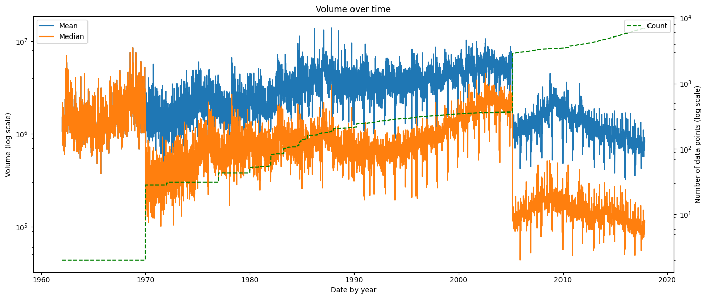
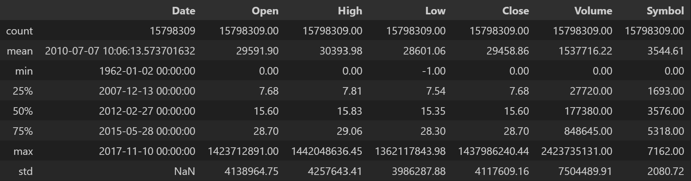
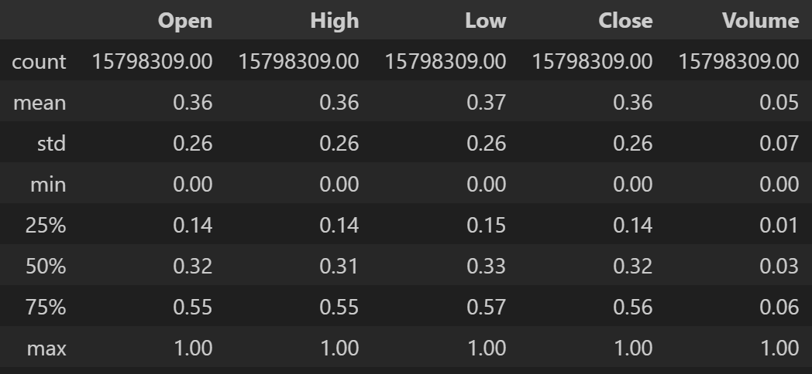

# IT3212 Assignment 1: Data Preprocessing (Second delivery)

[Changelog](#changelog)

## Table of Contents

- [1. Data Exploration](#1-data-exploration)
  - [a. Explore the dataset by displaying the first few rows, summary statistics, and data types of each column.](#1-data-exploration-section-a)
  - [b. Identify missing values, outliers, and unique values in categorical columns.](#1-data-exploration-section-b)
- [2. Data Cleaning](#2-data-cleaning)
  - [a. Handling Missing Values](#2-data-cleaning-section-a)
  - [b. Choose appropriate methods to handle missing values (e.g., mean/median imputation for numerical data, mode imputation for categorical data, or deletion of rows/columns).](#2-data-cleaning-section-b)
  - [c. Justify your choices for handling missing data.](#2-data-cleaning-section-c)
- [3. Handling Outliers](#3-handling-outliers)
  - [a. Detect outliers using methods such as the IQR method or Z-score.](#3-handling-outliers-section-a)
  - [b. Decide whether to remove, cap, or transform the outliers. Justify your decisions.](#3-handling-outliers-section-b)
- [4. Data Transformation](#4-data-transformation)
  - [a. Encoding Categorical Data](#4-data-transformation-section-a)
    - [i. Apply label encoding or one-hot encoding to transform categorical data into numerical form.](#4-data-transformation-section-a-i)
    - [ii. Justify your choice of encoding method.](#4-data-transformation-section-a-ii)
  - [b. Feature Scaling](#4-data-transformation-section-b)
    - [i. Apply feature scaling techniques such as normalization (Min-Max scaling) or standardization (Z-score normalization) to the dataset.](#4-data-transformation-section-b-i)
    - [ii. Explain why feature scaling is necessary and how it impacts the model.](#4-data-transformation-section-b-ii)
- [5. Data Splitting](#5-data-splitting)
  - [a. Split the preprocessed dataset into training and testing sets. Typically, an 80-20 or 70-30 split is used.](#5-data-splitting-section-a)
  - [b. Explain the importance of splitting the data and how it prevents overfitting.](#5-data-splitting-section-b)
- [6. Apply dimensionality reduction techniques such as Principal Component Analysis (PCA) and discuss how it affects the dataset.](#6-PCA)

<div style="page-break-after: always;"></div>

## <a id="1-data-exploration"></a> 1. Data Exploration

### <a id="1-data-exploration-section-a"></a> a. Explore the dataset by displaying the first few rows, summary statistics, and data types of each column.

We have chosen the Stock mMrket dataset. The dataset contains contains the following columns:

- `Date`: The date the stock was traded (datetime)
- `Open`: Price of the first stock that was traded on that date (float)
- `High`: Highest price of the stock was traded on that date (float)
- `Low`: Lowest price of the stock that was traded on that date (float)
- `Close`: Last price of the stock that was traded on that date (float)
- `Volume`: Number of traded stocks on that date (integer)
- `OpenInt`: Open contract, number of stocks that are still open to be traded on that date (integer)
- `Symbol`: Stock symbol, abbreviation used to identify a stock (string)

<p align="center">
  <br>
  <em>Figure 1: Data types for each column</em>
</p>

The dataset was extracted from 7 195 companies that were listed on the stock market. Figure 2 and 3 belows display the first few rows of the dataset and describe some initial statistics.

<p align="center">
  <br>
  <em>Figure 2: First few rows of the dataset</em>
</p>

<p align="center">
  <br>
  <em>Figure 3: Initial statistics of the dataset</em>
</p>

The initial summary statistics also revealed several sudden significant changes in mean and median price, as shown in Figures 4–8. These anomalies will be further addressed in the data cleaning and outlier handling sections.

<p align="center">
  <br>
  <em> Figure 4: Open price over time</em>
</p>

<p align="center">
  <br>
  <em>Figure 5: High price over time</em>
</p>

<p align="center">
  <br>
  <em>Figure 6: Low price over time</em>
</p>

<p align="center">
  <br>
  <em>Figure 7: Close price over time</em>
</p>

<p align="center">
  <br>
  <em>Figure 8: Volume over time</em>
</p>

### <a id="1-data-exploration-section-b"></a> b. Identify missing values, outliers, and unique values in categorical columns.

Out of the 7 165 companies, 32 contained no data and were excluded from further analysis. We also verified that no company had duplicate trading days, meaning no company had more than one row of stock data for the same day. For the remaining companies, no missing values were found in the columns, as shown in Figure 12. However, the drops observed in Figures 4–8 suggest that there might be some missing days of stock data. 

<p align="center">
  <br>
  <em>Figure 9: Missing values for each column</em>
</p>

When comparing the price trends with the number of recorded stock entries, we found that these drops were not caused by actual market movements, but rather by missing data during those periods. The correlation between the surge in available stock data, visualized by the dotted green count line, and the change in price statistics suggests that the shift was primarily driven by the expansion of the dataset rather than by underlying market dynamics, as shown in figure 4-8.

When investigating this matter further, we identified 5 186 companies that had missing trading days and in total 6 913 unique days with missing stock data. There were about 2.44% days with missing stock data in the dataset. Additional metrics are summarized in Figure 10.

<p align="center">
  <br>
  <em>Figure 10: Missing trading days</em>
</p>

We also observed a significant shift in stock prices around 1970 and 2005. As illustrated in Figure 11, this aligns with substantial increases in the number of recorded stocks. 

<p align="center">
  <br>
  <em>Figure 11: Number of stock data points over time</em>
</p>

In the initial analysis, we observed that the open, high, low, and close prices of the stocks were relatively similar in terms of their mean and average values (see Figures 4–8).

<!---Outliers-->
Boxplots for each column in figure 12 reveal many high outliers, though they do not fully explain their causes. It is also important to note that market trends vary, and sharp drops do not always indicate unrealistic prices but can reflect real economic events, such as the 2008 financial crisis observed in Figures 4–8. 

<p align="center">
  <br>
  <em>Figure 12: Boxplots for each column</em>
</p>

The unique values in categorial columns are the stock symbols, i.e., the identifiers for the different companies. See figure 13. The OpenInt column has the value 0 for every row.

<p align="center">
  <br>
  <em>Figure 13: Unique values for each column</em>
</p>

<div style="page-break-after: always;"></div>

## <a id="2-data-cleaning"></a> 2. Data Cleaning

### <a id="2-data-cleaning-section-a"></a> a. Handling Missing Values

We applied forward filling to handle the missing trading days identified in last section. Forward filling propagates the last known price to the next valid trading day. We performed this only on dates defined by the New York Stock Exchange calendar (NYSE). Forward filling added 2.44% additional rows, as shown in Figure 14, matching the share of missing trading days identified in Figure 10.

<p align="center">
  <br>
  <em>Figure 14: Forward filling</em>
</p>


<p align="center">
  <br>
  <em>Figure 15: Open price over time after forward-filling</em>
</p>

<p align="center">
  <br>
  <em>Figure 16: High price over time after forward-filling</em>
</p>

<p align="center">
  <br>
  <em>Figure 17: Low price over time after forward-filling</em>
</p>

<p align="center">
  <br>
  <em>Figure 18: Close price over time after forward-filling</em>
</p>

<p align="center">
  <br>
  <em>Figure 19: Volume over time after forward-filling</em>
</p

After handling missing values, the fluctuations seen in Figures 4–8 are resolved, leaving only the major shifts around 1970 and 2005, which correlate with the previously discussed increases in available stock data. This is shown in Figures 15–19.

The dataset also contains some cells with negative values, as shown in Figure 20 for the low price. These are treated as invalid, since a stock price cannot be negative.

<p align="center">
  <br>
  <em>Figure 20: Statistics of the dataset after forward-filling</em>
</p>

Despite forward-filling resolving the price fluctuations, outliers remain visible, as shown in figure 21. This will be addressed in the next section.

<p align="center">
  <br>
  <em>Figure 21: Boxplots for each column after forward-filling</em>
</p>

### <a id="2-data-cleaning-section-b"></a> b. Choose appropriate methods to handle missing values (e.g., mean/median imputation for numerical data, mode imputation for categorical data, or deletion of rows/columns).

As stated above, we used forward-filling to handle missing values. If there are missing stock data on Monday, we forward-fill with data from Friday. We also decided to exclude weekends and market holidays following the NYSE calendar. 

We ignore the 32 companies with empty stock data

The OpenInt column was completely dropped.

### <a id="2-data-cleaning-section-c"></a> c. Justify your choices for handling missing data.

Filling in with average values would be wrong since the market could vary, so it is reasonable to fill in with the previous stock data. Forward-fill is used because missing prices are more likely close to the previous day's data rather than to mean or median price. We preferred filling with the previous day's data instead of the next day's data as otherwise that would fill our dataset using the knowledge of future prices. We used the NYSE trading calendar to avoid flagging weekends and market holidays as missing dates.

The 32 companies without any stock data account for only a negligible portion of the dataset, so we chose to ignore them rather than generate synthetic prices with no underlying data.

The open interest column is excluded since it contains only zeros for all entries (see Figure 2 and 3), indicating no reported open contracts and adding no useful information for prediction while introducing unnecessary computation overhead.

<div style="page-break-after: always;"></div>

## <a id="3-handling-outliers"></a> 3. Handling Outliers

### <a id="3-handling-outliers-section-a"></a> a. Detect outliers using methods such as the IQR method or Z-score.

We have decided to detect outliers using a per-stock rolling Z-score over a 1-month window. Values with a Z-score above 3 are treated as outlier and replaced with the values from the previous data on that stock. We apply the same replacement to negative values, since price and volume cannot be negative. Figure 22 shows the statisctics of the dataset after replacing outliers with forward-filling, where negative values in the low column has been removed.

<p align="center">
  <br>
  <em>Figure 22: Statistics of the dataset after imputing outliers</em>
</p>

As shown in Figure 23, this method detected 184,512 rows with an outlier in at least one of the Open, High, Low, Close, or Volume columns, corresponding to about 1.21% of the dataset. Since this is a very small share of the dataset, imputing these rows is justifiable.

<p align="center">
  <br>
  <em>Figure 23: Statistics of the dataset after forward-filling</em>
</p>

Further analysis showed that most outliers were detected by unusually high trading activity on specific days for several stocks. This is supported by Figure 24, which shows 170 404 flagged rows in the Volume column, indicating days with abnormally large trading volumes.

<p align="center">
  <br>
  <em>Figure 24: Open price over time after removing outliers</em>
</p>

After applying rolling Z-score–based outlier detection and imputing flagged values, the resulting distributions remain largely unchanged relative to the old versions versions shown in Figures 15–19. This suggests the procedure had little effect on the overall index, but inspecting individuals companies reveals clearer effects

<p align="center">
  <br>
  <em>Figure 25: Open price over time after removing outliers</em>
</p>

<p align="center">
  <br>
  <em>Figure 26: High price over time after removing outliers</em>
</p>

<p align="center">
  <br>
  <em>Figure 27: Low price over time after removing outliers</em>
</p>

<p align="center">
  <br>
  <em>Figure 28: Close price over time after removing outliers</em>
</p>

<p align="center">
  <br>
  <em>Figure 29: Volume over time after removing outliers</em>
</p>

When ranking companies by the number of detected outliers per column, we see that the cleaning step had a clear impact on a few individual stocks, even though the overall index changed only slightly. The figures below list, for each column, the company with the most outliers before and after imputing values flagged by the rolling z-score.

<p align="center">
  <br>
  <em>Figure 30: Open before and after handling outlier for drys</em>
</p>


<p align="center">
  <br>
  <em>Figure 31: High before and after handling outlier for spts</em>
</p>

<p align="center">
  <br>
  <em>Figure 32: Low before and after handling outlier for ator</em>
</p>


<p align="center">
  <br>
  <em>Figure 33: Close before and after handling outlier for trxc</em>
</p>


<p align="center">
  <br>
  <em>Figure 34: Volume before and after handling outlier for nav</em>
</p>

In particular, Figure 31 shows a clear impact of outlier handling on the High price for SPTS, with the high spikes removed. Figure 34 shows that several extreme Volume spikes for NAV were reduced after cleaning. By contrast, Figures 32 and 33 show only small changes on low and close price for Ator and TRXC in figure 32 and 33, which corresponds with the small number of outliers detected.

### <a id="3-handling-outliers-section-b"></a> b. Decide whether to remove, cap, or transform the outliers. Justify your decisions.

All fields where we detected outliers or negative values were filled with the previous day's data. We have chosen to do this to be consistent with our method of filling cells, as we do the same with missing rows.

Z-score is chosen to remove outliers, as it seems to be most used method for detecting outliers in stock data. Our group also has more experience using Z-score, so we're more familiar with how the method works, meaning we understand our new dataset better.

Finally, rolling Z-score handles temporal fluctuations more effectively than global Z-score, which may flag small jumps after a normal price increase as an outlier.

We know Z-score can remove values for very volatile stocks, but since we only detected around 1.21% outliers, we have decided that it's okay to get rid of these data points since our dataset is so large.

<div style="page-break-after: always;"></div>

## <a id="4-data-transformation"></a> 4. Data Transformation

### <a id="4-data-transformation-section-a"></a> a. Encoding Categorical Data

#### <a id="4-data-transformation-section-a-i"></a> i. Apply label encoding or one-hot encoding to transform categorical data into numerical form.

We have chosen to apply label encoding. Below are some summary statistics of the dataset after encoding the ``Symbol`` column.

<p align="center">
  <br>
  <em>Figure 35: Statistics of the dataset after encoding categorical features</em>
</p>

<p align="center">
  <br>
  <em>Figure 36: Number of entries per stock symbol after label encoding</em>
</p>

<p align="center">
  <br>
  <em>Figure 37: Average close price for 20 stock symbols after label encoding</em>
</p>

<p align="center">
  <br>
  <em>Figure 38: Close price over time for stock symbol 0 after label encoding</em>
</p>

We chose to label encode the symbol column, setting an integer to replace every unique value of symbol in the dataset.

We applied label encoding to the symbol column. Since encoding starts from 0, the count in Figure 35 is 7162, despite there being 7 163 unique companies.

#### <a id="4-data-transformation-section-a-ii"></a> ii. Justify your choice of encoding method.

With 7 162 unique companies, one-hot encoding would introduce 7 162 extra features, making the chosen model unnecessarily complex. Label encoding is thus more suitable in this case, as it assigns each unique company a numeric value, reducing dimensionality while preserving category distinction, and does not introduce computational overhead.

We are aware that label encoding imposes an arbitrary ordering on the symbols, which can bias models that treat larger numbers as greater. In practice, some models might wrongly treat a company with a large encoded Symbol value as “better” or "more important" than one with a smaller value, which could increase the predicted prices.

This effect can be mitigated if the models are tree-based like Decision Tree, Random Forest and XGBoost, since they split on thresholds and are generally less sensitive the actual numeric scale of the labels.

By contrast, other models such as linear/logistic regression and many neural networks, can misinterpret these encoded integers as meaningful magnitudes. For those models, one-hot encoding would be more appropriate, even though it increases dimensionality.

Label encoding is acceptable when using tree-based models, which are relatively robust to label bias and keeps the dataset computationally manageable.

### <a id="4-data-transformation-section-b"></a> b. Feature Scaling

#### <a id="4-data-transformation-section-b-i"></a> i. Apply feature scaling techniques such as normalization (Min-Max scaling) or standardization (Z-score normalization) to the dataset.

We applied Min-Max normalization to scale the dataset. The scaling was only used on the columns that have ordinal data, meaning values have a meaningful order. 

These columns was the numeric features: Open, High, Low, Close and Volume. Each value was scaled so that they ended up in the [0, 1] range.

Min-Max was chosen instead of other scaling techniques, as the result of Min-Max scaling gives an intuitive understanding of the output.

What you can tell from the result of Min-Max scaling is what percentage from the minimum value to the maximum value a give datapoint is.


<p align="center">
  <br>
  <em>Figure 40a: Statistics of the dataset before scaling numeric features</em>
</p>

<p align="center">
  <br>
  <em>Figure 40b: Statistic of the dataset after scaling numeric features</em>
</p>

<p align="center">
  <br>
  <em>Figure 41: Open price before and after Min-Max scaling</em>
</p>

<p align="center">
  <br>
  <em>Figure 42: High price before and after Min-Max scaling</em>
</p>

<p align="center">
  <br>
  <em>Figure 43: Low price before and after Min-Max scaling</em>
</p>

<p align="center">
  <br>
  <em>Figure 44: Close price before and after Min-Max scaling</em>
</p>

<p align="center">
  <br>
  <em>Figure 45: Volume before and after Min-Max scaling</em>
</p>


We can see that after scaling we get a left-skewed distribution. This means that the stock prices are densely packed at the lower end of their own range.

#### <a id="4-data-transformation-section-b-ii"></a> ii. Explain why feature scaling is necessary and how it impacts the model.

Feature scaling is important because raw features often have very different ranges, and this can cause models to give more weight to features with larger values.

By scaling, we ensure that all features contribute equally, which improves fairness and accuracy.

In our case, the Open, High, Low, Close, and Volume features had very large ranges, with some extremely high values. By scaling them to the  [0,1] interval, we prevent high-magnitude features from dominating the model.

Figure 40a shows that the raw features had very different ranges, with some extremely large values. By scaling them to the  [0,1] interval, we prevent high-magnitude features from dominating the model. This is seen in Figure 40b, where the mean is lower.
 
<div style="page-break-after: always;"></div>

## <a id="5-data-splitting"></a> 5. Data Splitting

### <a id="5-data-splitting-section-a"></a> a. Split the preprocessed dataset into training and testing sets. Typically, an 80-20 or 70-30 split is used.

We split the dataset into a training and testing dataset using an 80-20 split.

We sorted the preprocessed data by date and split chronologically, the earliest 80% for training and the most recent 20% for testing. This preserves the time distribution of the data and ensures the test set reflects the most recent period. We split on the whole dataset rather than per stock to prevent data leakage. Without this approach, some older stocks would have been tested on periods where some recently listed stocks still provide information about market movement in the training set. This approach would leak future information and produce overly optimistic results, making the models less reliable for new information. 

This issue is illustrated in Figure 46, where the training set of a newer stock overlaps with the test set of an older stock, causing data leakage in the yellow highlighted region. This is particularly problematic around major events such as the 2008 financial crisis. Figure 47 shows how using a single global split date avoids this problem: no stock is tested in periods where other stocks still provide information, and the time distribution of the data is preserved. This is the splitting strategy we use for the stock data.

<p align="center">
  <br>
  <em>Figure 46: Datasplitting on per stock</em>
</p>

<p align="center">
  <br>
  <em>Figure 47: Datasplitting on whole dataset</em>
</p>

This shows the number of data points in the training and test sets after applying the splitting method described above.

```
Training set shape: (12634695, 7)
Testing set shape: (3163614, 7)
```

When training the model, we would prefer using chronological splits with rolling validation, as this method would mean most of the training data could be used for both validation and training without data leakage.

### <a id="5-data-splitting-section-b"></a> b. Explain the importance of splitting the data and how it prevents overfitting.

Splitting the data allows the model to be trained on one set and evaluated on another, ensuring that performance is measured on unseen data.

The training set adjusts model parameters, while the test set checks generalization. This prevents overfitting by forcing the model to learn patterns instead of memorizing the training data.

A validation set is often used during training to tune hyperparameters and monitor performance.


<div style="page-break-after: always;"></div>

## <a id="6-PCA"></a> 6. Apply dimensionality reduction techniques such as Principal Component Analysis (PCA) and discuss how it affects the dataset.

Applying Principal Component Analysis (PCA) to our stock dataset reduces dimensionality by turning the original, correlated features into a smaller set of uncorrelated components. This lets us keep the most informative parts of the data while dropping redundant features, which can speed up model training, reduce multicollinearity, and make the data easier to visualize. The trade-off is that the new features (principal components) are linear combinations of the original ones, so they’re less interpretable, and some information is inevitably lost when lower-variance components are discarded. 

We applied PCA to the Open, High, Low, Close, and Volume features and retained the first two components. Figures 48 and 49 show these two components for the training and test sets, respectively. The reason for choosing two components will be described shortly.

<p align="center">
  <br>
  <em>Figure 48: First few lines from the PCA train set</em>
</p>

<p align="center">
  <br>
  <em>Figure 49: First few lines from the PCA test set</em>
</p>

Since stock prices (Open, High, Low, Close) and Volume tend to move together, PCA captures most of their shared variance in the first few components. The explained variance of each component shows how much of the original information it retains. Components with higher variance keep more of the data’s structure. 

Figure 50 and 51 show this clearly. The first PCA component (PC1) explains 96.09% of the variance and the second PLA component (PC2) adds 3.53%, so the first two components together capture about 99.6% of the orginal information, while the remaining components add very little.

<p align="center">
  <br>
  <em>Figure 50: Variance for each PCA components</em>
</p>

<p align="center">
  <br>
  <em>Figure 51: Individual and cumulative variance for each PCA component</em>
</p>

<p align="center">
  <br>
  <em>Figure 52: A random sample from the first two PCA components</em>
</p>


<div style="page-break-after: always;"></div>

# Changelog
- Added numerical count and percentage of days with missing stock data in section [1b.](#1-data-exploration-section-b) to improve: 
  - While graphs provided are informative, there’s limited statistical summary (e.g., no numerical count or percentage of missing values/outliers).
- Used the NYSE stock calendar to forward fill data in section [2](#2-data-cleaning)
- Added a quantative check with number and percentage of rows forward-filled in section to handle days with missing stock data [2a.](#2-data-cleaning-section-a) to improve:
  - You could add a quantitative check (e.g., percent of missing data replaced, number of rows dropped)
- Added before/after distributions for companies with the most rolling z-score outliers for each column: Open, High, Low, Close, and Volume,  in section [3a. ](#3-handling-outliers-section-a) to improve:
  - You could have visualized before/after distributions or volatility metrics to strengthen discussion of impact.
- Mentioned mitigation strategies which are less sensitive to label bias to justify our label encoding choice in section [4a. ii)](#4-data-transformation-section-a-ii) to improve:
  - You could have mentioned mitigation strategies if used in ML (e.g., tree-based models less sensitive to label bias).
- Included numeric evidence in terms of mean and variance before and after applying Min-max normalization in section [4b. ii)](#4-data-transformation-section-b-ii) to improve:
  - You could have included numerical evidence (e.g., mean, variance before/after) or rationale for not choosing standardization (beyond intuition).
- Briefly noted how our split maintains time distribution to avoid data leakage in section [5a.](#5-data-splitting-section-a) to improve:
  - You could have briefly noted how this split maintains class/time distribution
- Included variance explained by first PCA components and justified retaining two components in section [6](#6-PCA) to improve:
  - You could have included quantitative detail (e.g., variance explained by first components, number of components retained).