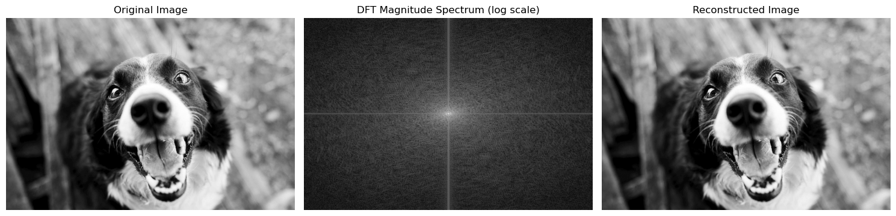
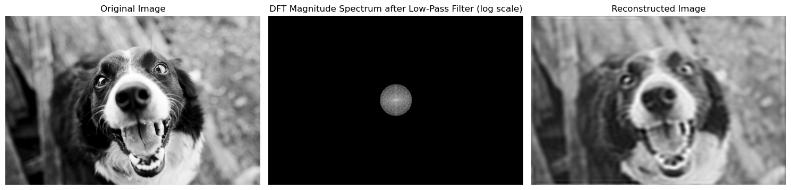
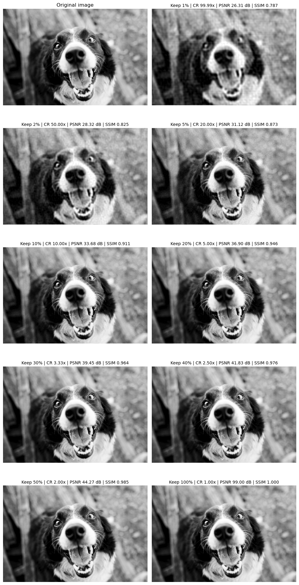

# IT3212 Assignment 2: Image Preprocessing

## Table of Contents

- [1. Fourier Transformation](#1-fourier-transformation)
  - [a. Load a grayscale image and apply the 2D Discrete Fourier Transform (DFT) to it Visualize the original image and its frequency spectrum (magnitude). Submit the images, and explanation.](#section-a)
  - [b. Implement a low-pass filter in the frequency domain to remove high-frequency noise from an image. Compare the filtered image with the original image. Submit images, and analysis of the results](#section-b)
  - [c. Implement a high-pass filter to enhance the edges in an image Visualize the filtered image and discuss the effects observed. Submit images, and explanation.](#section-c)
  - [d. Implement an image compression technique using Fourier Transform by selectively keeping only a certain percentage of the Fourier coefficients. Evaluate the quality of the reconstructed image as you vary the percentage of coefficients used. Submit the images,and your observations on image quality and compression ratio.](#section-d)

## 1. Fourier Transformation

### a. Load a grayscale image and apply the 2D Discrete Fourier Transform (DFT) to it Visualize the original image and its frequency spectrum (magnitude). Submit the images, and explanation.

   
  <em>Figure 1: Discrete fourier transformation</em>

The 2D Discrete Fourier Transform (DFT) is used in image processing to convert an image from the spatial domain to the frequency domain. In this domain, each point represents a specific frequency and orientation, with the center representing the lowest frequencies (average intensity) and the outer points representing higher frequencies (detail and sharp changes). An inverse DFT transforms the frequency representation back into the spatial domain, and reconstruct the image. 

### b. Implement a low-pass filter in the frequency domain to remove high-frequency noise from an image. Compare the filtered image with the original image. Submit images, and analysis of the results

   
  <em>Figure 2: Low-pass filter</em>

A low-pass filter in the DFT keeps the low-frequency components near the spectrum’s center and suppresses high-frequency components toward the edges. After inverse DFT, this reduces noise and fine edges, producing a smoother, denoised—but slightly blurred—image. 

### c. Implement a high-pass filter to enhance the edges in an image. Visualize the filtered image and discuss the effects observed. Submit images, and explanation.

   
  <em>Figure 3: High-pass filter</em>

### <d id="section-c"></a>c. Implement an image compression technique using Fourier Transform by selectively keeping only a certain percentage of the Fourier coefficients. Evaluate the quality of the reconstructed image as you vary the percentage of coefficients used. Submit the images, and your observations on image quality and compression ratio.

A high-pass filter in the DFT keeps the high-frequency components toward the spectrum’s edges and suppresses low-frequency components near the center. After inverse DFT, this enhances edges and fine textures, increasing sharpness but also amplifying noise and reducing smooth regions.

   
  <em>Figure 4: Discrete fourier transformation coeffisients</em>

