# IT3212 Assignment 2: Image Preprocessing

## Table of Contents

- [Fourier Transformation](#1-fourier-transformation)
  - [1. Load a grayscale image and apply the 2D Discrete Fourier Transform (DFT) to it Visualize the original image and its frequency spectrum (magnitude). Submit the images, and explanation.](#DFT-section-1)
  - [2. Implement a low-pass filter in the frequency domain to remove high-frequency noise from an image. Compare the filtered image with the original image. Submit images, and analysis of the results](#DFT-section-2)
  - [3. Implement a high-pass filter to enhance the edges in an image Visualize the filtered image and discuss the effects observed. Submit images, and explanation.](#DFT-section-3)
  - [4. Implement an image compression technique using Fourier Transform by selectively keeping only a certain percentage of the Fourier coefficients. Evaluate the quality of the reconstructed image as you vary the percentage of coefficients used. Submit the images,and your observations on image quality and compression ratio.](#DFT-section-4)

- [Principal Component Analysis](#2-principal-component-analysis)
    - [1. PCA Implementation.](#PCA-section-1)
    - [2. Reconstruction of images.](#PCA-section-2)
      - [a. Using the selected principal components, reconstruct the images.](#PCA-section-2a)
      - [b. Compare the reconstructed images with the original images to observe th effects of dimensionality reduction.](#PCA-section-2b)
    - [3. Experementation.](#PCA-section-3)
      - [a. Vary the number of principal components (k) and observe the impact on the quality of the reconstructed images.](#PCA-section-3a)
      - [b .Plot the variance explained by the principal components and determine the optimal number of components that balances compression and quality.](#PCA-section-3b)
    - [4. Visual Analysis.](#PCA-section-4)
      - [a. Display the original images alongside the reconstructed images for different values of k.](#PCA-section-4a)
      - [b. Comment on the visual quality of the images and how much information is lost during compression.](#PCA-section-4b)
    - [5. Error Analysis.](#PCA-section-5)
      - [a. Compute the Mean Squared Error (MSE) between the original and reconstructed images.](#PCA-section-5a)
      - [b. Analyze the trade-off between compression and reconstruction error.](#PCA-section-5b)

- [Histogram of Oriented Gradients Features](#3-hog)
  - [1.Write a Python script to compute the HOG features of a given image using a library such as OpenCV or scikit-image. Apply your implementation to at least three different images, including both simple and complex scenes.](#hog-section-1)
  - [2. Visualize the original image, the gradient image, and the HOG feature image. Compare the HOG features extracted from different images.](#hog-section-2)
  - [3. Discuss the impact of varying parameters like cell size, block size, and the number of bins on the resulting HOG descriptors.](#hog-section-3)

- [Local Binary Patterns](#4-lbp)
  - [1. Write a Python function to compute the LBP of a given grayscale image (basic 8-neighbor). Output the LBP image where each pixel is replaced by its corresponding LBP value.](#lbp-section-1)
  - [2. Write a Python function to compute the histogram of the LBP image. Plot the histogram and explain what it represents in terms of texture features.](#lbp-section-2)
  - [3. Apply the LBP function to at least three grayscale images (natural scene, texture, face). Generate and compare the histograms of the LBP images.](#lbp-section-3)
  - [4. Discuss the differences in the histograms and what they reveal about image textures.](#lbp-section-4)

- [Implement a Blob Detection Algorithm](#4-blob-detection)
   - [1. Apply the blob detection algorithm to one of the provided image datasets on blackborad.](#blob-section-1)
   - [2. Visualize the detected blobs on the original images, marking each detected blob with a circle or bounding box.](#blob-section-1)
   - [3. Calculate and display relevant statistics for each image, such as the number of blobs detected, their sizes, and positions.](#blob-section-3)

- [Implement a Contour Detection Algorithm](#5-contour-detection)
  - [1. Apply the contour detection algorithm to the same image dataset.](#contour-section-1)
  - [2. Visualize the detected contours on the original images, marking each contour with a different color.](#contour-section-2)
  - [3. Calculate and display relevant statistics for each image, such as the number of contours detected, contour area, and perimeter.](#contour-section-3)
  - [4. Compare the results of blob detection and contour detection for the chosen dataset.](#contour-section-4)
  - [5. Discuss the advantages and limitations of each technique.](#contour-section-5)
  - [6. Analyze the impact of different parameters (e.g., threshold values, filter sizes) on the detection results.](#contour-section-6)
  - [7. Provide examples where one technique might be more suitable than the other.](#contour-section-7)

##  Fourier Transformation

###  1. Load a grayscale image and apply the 2D Discrete Fourier Transform (DFT) to it Visualize the original image and its frequency spectrum (magnitude). Submit the images, and explanation.

  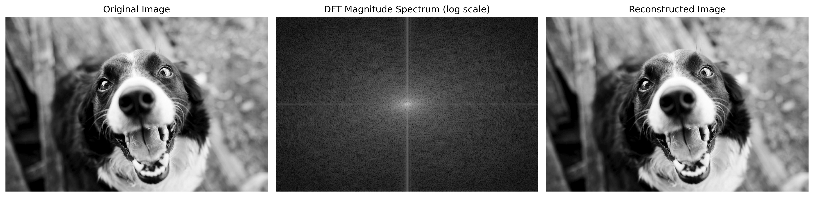 
  <em>Figure 1: Discrete fourier transformation</em>

The 2D Discrete Fourier Transform (DFT) converts an image from the spatial domain to the frequency domain. In this domain, each point encodes a sinusoidal frequency and orientation, with the center representing the lowest frequencies (average intensity) and the outer points representing higher frequencies (detail and sharp changes). An inverse DFT transforms the frequency representation back into the spatial domain, and reconstruct the image. We see this in Figure 1: the log-scale magnitude spectrum is brightest at the center (low frequencies) and sparse toward the edges (high frequencies), and the inverse DFT on the right reconstructs the image accordingly.

###  2. Implement a low-pass filter in the frequency domain to remove high-frequency noise from an image. Compare the filtered image with the original image. Submit images, and analysis of the results

   
  <em>Figure 2: Low-pass filter</em>

A low-pass filter in the DFT keeps the low-frequency components near the spectrum’s center and suppresses high-frequency components toward the edges. After applying the inverse DFT, the loss of high-frequency detail like edges and fine textures produces a blurred image, as seen in Figure 2.

###  3. Implement a high-pass filter to enhance the edges in an image. Visualize the filtered image and discuss the effects observed. Submit images, and explanation.

  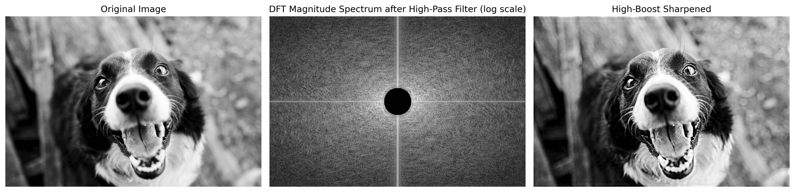 
  <em>Figure 3: High-pass filter</em>

A DFT high-pass filter preserves the high-frequency components toward the spectrum’s edges while suppressing the low-frequency components near the center. After the inverse DFT, the retained high-frequency detail emphasizes edges and fine textures, yielding a crisper, more contrasty result, as shown in Figure 3.

### <d id="DFT-section-4"></a> 4. Implement an image compression technique using Fourier Transform by selectively keeping only a certain percentage of the Fourier coefficients. Evaluate the quality of the reconstructed image as you vary the percentage of coefficients used. Submit the images, and your observations on image quality and compression ratio.

  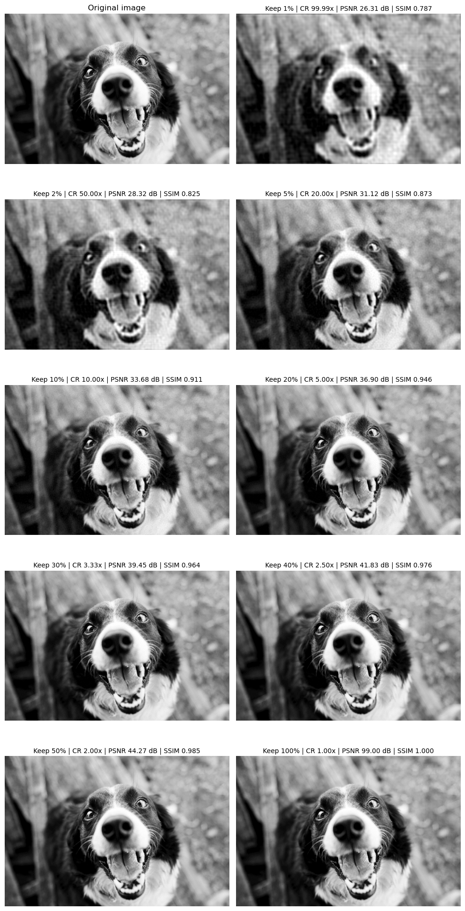 
  <em>Figure 4: Discrete fourier transformation coeffisients</em>

Keeping only a percentage of the Fourier coefficients means ranking the DFT coefficients by magnitude and retaining just the largest ones, while zeroing the rest. As the proportion of retained Fourier coefficients increases, the visual quality of the reconstructed images improves gradually, as shown in figure 4. At 0.1% of coefficients, the image is barely recognizable, only the dog’s rough outline and overall composition are visible, with fine details lost. At 1-5%, most structures and textures are restored, but thereconstructions still remain blurry. From 5%, the reconstruction becomes nearly indistinguishable from the original

  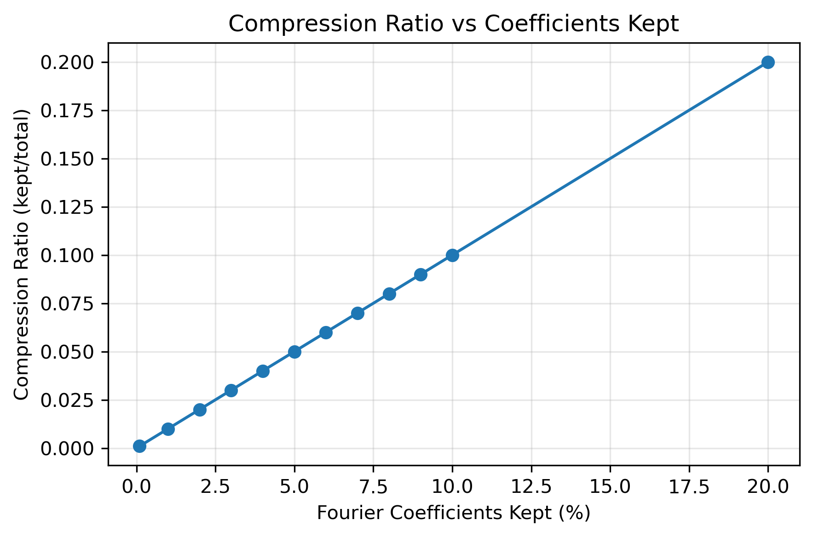 
  <em>Figure 5: Compression ratio</em>

Compression ratio (CR) measures how much an image is reduced in size, defined as original size divided by compressed size. A higher CR means stronger compression, and potentially greater quality loss. As shown in Figure 5, the compression ratio quickly approaches 1, meaning there’s little room left to compress as more coefficients are kept. Beyond ~20% of coefficients, there’s no visible quality gain over the original result. This suggests that keeping more coefficients doesn’t improve compression, it only increases method complexity and adds computational overhead.

  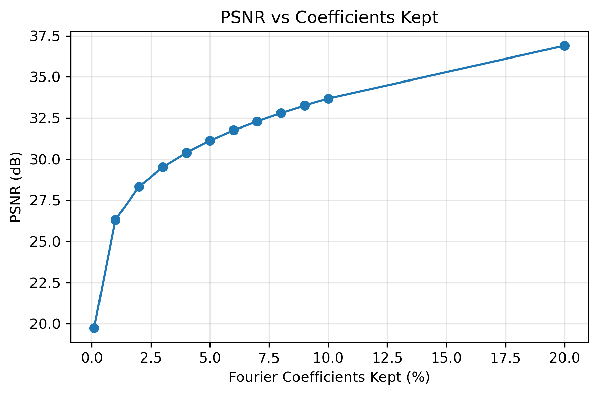 
  <em>Figure 6: Peak Signal-to-Noise Ratio</em>

Peak signal-to-noise ratio (PSNR) is the ratio between the maximum possible power of an image and the power of corrupting noise that affects the quality of its representation. n Figure 6, PSNR rises quickly at very low keep-rates, from about 20 dB at 0.1% to around 30–31 dB by 3–5%, then shows diminishing returns, reaching roughly 37 dB at 20%. About 3–5% already yields acceptable quality, while increases beyond 10% bring only small gains.

  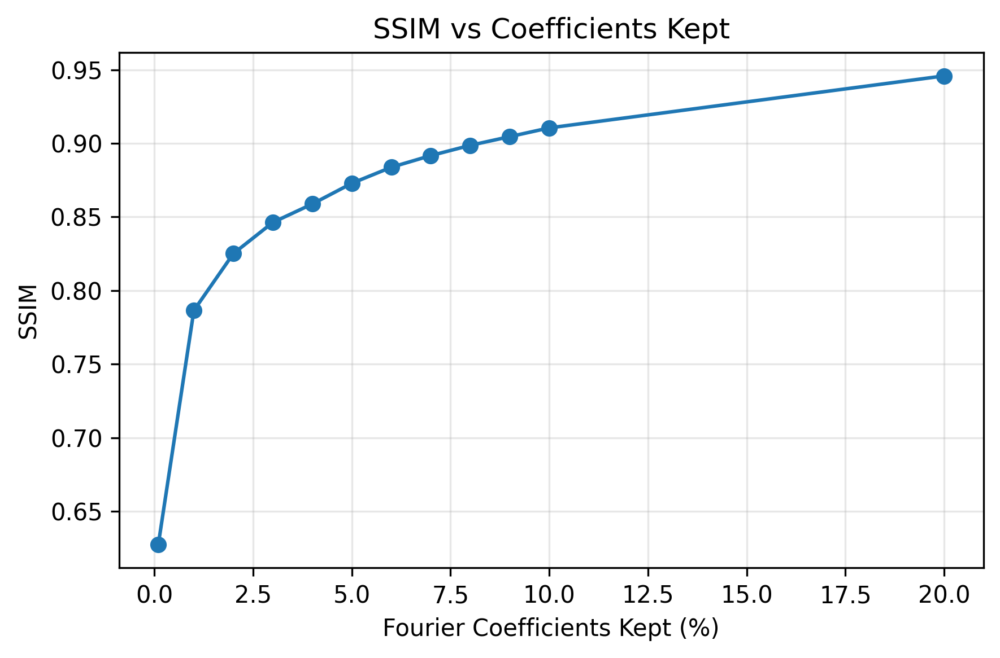 
  <em>Figure 7: Structural Similarity Index</em>

The Structural Similarity Index (SSIM) is a metric used to measure the similarity between two images by comparing luminance, contrast, and structure, where 1 indicates a perfect match. As shown in Figure 6, SSIM rises sharply at very low keep-rates and then plateaus. Beyond ~10%, additional coefficients yield only minor gains in similarity. Increasing the percentage further does not improve the quality in terms of SSIM.

##  Principal Component Analysis

### 1. PCA Implementation

### 2. Reconstruction of images

#### a. Using the selected principal components, reconstruct the images.

#### b. Compare the reconstructed images with the original images to observe the effects of dimensionality reduction.

### 3. Experimentation

#### a. Vary the number of principal components (k) and observe the impact on the quality of the reconstructed images.

#### b. Plot the variance explained by the principal components and determine the optimal number of components that balances compression and quality.

### 4. Visual Analysis

#### a. Display the original images alongside the reconstructed images for different values of k.

#### b. Comment on the visual quality of the images and how much information is lost during compression.

### 5. Error Analysis

#### a. Compute the Mean Squared Error (MSE) between the original and reconstructed images.

#### b. Analyze the trade-off between compression and reconstruction error.

##  Histogram of Oriented Gradients

### 1. Write a Python script to compute the HOG features of a given image using a library such as OpenCV or scikit-image. Apply your implementation to at least three different images, including both simple and complex scenes.

Histogram of Oriented Gradients (HOG) features capture local shape by counting how often edges point in each direction within small regions, then normalizing and concatenating those histograms into a feature vector. The x and y gradients are the horizontal and vertical changes in pixel intensity, revealing edge direction. The gradient magnitude is the overall edge strength at each pixel, used as the weight when voting into orientation bins. Together, these produce a robust descriptor for object detection. We used the skimage library to compute the HOG features of a given image.

### 3. Visualize the original image, the gradient image, and the HOG feature image. Compare the HOG features extracted from different images.

   
  <em>Figure 10: HOG features with baseline parameters</em>

### 3. Discuss the impact of varying parameters like cell size, block size, and the number of bins on the resulting HOG descriptors.

   
  <em>Figure 10: HOG features with different parameters</em>

As observed in figure 10, Smaller cells (4×4) make HOG very sensitive to fine texture and small edges, while larger cells (16×16) average local gradients and emphasize only coarse object shape/silhouette. Bigger blocks (4×4 cells) normalize over a wider area, improving illumination/contrast robustness but slightly smoothing local detail, tiny blocks (1×1) keep punchy local contrast but are less robust. Fewer orientation bins (6) give compact, coarse angle coding that highlights major contours; many bins (18) capture subtle angle changes but can add redundancy/noise.

##  Local Binary Patterns

### 1. Write a Python function to compute the LBP of a given grayscale image (basic 8-neighbor). Your function should output the LBP image, where each pixel is replaced by its corresponding LBP value.

  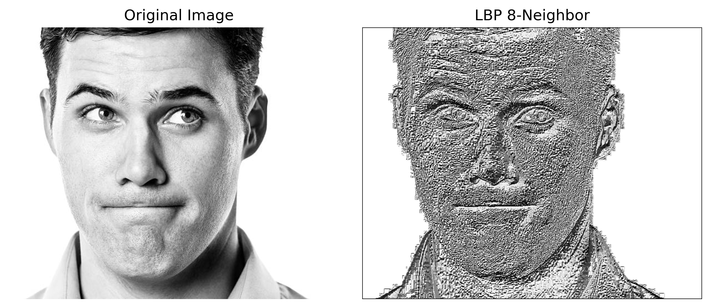 
  <em>Figure 11: LBP</em>

Local Binary Patterns (LBP) encodes local texture at each pixel by comparing the pixel's intensity to its eight immediate neighbors: 1 for each neighbor that is at least as bright as the center, otherwise 0. Reading these eight bits in a fixed order yields an 8-bit pattern that is converted to a decimal value in the range from 0 to 255, and the pixel in the LBP image is replaced by this value. Figure 11 presents the original image alongside its 8-neighbor LBP representation.

### 3. Write a Python function to compute the histogram of the LBP image. Plot the histogram and explain what it represents in terms of the texture features of the image.

  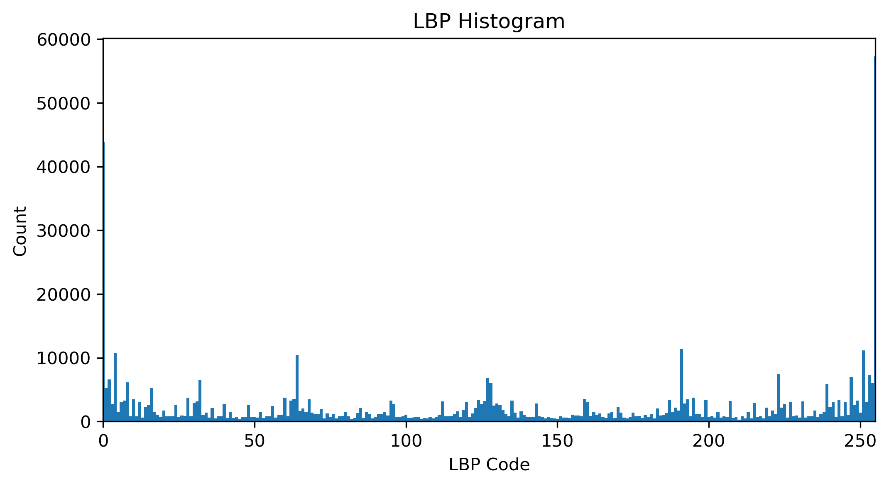 
  <em>Figure 12: LBP histogram</em>

An LBP histogram counts how many pixels in the LBP image have each code value from 0 to 255, and shows the texture distribution within the original image. The histogram is used to capture the frequency of occurrence of different texture patterns in the original image.

### 5. Apply your LBP function to at least three different grayscale images (e.g., a natural scene, a texture, and a face image). Generate and compare the histograms of the LBP images.

   
  <em>Figure 13: LBP for several images</em>

   
  <em>Figure 13: LBP by category for several images</em>

### 7. Discuss the differences in the histograms and what they tell you about the textures of the different images.

##  Implement a Blob Detection Algorithm

###  Apply the blob detection algorithm to one of the provided image datasets on blackboard.

###  Visualize the detected blobs on the original images, marking each detected blob with a circle or bounding box.

  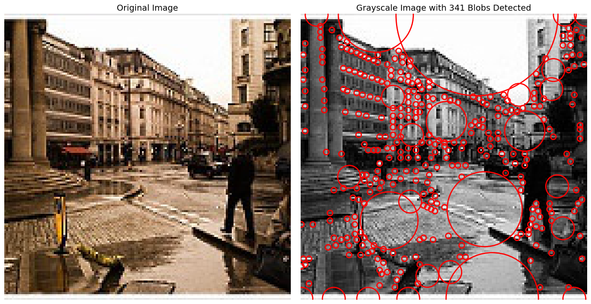 
  <em>Figure 3a Blob detection on image 1</em>

  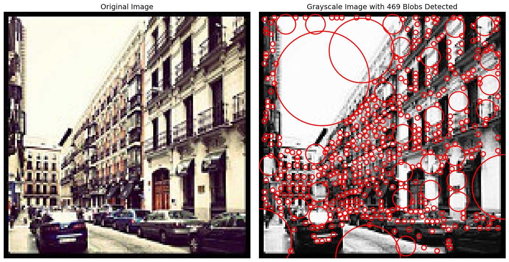 
  <em>Figure 3b Blob detection on image 2</em>

  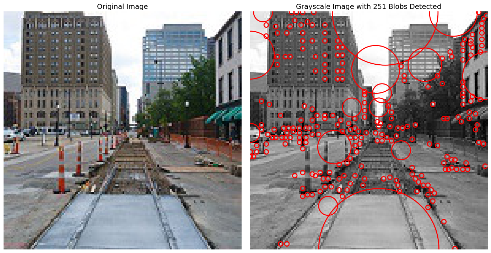 
  <em>Figure 3c Blob detection on image 3</em>

  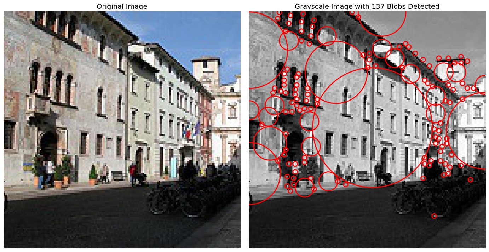 
  <em>Figure 3d Blob detection on image 4</em>

###  3. Calculate and display relevant statistics for each image, such as the number of blobs detected, their sizes, and positions.

  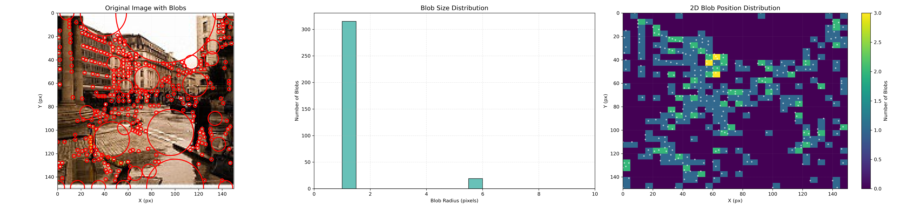 
  <em>Figure 3a Blob detection analysis on image 1</em>

  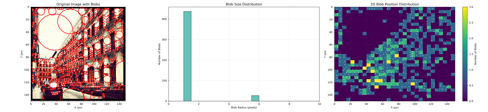 
  <em>Figure 3b Blob detection analysis on image 2</em>

  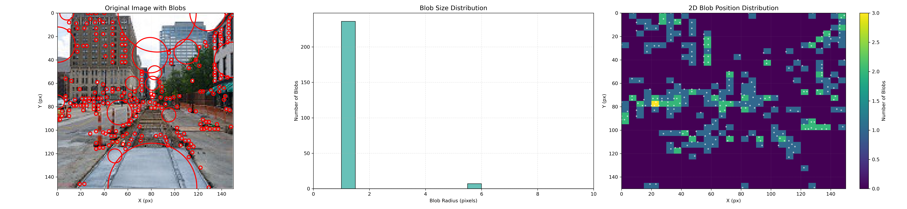 
  <em>Figure 3c Blob detection analysis on image 3</em>

  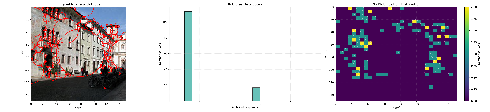 
  <em>Figure 3d Blob detection analysis on image 4</em>

   
  <em>Figure 3e Blob detection analysis on image 5</em>

###  Evaluate and discuss the effect of different parameters in the algorithms on the detection of different blobs.

##  Implement a Contour Detection Algorithm

###  1. Apply the contour detection algorithm to the same image dataset.

###  2. Visualize the detected contours on the original images, marking each contour with a different color.

   
  <em>Figure 3a Contour detection on image 1</em>

   
  <em>Figure 3a Contour detection on image 2</em>

   
  <em>Figure 3a Contour detection on image 3</em>

   
  <em>Figure 3a Contour detection on image 4</em>

   
  <em>Figure 3a Contour detection on image 5</em>

