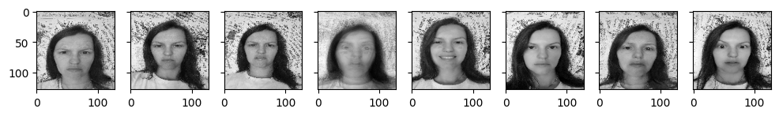
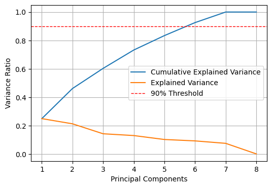
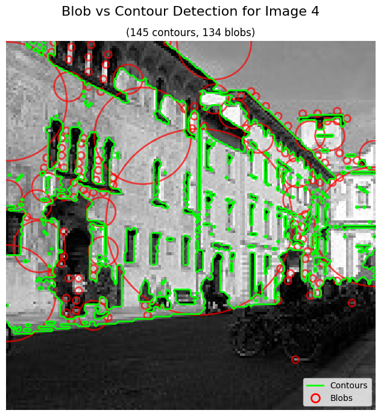

# IT3212 Assignment 2: Image Preprocessing

## Table of Contents

- [IT3212 Assignment 2: Image Preprocessing](#it3212-assignment-2-image-preprocessing)
  - [Table of Contents](#table-of-contents)
  - [ Fourier Transformation](#-fourier-transformation)
    - [ 1. Load a grayscale image and apply the 2D Discrete Fourier Transform (DFT) to it Visualize the original image and its frequency spectrum (magnitude). Submit the images, and explanation.](#-1-load-a-grayscale-image-and-apply-the-2d-discrete-fourier-transform-dft-to-it-visualize-the-original-image-and-its-frequency-spectrum-magnitude-submit-the-images-and-explanation)
    - [ 2. Implement a low-pass filter in the frequency domain to remove high-frequency noise from an image. Compare the filtered image with the original image. Submit images, and analysis of the results](#-2-implement-a-low-pass-filter-in-the-frequency-domain-to-remove-high-frequency-noise-from-an-image-compare-the-filtered-image-with-the-original-image-submit-images-and-analysis-of-the-results)
    - [ 3. Implement a high-pass filter to enhance the edges in an image. Visualize the filtered image and discuss the effects observed. Submit images, and explanation.](#-3-implement-a-high-pass-filter-to-enhance-the-edges-in-an-image-visualize-the-filtered-image-and-discuss-the-effects-observed-submit-images-and-explanation)
    - [ 4. Implement an image compression technique using Fourier Transform by selectively keeping only a certain percentage of the Fourier coefficients. Evaluate the quality of the reconstructed image as you vary the percentage of coefficients used. Submit the images, and your observations on image quality and compression ratio.](#-4-implement-an-image-compression-technique-using-fourier-transform-by-selectively-keeping-only-a-certain-percentage-of-the-fourier-coefficients-evaluate-the-quality-of-the-reconstructed-image-as-you-vary-the-percentage-of-coefficients-used-submit-the-images-and-your-observations-on-image-quality-and-compression-ratio)
  - [ Principal Component Analysis](#-principal-component-analysis)
    - [1. PCA Implementation](#1-pca-implementation)
    - [2. Reconstruction of images](#2-reconstruction-of-images)
      - [a. Using the selected principal components, reconstruct the images.](#a-using-the-selected-principal-components-reconstruct-the-images)
      - [b. Compare the reconstructed images with the original images to observe the effects of dimensionality reduction.](#b-compare-the-reconstructed-images-with-the-original-images-to-observe-the-effects-of-dimensionality-reduction)
    - [3. Experimentation](#3-experimentation)
      - [a. Vary the number of principal components (k) and observe the impact on the quality of the reconstructed images.](#a-vary-the-number-of-principal-components-k-and-observe-the-impact-on-the-quality-of-the-reconstructed-images)
      - [b. Plot the variance explained by the principal components and determine the optimal number of components that balances compression and quality.](#b-plot-the-variance-explained-by-the-principal-components-and-determine-the-optimal-number-of-components-that-balances-compression-and-quality)
    - [4. Visual Analysis](#4-visual-analysis)
      - [a. Display the original images alongside the reconstructed images for different values of k.](#a-display-the-original-images-alongside-the-reconstructed-images-for-different-values-of-k)
      - [b. Comment on the visual quality of the images and how much information is lost during compression.](#b-comment-on-the-visual-quality-of-the-images-and-how-much-information-is-lost-during-compression)
    - [5. Error Analysis](#5-error-analysis)
      - [a. Compute the Mean Squared Error (MSE) between the original and reconstructed images.](#a-compute-the-mean-squared-error-mse-between-the-original-and-reconstructed-images)
      - [b. Analyze the trade-off between compression and reconstruction error.](#b-analyze-the-trade-off-between-compression-and-reconstruction-error)
  - [ Histogram of Oriented Gradients](#-histogram-of-oriented-gradients)
    - [1. Write a Python script to compute the HOG features of a given image using a library such as OpenCV or scikit-image. Apply your implementation to at least three different images, including both simple and complex scenes.](#1-write-a-python-script-to-compute-the-hog-features-of-a-given-image-using-a-library-such-as-opencv-or-scikit-image-apply-your-implementation-to-at-least-three-different-images-including-both-simple-and-complex-scenes)
    - [3. Visualize the original image, the gradient image, and the HOG feature image. Compare the HOG features extracted from different images.](#3-visualize-the-original-image-the-gradient-image-and-the-hog-feature-image-compare-the-hog-features-extracted-from-different-images)
    - [3. Discuss the impact of varying parameters like cell size, block size, and the number of bins on the resulting HOG descriptors.](#3-discuss-the-impact-of-varying-parameters-like-cell-size-block-size-and-the-number-of-bins-on-the-resulting-hog-descriptors)
  - [ Local Binary Patterns](#-local-binary-patterns)
    - [1. Write a Python function to compute the LBP of a given grayscale image (basic 8-neighbor). Your function should output the LBP image, where each pixel is replaced by its corresponding LBP value.](#1-write-a-python-function-to-compute-the-lbp-of-a-given-grayscale-image-basic-8-neighbor-your-function-should-output-the-lbp-image-where-each-pixel-is-replaced-by-its-corresponding-lbp-value)
    - [3. Write a Python function to compute the histogram of the LBP image. Plot the histogram and explain what it represents in terms of the texture features of the image.](#3-write-a-python-function-to-compute-the-histogram-of-the-lbp-image-plot-the-histogram-and-explain-what-it-represents-in-terms-of-the-texture-features-of-the-image)
    - [5. Apply your LBP function to at least three different grayscale images (e.g., a natural scene, a texture, and a face image). Generate and compare the histograms of the LBP images.](#5-apply-your-lbp-function-to-at-least-three-different-grayscale-images-eg-a-natural-scene-a-texture-and-a-face-image-generate-and-compare-the-histograms-of-the-lbp-images)
    - [7. Discuss the differences in the histograms and what they tell you about the textures of the different images.](#7-discuss-the-differences-in-the-histograms-and-what-they-tell-you-about-the-textures-of-the-different-images)
  - [ Implement a Blob Detection Algorithm.](#-implement-a-blob-detection-algorithm)
    - [ 1. Apply the contour detection algorithm to the same image dataset. Visualize the detected contours on the original images, marking each contour with a different color.](#-1-apply-the-contour-detection-algorithm-to-the-same-image-dataset-visualize-the-detected-contours-on-the-original-images-marking-each-contour-with-a-different-color)
    - [ 2. Calculate and display relevant statistics for each image, such as the number of blobs detected, their sizes, and positions.](#-2-calculate-and-display-relevant-statistics-for-each-image-such-as-the-number-of-blobs-detected-their-sizes-and-positions)
    - [ 3. Evaluate and discuss the effect of different parameters in the algorithms on the detection of different blobs.](#-3-evaluate-and-discuss-the-effect-of-different-parameters-in-the-algorithms-on-the-detection-of-different-blobs)
  - [ Implement a Contour Detection Algorithm](#-implement-a-contour-detection-algorithm)
    - [ 1. Apply the contour detection algorithm to the same image dataset. Visualize the detected contours on the original images, marking each contour with a different color.](#-1-apply-the-contour-detection-algorithm-to-the-same-image-dataset-visualize-the-detected-contours-on-the-original-images-marking-each-contour-with-a-different-color-1)
    - [ 2. Calculate and display relevant statistics for each image, such as the number of contours detected, contour area, and perimeter.](#-2-calculate-and-display-relevant-statistics-for-each-image-such-as-the-number-of-contours-detected-contour-area-and-perimeter)
    - [ 3. Compare the results of blob detection and contour detection for the chosen dataset.](#-3-compare-the-results-of-blob-detection-and-contour-detection-for-the-chosen-dataset)
    - [ 4. Discuss the advantages and limitations of each technique.](#-4-discuss-the-advantages-and-limitations-of-each-technique)
    - [ 5. Analyze the impact of different parameters (e.g., threshold values, filter sizes) on the detection results.](#-5-analyze-the-impact-of-different-parameters-eg-threshold-values-filter-sizes-on-the-detection-results)
    - [ 6. Provide examples where one technique might be more suitable than the other.](#-6-provide-examples-where-one-technique-might-be-more-suitable-than-the-other)

##  Fourier Transformation

###  1. Load a grayscale image and apply the 2D Discrete Fourier Transform (DFT) to it Visualize the original image and its frequency spectrum (magnitude). Submit the images, and explanation.

   
  <em>Figure 1: Discrete fourier transformation</em>

The 2D Discrete Fourier Transform (DFT) converts an image from the spatial domain to the frequency domain. In this domain, each point encodes a sinusoidal frequency and orientation, with the center representing the lowest frequencies (average intensity) and the outer points representing higher frequencies (detail and sharp changes). An inverse DFT transforms the frequency representation back into the spatial domain, and reconstruct the image. We see this in Figure 1: the log-scale magnitude spectrum is brightest at the center (low frequencies) and sparse toward the edges (high frequencies), and the inverse DFT on the right reconstructs the image accordingly.

###  2. Implement a low-pass filter in the frequency domain to remove high-frequency noise from an image. Compare the filtered image with the original image. Submit images, and analysis of the results

   
  <em>Figure 2: Low-pass filter</em>

A low-pass filter in the DFT keeps the low-frequency components near the spectrum’s center and suppresses high-frequency components toward the edges. After applying the inverse DFT, the loss of high-frequency detail like edges and fine textures produces a blurred image, as seen in Figure 2.

###  3. Implement a high-pass filter to enhance the edges in an image. Visualize the filtered image and discuss the effects observed. Submit images, and explanation.

   
  <em>Figure 3: High-pass filter</em>

A DFT high-pass filter preserves the high-frequency components toward the spectrum’s edges while suppressing the low-frequency components near the center. After the inverse DFT, the retained high-frequency detail emphasizes edges and fine textures, yielding a crisper, more contrasty result, as shown in Figure 3.

### <d id="DFT-section-4"></a> 4. Implement an image compression technique using Fourier Transform by selectively keeping only a certain percentage of the Fourier coefficients. Evaluate the quality of the reconstructed image as you vary the percentage of coefficients used. Submit the images, and your observations on image quality and compression ratio.

   
  <em>Figure 4: Discrete fourier transformation coeffisients</em>

Keeping only a percentage of the Fourier coefficients means ranking the DFT coefficients by magnitude and retaining just the largest ones, while zeroing the rest. As the proportion of retained Fourier coefficients increases, the visual quality of the reconstructed images improves gradually, as shown in figure 4. At 0.1% of coefficients, the image is barely recognizable, only the dog’s rough outline and overall composition are visible, with fine details lost. At 1-5%, most structures and textures are restored, but thereconstructions still remain blurry. From 5%, the reconstruction becomes nearly indistinguishable from the original

   
  <em>Figure 5: Compression ratio</em>

Compression ratio (CR) measures how much an image is reduced in size, defined as compressed size divided by original size. A lower CR means more compression, and potentially greater quality loss, while a higher CR means less compression. As shown in figure 5, the compression ratio is linear, meaning that keeping more coefficients takes more space.

   
  <em>Figure 6: Peak Signal-to-Noise Ratio</em>

Peak signal-to-noise ratio (PSNR) is the ratio between the maximum possible power of an image and the power of corrupting noise that affects the quality of its representation. n Figure 6, PSNR rises quickly at very low keep-rates, from about 20 dB at 0.1% to around 30–31 dB by 3–5%, then shows diminishing returns, reaching roughly 37 dB at 20%. About 3–5% already yields acceptable quality, while increases beyond 10% bring only small gains.

   
  <em>Figure 7: Structural Similarity Index</em>

The Structural Similarity Index (SSIM) is a metric used to measure the similarity between two images by comparing luminance, contrast, and structure, where 1 indicates a perfect match. As shown in Figure 6, SSIM rises sharply at very low keep-rates and then plateaus. Beyond ~10%, additional coefficients yield only minor gains in similarity. Increasing the percentage further does not improve the quality in terms of SSIM.

##  Principal Component Analysis

### 1. PCA Implementation

   
  <em>Figure "1": Components</em>

   
  <em>Figure "1": Components</em>

### 2. Reconstruction of images

#### a. Using the selected principal components, reconstruct the images.

   
  <em>Figure "3": Images reconstructed with k = 6</em>

#### b. Compare the reconstructed images with the original images to observe the effects of dimensionality reduction.

   
  <em>Figure "3": Original images vs reconstructed images with k = 6</em>

### 3. Experimentation
#### a. Vary the number of principal components (k) and observe the impact on the quality of the reconstructed images.

   
  <em>Figure "4": Images reconstructed with different K's</em>

We experimented with different k's for the reconstruction of the original images. This figure ilustrates how the reconstruction increasingly aporaches an aproximation of the original images with every aditional increase of k.

#### b. Plot the variance explained by the principal components and determine the optimal number of components that balances compression and quality.

   
  <em>Figure "5": Plot for cumulative variance and individual variance per component </em>

With a threshold of 90% we see that six prinicple components would be needed to reach this level. As seen in figure 4 the images reconstructed with less than six components are considerably more blurry. Given that our dataset is a facial emotions dataset would mean that blurry images are detrimental to the intended purpose of the dataset. However, using all seven components would aproximate a full reconstruction of the original images and would constitute little compression. It can therefore be argued that in our case, if we want to compress our images we could only use six priniciple componets before it would make the subjects emotions difficult to recognize.

### 4. Visual Analysis

#### a. Display the original images alongside the reconstructed images for different values of k.

#### b. Comment on the visual quality of the images and how much information is lost during compression.

As seen in figure "3" the reconstructed images are fairly close to the original with the exeption of image nr 4(from the left). 

### 5. Error Analysis

#### a. Compute the Mean Squared Error (MSE) between the original and reconstructed images.

   
  <em>Figure "7": Orignal images comapred to reconstructed images with k = 6</em>

#### b. Analyze the trade-off between compression and reconstruction error.

   
  <em>Figure "7": Orignal images comapred to reconstructed images with k = 6</em>

In figure 7 we can see that the MSE is continually decreasing from 0.028 (k=1) to 0.0033 (k=6), and becomes aproximally 0 at k=7, which is in line with the dataset being rank n-1=7. We chose k=6 as a balance between compression and quality(PSNR ≈ 25 dB at a [0,1]-scale)

##  Histogram of Oriented Gradients

### 1. Write a Python script to compute the HOG features of a given image using a library such as OpenCV or scikit-image. Apply your implementation to at least three different images, including both simple and complex scenes.

Histogram of Oriented Gradients (HOG) features capture local shape by counting how often edges point in each direction within small regions, then normalizing and concatenating those histograms into a feature vector. The x and y gradients are the horizontal and vertical changes in pixel intensity, revealing edge direction. The gradient magnitude is the overall edge strength at each pixel, used as the weight when voting into orientation bins. Together, these produce a robust descriptor for object detection. We used the skimage library to compute the HOG features of a given image.

### 3. Visualize the original image, the gradient image, and the HOG feature image. Compare the HOG features extracted from different images.

   
  <em>Figure 10: HOG features with baseline parameters</em>

### 3. Discuss the impact of varying parameters like cell size, block size, and the number of bins on the resulting HOG descriptors.

   
  <em>Figure 10: HOG features with different parameters</em>

As shown in figure 10, using smaller cells (4×4) makes the HOG more sensitive to fine texture and details. This is most visible on the image of the strawberry, where individual seeds are much more recognizable compared to HOG with other parameters.

Larger cells (16×16) smooth local gradients and emphasize only the rough shape of the image.

Block size has less impact than cell size, but iny blocks (1×1) preserve more local contrast and are less robust to illumination/contrast changes, while large blocks (4×4 cells) normalize gradients across a wider area, improving robustness to illumination/contrast changes, but slightly smooths local variation.

The amount of orientation also doens't have the same impact as cell size, but fewer orientation bins (6) give more compact, coarse angle coding that highlights major contours, while many bins (18) capture subtle angle changes but can add redundancy/noise.

##  Local Binary Patterns

### 1. Write a Python function to compute the LBP of a given grayscale image (basic 8-neighbor). Your function should output the LBP image, where each pixel is replaced by its corresponding LBP value.

   
  <em>Figure 11: LBP</em>

Local Binary Patterns (LBP) encodes local texture at each pixel by comparing the pixel's intensity to its eight immediate neighbors: 1 for each neighbor that is at least as bright as the center, otherwise 0. Reading these eight bits in a fixed order yields an 8-bit pattern that is converted to a decimal value in the range from 0 to 255, and the pixel in the LBP image is replaced by this value. Figure 11 presents the original image alongside its 8-neighbor LBP representation.

### 3. Write a Python function to compute the histogram of the LBP image. Plot the histogram and explain what it represents in terms of the texture features of the image.

   
  <em>Figure 12: LBP histogram</em>

An LBP histogram counts how many pixels in the LBP image have each code value from 0 to 255, and shows the texture distribution within the original image. The histogram is used to capture the frequency of occurrence of different texture patterns in the original image.

In Figure 12, the LBP histogram shows tall peaks near the extreme codes (0 and 255), indicating many uniform patterns from smooth regions such as Mona Lisa’s cheeks and forehead and the sky background. Distinct clusters around 60–70 and 120–140 correspond to edge textures visible along the hairline/veil, eyelids and lips, and the neckline/garment folds highlighted in the LBP image in figure 11. Narrower peaks near 180–200 and 240–250 arise from sharper transitions in the rocky background and dress embroidery. Low, scattered bins capture the fine crackle of the paint and small stippled details across the landscape.

### 5. Apply your LBP function to at least three different grayscale images (e.g., a natural scene, a texture, and a face image). Generate and compare the histograms of the LBP images.

   
  <em>Figure 13: LBP for several images</em>

The LBP histograms clearly differentiate the three textures. For Image 1 (portrait), dominant peaks at extreme codes at 0 and 255 indicate many uniform patterns from smooth regions like the skin and sky, with secondary mid-range peaks from facial and garment edges. Image 2 (brick wall) shows concentrated, repeating mid-range peaks, reflecting the regular, edge-dominated brick pattern with fewer uniform regions. Image 3 (mountain/forest) has the broadest distribution with tall spikes across several codes, including extremes, consistent with heterogeneous, high-contrast textures from ridges, foliage, and mist. These distinct profiles demonstrate that LBP histograms capture texture smoothness, regularity, and complexity in a way that separates the images.

### 7. Discuss the differences in the histograms and what they tell you about the textures of the different images.

   
  <em>Figure 14: LBP by category for several images</em>

The categorized LBP histograms and overlays in Figure 14 separate flat (codes 0/255), uniform-edge, and corner/texture patterns, revealing distinct texture regimes. Image 1 (portrait) shows high flat counts with secondary uniform-edge peaks, the overlay places flats on skin/sky and edges along the hairline, eyes, and garment folds, typical of largely smooth surfaces with soft boundaries. Image 2 (brick wall) is dominated by repeated uniform-edge peaks and few flats, the overlay aligns these edge codes with mortar lines, indicating a regular, periodic, edge-rich texture. Image 3 (mountain/forest) has the broadest distribution and the largest corner/texture component, the overlay highlights dense non-uniform patterns over trees, ridges, and rocks, evidencing a heterogeneous, high-contrast texture field.

##  Implement a Blob Detection Algorithm. 

###  1. Apply the contour detection algorithm to the same image dataset. Visualize the detected contours on the original images, marking each contour with a different color.

Original images for reference:

   
  <em>Image 1</em>

   
  <em>Image 3</em>

   
  <em>Image 4</em>

   
  <em>Image 5</em>

Below are the same images but with the Laplacian of Gaussian (LoG) Blob Detection algorithm applied on the grayscale version of the images.

   
  <em>Figure 10a: Blob detection on image 1</em>

   
  <em>Figure 10b: Blob detection on image 2</em>

   
  <em>Figure 10c: Blob detection on image 3</em>

   
  <em>Figure 10d: Blob detection on image 4</em>

   
  <em>Figure 10e: Blob detection on image 5</em>

###  2. Calculate and display relevant statistics for each image, such as the number of blobs detected, their sizes, and positions.

   
  <em>Figure 12a: Statistics for blob detection on image 1</em>

   
  <em>Figure 12b: Statistics for blob detection on image 2</em>

   
  <em>Figure 12c: Statistics for blob detection on image 3</em>

   
  <em>Figure 12d: Statistics for blob detection on image 4</em>

   
  <em>Figure 12e: Statistics for blob detection on image 5</em>

###  3. Evaluate and discuss the effect of different parameters in the algorithms on the detection of different blobs.

As mentioned above, our blob detection algorithm uses the Laplacian of Gaussian (LoG) method from skimage.feature.blob_log.

As mentioned above, our blob detection algorithm uses the Laplacian of Gaussian (LoG) method from skimage.feature.blob_log.

The `max_sigma` parameter defines the maximum standard deviation for the Gaussian kernel and essentially sets the upper limit for the size of blobs that can be detected. We have set this to 30, which allows detection of relatively large blobs.\
If `max_sigma` is set too low, larger blobs will not be detected at all. On the other hand, a high value can lead to the detection of large, low-contrast regions that may not correspond to meaningful features.

The `num_sigma` parameter defines how many intermediate scales are tested between $0$ and `max_sigma`. We set a value value of $10$ so our code checks 10 different scales. Increasing this number can improve the precision of blob detection, especially for blobs that do not fall neatly into one of the predefined scales. However this can also greatly increases computational complexity.

The `threshold` parameter determines the minimum intensity difference required for a region to be considered a blob. A low `threshold` like $0.05$ makes the algorithm more sensitive, allowing it to detect faint or low-contrast blobs, but it may also detect noise.\
Conversely, a high `threshold` like $0.2$ makes the detection stricter, potentially missing subtle features while reducing false positives.

The overlay of detected blobs on grayscale and RGB images helps confirm whether the blobs align with visually identifiable features or not.\
Histograms of blob sizes reveal the distribution of detected radii across images and can indicate whether certain sizes are being over- or under-represented.\
The 2D heatmaps of blob positions show where blobs tend to occur spatially, revealing patterns or clustering, and can also highlight issues such as biased detection in bright regions due to thresholding.

##  Implement a Contour Detection Algorithm

###  1. Apply the contour detection algorithm to the same image dataset. Visualize the detected contours on the original images, marking each contour with a different color.

Below are the same images but with the Marching Squares contour detection algorithm (skimage.measure.find_contours) applied on the grayscale version of the images.

   
  <em>Figure 13a: Contour detection on image 1</em>

   
  <em>Figure 13b: Contour detection on image 2</em>

   
  <em>Figure 13c: Contour detection on image 3</em>

   
  <em>Figure 13d: Contour detection on image 4</em>

   
  <em>Figure 13e: Contour detection on image 5</em>

###  2. Calculate and display relevant statistics for each image, such as the number of contours detected, contour area, and perimeter.

  
  
   
  <em>Figure 15a: Statistics for contour detection on image 1</em>

  
   
  <em>Figure 15b: Statistics for contour detection on image 2</em>

  
   
  <em>Figure 15c: Statistics for contour detection on image 3</em>

  
   
  <em>Figure 15d: Statistics for contour detection on image 4</em>

  
   
  <em>Figure 15e: Statistics for contour detection on image 5</em>

<!-- HISTOGRAMS -->

   
  <em>Figure 15f: Histogram of statistics for contour detection on image 1</em>

   
  <em>Figure 15g: Histogram of statistics for contour detection on image 2</em>

   
  <em>Figure 15i: Histogram of statistics for contour detection on image 3</em>

   
  <em>Figure 15j: Histogram of statistics for contour detection on image 4</em>

   
  <em>Figure 15k: Histogram of statistics for contour detection on image 5</em>

###  3. Compare the results of blob detection and contour detection for the chosen dataset.

   
  <em>Figure 16a: Blob vs contour detection on image 1</em>

   
  <em>Figure 16b: Blob vs contour detection on image 2</em>

   
  <em>Figure 16c: Blob vs contour detection on image 3</em>

   
  <em>Figure 16d: Blob vs contour detection on image 4</em>

   
  <em>Figure 16e: Blob vs contour detection on image 5</em>

###  4. Discuss the advantages and limitations of each technique.

Blob detection is efficient at identifying roughly circular regions and provides quick localization and size estimates, making it ideal for detecting spots or particles across multiple scales.

However, it lacks detailed shape information and struggles with irregular or complex objects.

Contour detection, on the other hand, excels at outlining precise object boundaries and capturing detailed shape features, which is valuable for morphological analysis.

Its effectiveness depends heavily on image quality and edge definition, and it can be computationally more intensive and sensitive to noise.

So blob detection is best for fast, approximate feature localization, while contour detection is preferred when detailed shape and boundary information is required.

###  5. Analyze the impact of different parameters (e.g., threshold values, filter sizes) on the detection results.

   
  <em>Figure 17a: Histogram of statistics for contour detection on image 1</em>

   
  <em>Figure 17b: Histogram of statistics for contour detection on image 1</em>

The performance of both blob and contour detection methods is sensitive to parameters like threshold values and filter sizes.

In blob detection, adjusting the `threshold` controls the sensitivity.

Lower thresholds detect more blobs but increase false positives, while higher thresholds reduce noise but may miss subtle features. Similarly, the choice of `max_sigma` and `num_sigma` affects the scale range and granularity of detected blobs.

For contour detection, the threshold used in binarization critically impacts which features are segmented, a too low threshold may merge objects or include noise, while too high may fragment or miss contours.

Additionally, morphological operations like removing small objects depend on filter sizes that balance noise reduction against losing small meaningful contours.

###  6. Provide examples where one technique might be more suitable than the other.

Blob detection is more suitable in applications where the target objects are roughly circular and uniformly bright or dark against the background.\
For example, detecting cells in microscopy images, stars in astronomical images, or bubbles in fluid simulations.

Its strength lies in quick localization and size estimation of round features across different scales.

In contrast, contour detection is ideal when precise object boundaries and shape details are essential, such as in medical image analysis, character recognition, or analyzing irregularly shaped objects like leaves or cracks.

It enables detailed morphological analysis, making it preferable when shape complexity and boundary accuracy matter more than speed or rough position.

