# IT3212 Assignment 2: Image Preprocessing

## Table of Contents

- [Fourier Transformation](#1-fourier-transformation)
  - [1. Load a grayscale image and apply the 2D Discrete Fourier Transform (DFT) to it Visualize the original image and its frequency spectrum (magnitude). Submit the images, and explanation.](#DFT-section-1)
  - [2. Implement a low-pass filter in the frequency domain to remove high-frequency noise from an image. Compare the filtered image with the original image. Submit images, and analysis of the results](#DFT-section-2)
  - [3. Implement a high-pass filter to enhance the edges in an image Visualize the filtered image and discuss the effects observed. Submit images, and explanation.](#DFT-section-3)
  - [4. Implement an image compression technique using Fourier Transform by selectively keeping only a certain percentage of the Fourier coefficients. Evaluate the quality of the reconstructed image as you vary the percentage of coefficients used. Submit the images,and your observations on image quality and compression ratio.](#DFT-section-4)

- [Principal Component Analysis](#2-principal-component-analysis)
    - [1. PCA Implementation.](#PCA-section-1)
    - [2. Reconstruction of images.](#PCA-section-2)
      - [a. Using the selected principal components, reconstruct the images.](#PCA-section-2a)
      - [b. Compare the reconstructed images with the original images to observe th effects of dimensionality reduction.](#PCA-section-2b)
    - [3. Experementation.](#PCA-section-3)
      - [a. Vary the number of principal components (k) and observe the impact on the quality of the reconstructed images.](#PCA-section-3a)
      - [b .Plot the variance explained by the principal components and determine the optimal number of components that balances compression and quality.](#PCA-section-3b)
    - [4. Visual Analysis.](#PCA-section-4)
      - [a. Display the original images alongside the reconstructed images for different values of k.](#PCA-section-4a)
      - [b. Comment on the visual quality of the images and how much information is lost during compression.](#PCA-section-4b)
    - [5. Error Analysis.](#PCA-section-5)
      - [a. Compute the Mean Squared Error (MSE) between the original and reconstructed images.](#PCA-section-5a)
      - [b. Analyze the trade-off between compression and reconstruction error.](#PCA-section-5b)

- [Local Binary Patterns](#3-local-binary-patterns)

- [Implement a Blob Detection Algorithm](#4-blob-detection)
   - [1. Apply the blob detection algorithm to one of the provided image datasets on blackborad.](#blob-section-1)
   - [2. Visualize the detected blobs on the original images, marking each detected blob with a circle or bounding box.](#blob-section-1)
   - [3. Calculate and display relevant statistics for each image, such as the number of blobs detected, their sizes, and positions.](#blob-section-3)

- [Implement a Contour Detection Algorithm](#5-contour-detection)
  - [1. Apply the contour detection algorithm to the same image dataset.](#contour-section-1)
  - [2. Visualize the detected contours on the original images, marking each contour with a different color.](#contour-section-2)
  - [3. Calculate and display relevant statistics for each image, such as the number of contours detected, contour area, and perimeter.](#contour-section-3)
  - [4. Compare the results of blob detection and contour detection for the chosen dataset.](#contour-section-4)
  - [5. Discuss the advantages and limitations of each technique.](#contour-section-5)
  - [6. Analyze the impact of different parameters (e.g., threshold values, filter sizes) on the detection results.](#contour-section-6)
  - [7. Provide examples where one technique might be more suitable than the other.](#contour-section-7)

##  Fourier Transformation

###  1. Load a grayscale image and apply the 2D Discrete Fourier Transform (DFT) to it Visualize the original image and its frequency spectrum (magnitude). Submit the images, and explanation.

   
  <em>Figure 1: Discrete fourier transformation</em>

The 2D Discrete Fourier Transform (DFT) is used in image processing to convert an image from the spatial domain to the frequency domain. In this domain, each point represents a specific frequency and orientation, with the center representing the lowest frequencies (average intensity) and the outer points representing higher frequencies (detail and sharp changes). An inverse DFT transforms the frequency representation back into the spatial domain, and reconstruct the image. This technique is used for tasks like image filtering, compression and noice reduction by filtering high- and low frequencies.

###  2. Implement a low-pass filter in the frequency domain to remove high-frequency noise from an image. Compare the filtered image with the original image. Submit images, and analysis of the results

A low-pass filter in the DFT keeps the low-frequency components near the spectrum’s center and suppresses high-frequency components toward the edges. After applying the inverse DFT, the loss of high-frequency detail like edges and fine textures produces a blurred image, as seen in Figure 2.

   
  <em>Figure 2: Low-pass filter</em>

###  3. Implement a high-pass filter to enhance the edges in an image. Visualize the filtered image and discuss the effects observed. Submit images, and explanation.

A DFT high-pass filter preserves the high-frequency components toward the spectrum’s edges while suppressing the low-frequency components near the center. After the inverse DFT, the retained high-frequency detail emphasizes edges and fine textures, yielding a crisper, more contrasty result, as shown in Figure 3.

  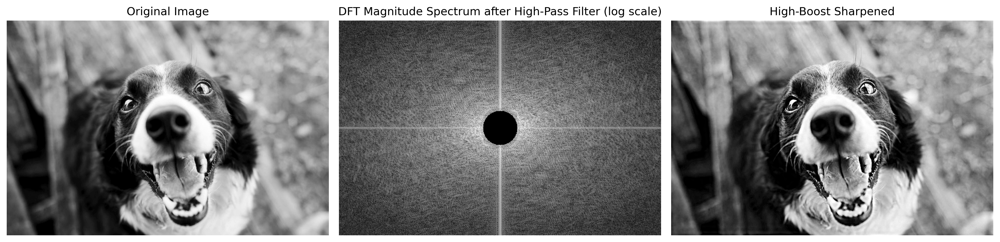 
  <em>Figure 3: High-pass filter</em>

### <d id="DFT-section-4"></a> 4. Implement an image compression technique using Fourier Transform by selectively keeping only a certain percentage of the Fourier coefficients. Evaluate the quality of the reconstructed image as you vary the percentage of coefficients used. Submit the images, and your observations on image quality and compression ratio.

   
  <em>Figure 4: Discrete fourier transformation coeffisients</em>

Keeping only a percentage of the Fourier coefficients means ranking the DFT coefficients by magnitude and retaining just the largest oneswhile zeroing the rest. As the proportion of retained Fourier coefficients increases, the reconstructed image quality improves gradually. 

When keeping only 1–5% of the coefficients, the image remains recognizable but appears blurred and lacks detail. At 10–20%, most structures and textures are restored, showing a noticeable enhancement in visual quality. From 30–50%, the reconstruction becomes nearly indistinguishable from the original, with PSNR values exceeding 40 dB. These results demonstrate that the essential visual information is concentrated in a small fraction of large-magnitude Fourier coefficients, enabling strong compression with minimal perceptual loss — effectively balancing compression ratio and image fidelity.

##  Principal Component Analysis

### 1. PCA Implementation

### 2. Reconstruction of images

#### a. Using the selected principal components, reconstruct the images.

#### b. Compare the reconstructed images with the original images to observe the effects of dimensionality reduction.

### 3. Experimentation

#### a. Vary the number of principal components (k) and observe the impact on the quality of the reconstructed images.

#### b. Plot the variance explained by the principal components and determine the optimal number of components that balances compression and quality.

### 4. Visual Analysis

#### a. Display the original images alongside the reconstructed images for different values of k.

#### b. Comment on the visual quality of the images and how much information is lost during compression.

### 5. Error Analysis

#### a. Compute the Mean Squared Error (MSE) between the original and reconstructed images.

#### b. Analyze the trade-off between compression and reconstruction error.

##  Implement a Blob Detection Algorithm

### 1. Apply the blob detection algorithm to one of the provided image datasets on blackboard.

Original images for reference:

   
  <em>Image 1</em>

   
  <em>Image 3</em>

   
  <em>Image 4</em>

  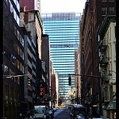 
  <em>Image 5</em>

Below are the same images but with the Laplacian of Gaussian (LoG) Blob Detection algorithm applied on the grayscale version of the images.

  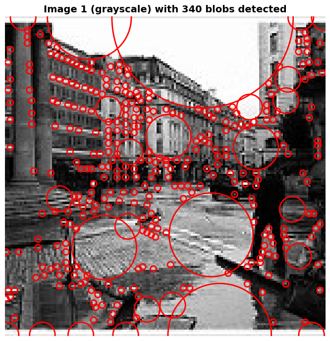 
  <em>Figure 10a: Blob detection on image 1</em>

  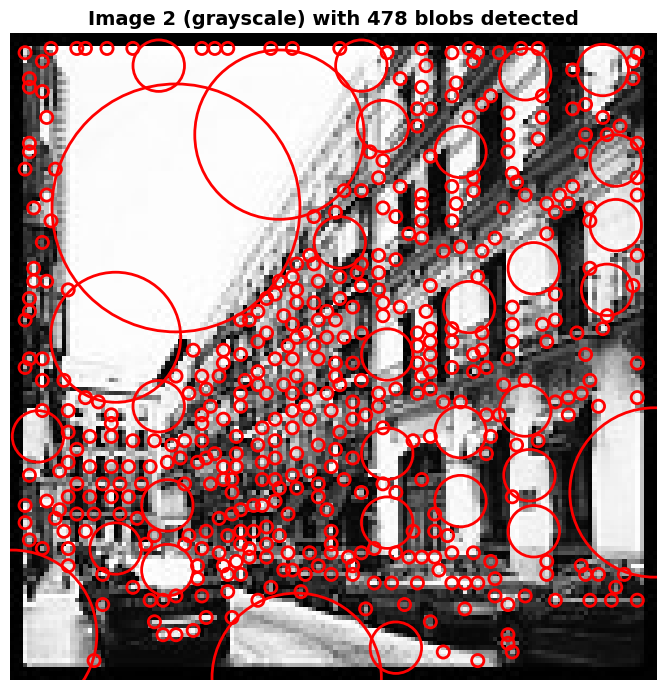 
  <em>Figure 10b: Blob detection on image 2</em>

  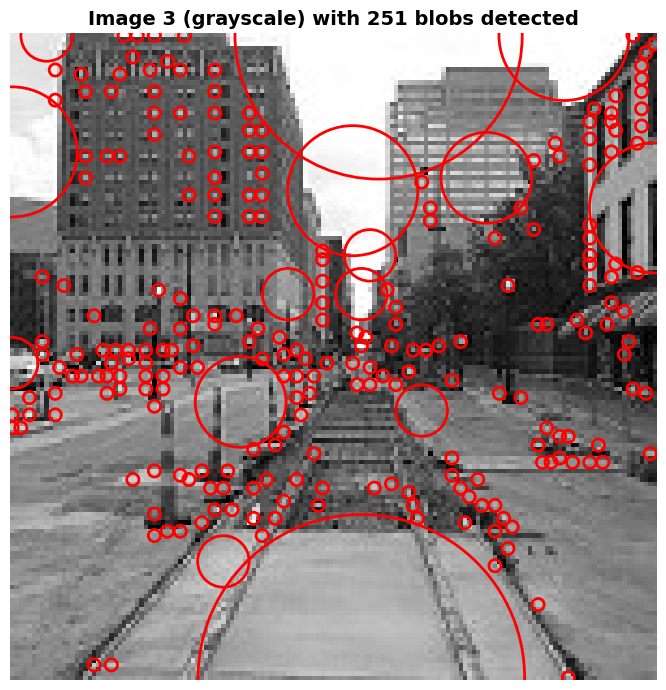 
  <em>Figure 10c: Blob detection on image 3</em>

   
  <em>Figure 10d: Blob detection on image 4</em>

   
  <em>Figure 10e: Blob detection on image 5</em>

### 2. Visualize the detected blobs on the original images, marking each detected blob with a circle or bounding box.

   
  <em>Figure 11a: Blob detection on image 1</em>

   
  <em>Figure 11b: Blob detection on image 2</em>

   
  <em>Figure 11c: Blob detection on image 3</em>

   
  <em>Figure 11d: Blob detection on image 4</em>

   
  <em>Figure 11e: Blob detection on image 5</em>

### 3. Calculate and display relevant statistics for each image, such as the number of blobs detected, their sizes, and positions.

  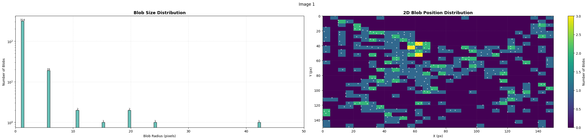 
  <em>Figure 12a: Statistics for blob detection on image 1</em>

   
  <em>Figure 12b: Statistics for blob detection on image 2</em>

  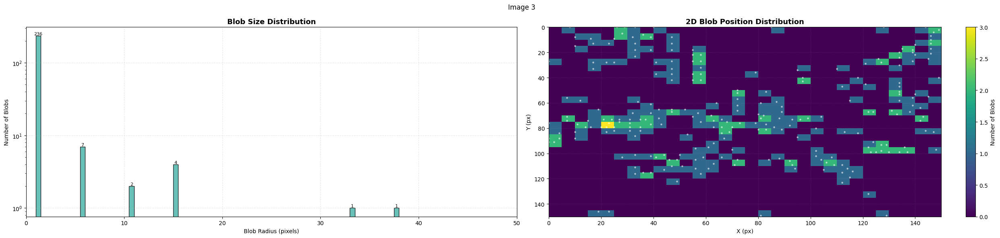 
  <em>Figure 12c: Statistics for blob detection on image 3</em>

  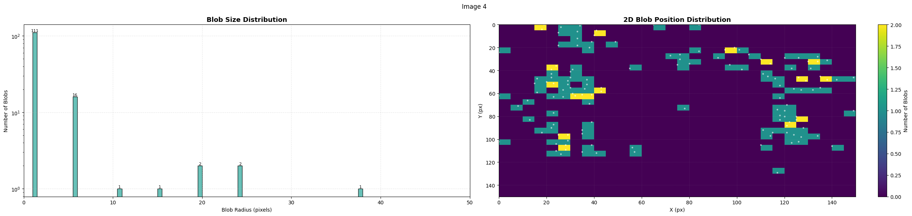 
  <em>Figure 12d: Statistics for blob detection on image 4</em>

   
  <em>Figure 12e: Statistics for blob detection on image 5</em>

### 4. Evaluate and discuss the effect of different parameters in the algorithms on the detection of different blobs.

As mentioned above, our blob detection algorithm uses the Laplacian of Gaussian (LoG) method from skimage.feature.blob_log.

The `max_sigma` parameter defines the maximum standard deviation for the Gaussian kernel and essentially sets the upper limit for the size of blobs that can be detected. We have set this to 30, which allows detection of relatively large blobs.\
If `max_sigma` is set too low, larger blobs will not be detected at all. On the other hand, a high value can lead to the detection of large, low-contrast regions that may not correspond to meaningful features.

The `num_sigma` parameter defines how many intermediate scales are tested between $0$ and `max_sigma`. We set a value value of $10$ so our code checks 10 different scales. Increasing this number can improve the precision of blob detection, especially for blobs that do not fall neatly into one of the predefined scales. However this can also greatly increases computational complexity.

The `threshold` parameter determines the minimum intensity difference required for a region to be considered a blob. A low `threshold` like $0.05$ makes the algorithm more sensitive, allowing it to detect faint or low-contrast blobs, but it may also detect noise.\
Conversely, a high `threshold` like $0.2$ makes the detection stricter, potentially missing subtle features while reducing false positives.

The overlay of detected blobs on grayscale and RGB images helps confirm whether the blobs align with visually identifiable features or not.\
Histograms of blob sizes reveal the distribution of detected radii across images and can indicate whether certain sizes are being over- or under-represented.\
The 2D heatmaps of blob positions show where blobs tend to occur spatially, revealing patterns or clustering, and can also highlight issues such as biased detection in bright regions due to thresholding.

##  Implement a Contour Detection Algorithm

###  1. Apply the contour detection algorithm to the same image dataset.

Below are the same images but with the Marching Squares contour detection algorithm (skimage.measure.find_contours) applied on the grayscale version of the images.

   
  <em>Figure 13a: Contour detection on image 1</em>

   
  <em>Figure 13b: Contour detection on image 2</em>

   
  <em>Figure 13c: Contour detection on image 3</em>

  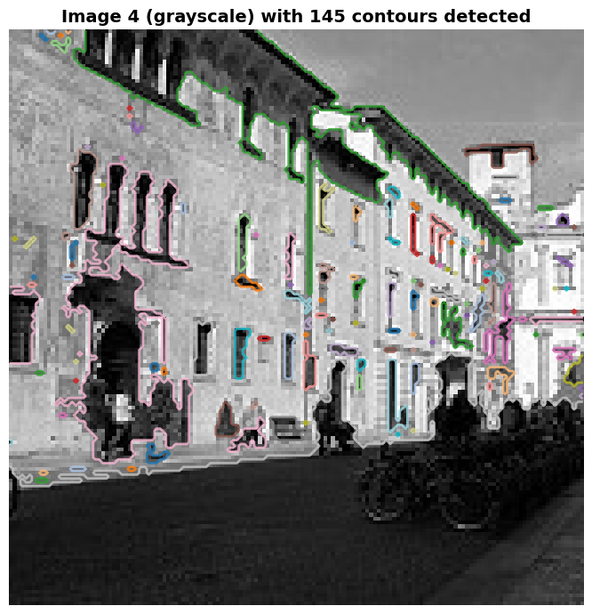 
  <em>Figure 13d: Contour detection on image 4</em>

   
  <em>Figure 13e: Contour detection on image 5</em>

###  2. Visualize the detected contours on the original images, marking each contour with a different color.

   
  <em>Figure 14a: Contour detection on image 1</em>

   
  <em>Figure 14b: Contour detection on image 2</em>

   
  <em>Figure 14c: Contour detection on image 3</em>

   
  <em>Figure 14d: Contour detection on image 4</em>

   
  <em>Figure 14e: Contour detection on image 5</em>

###  3. Calculate and display relevant statistics for each image, such as the number of contours detected, contour area, and perimeter.

  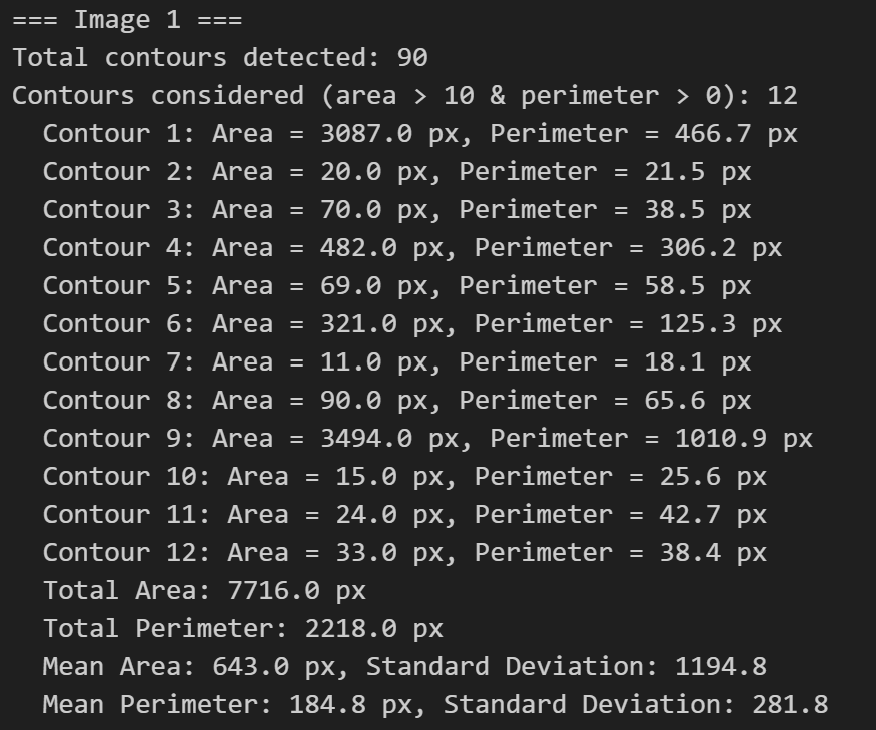
  
   
  <em>Figure 15a: Statistics for contour detection on image 1</em>

  
  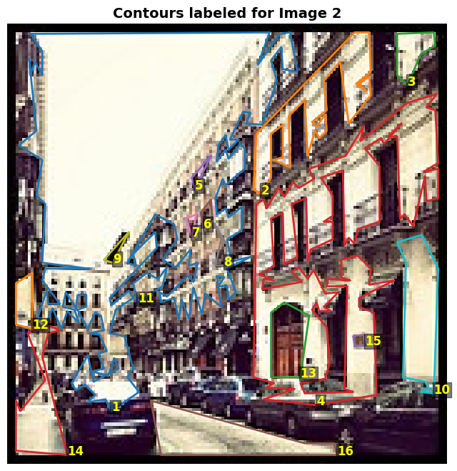 
  <em>Figure 15b: Statistics for contour detection on image 2</em>

  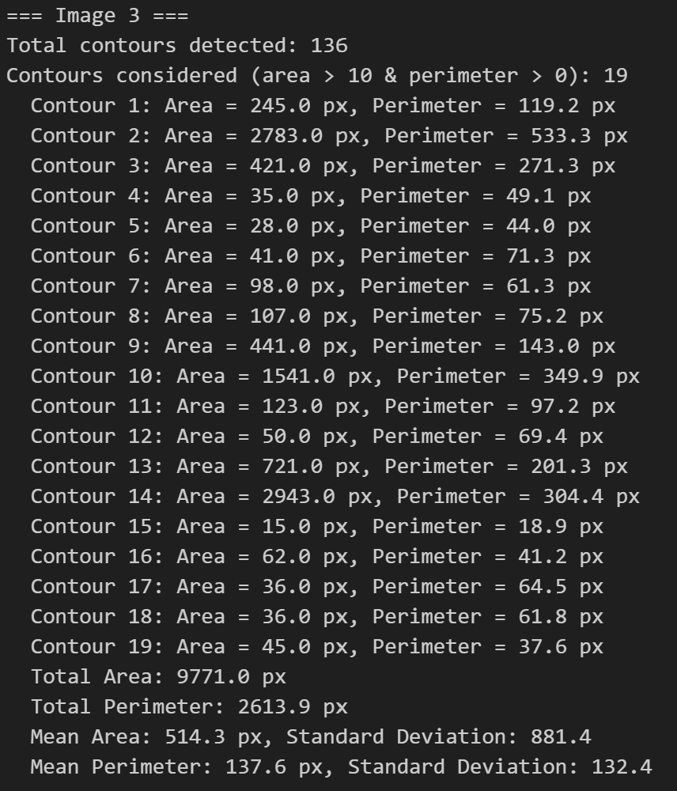
   
  <em>Figure 15c: Statistics for contour detection on image 3</em>

  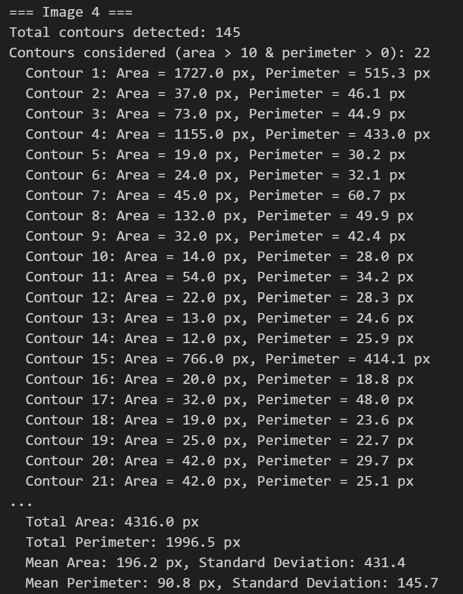
   
  <em>Figure 15d: Statistics for contour detection on image 4</em>

  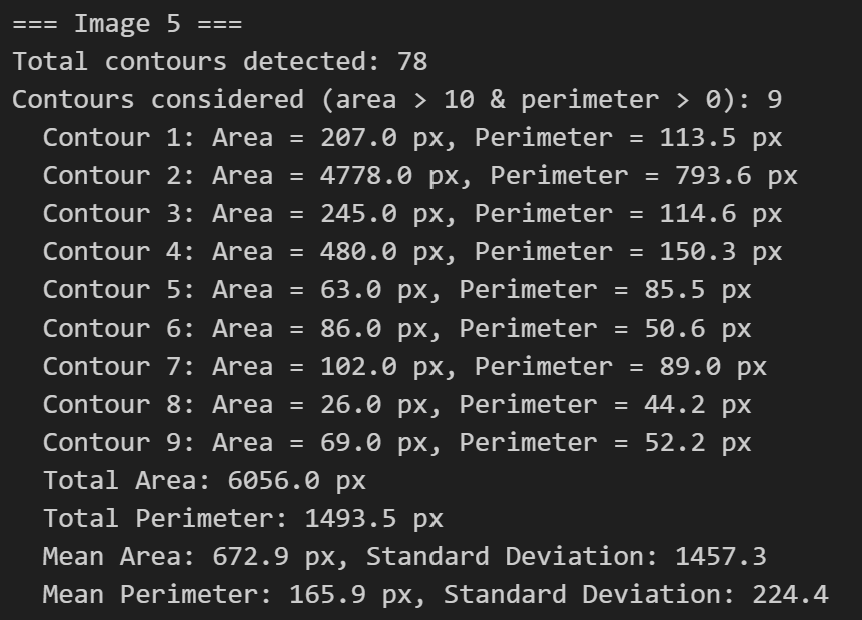
   
  <em>Figure 15e: Statistics for contour detection on image 5</em>

<!-- HISTOGRAMS -->

   
  <em>Figure 15f: Histogram of statistics for contour detection on image 1</em>

   
  <em>Figure 15g: Histogram of statistics for contour detection on image 2</em>

   
  <em>Figure 15i: Histogram of statistics for contour detection on image 3</em>

  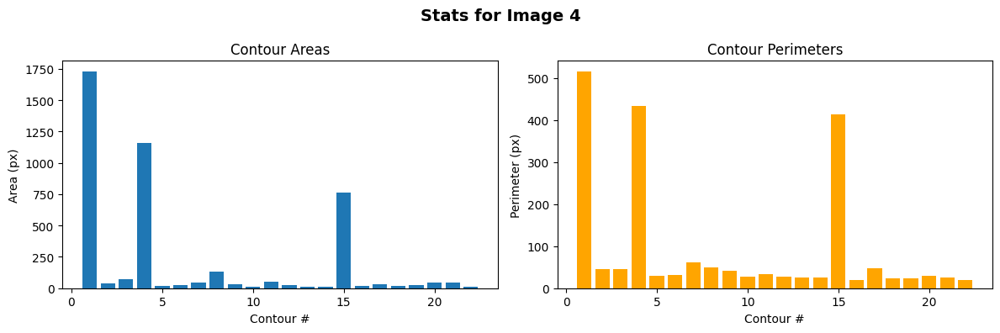 
  <em>Figure 15j: Histogram of statistics for contour detection on image 4</em>

   
  <em>Figure 15k: Histogram of statistics for contour detection on image 5</em>

###  4. Compare the results of blob detection and contour detection for the chosen dataset.

   
  <em>Figure 16a: Blob vs contour detection on image 1</em>

  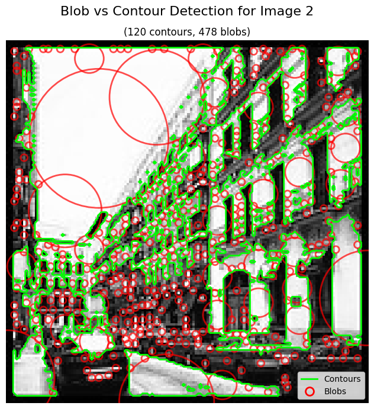 
  <em>Figure 16b: Blob vs contour detection on image 2</em>

  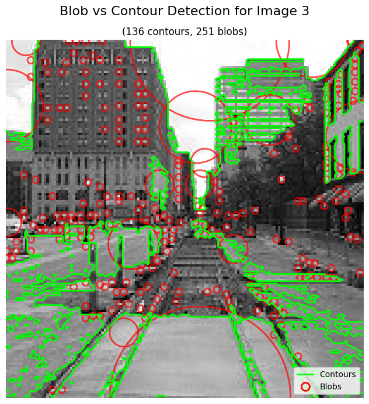 
  <em>Figure 16c: Blob vs contour detection on image 3</em>

   
  <em>Figure 16d: Blob vs contour detection on image 4</em>

  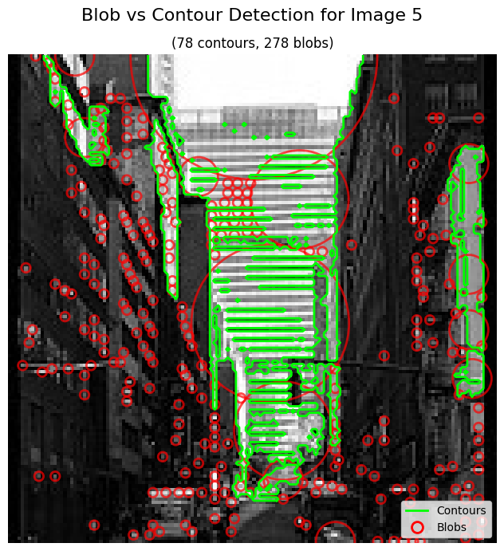 
  <em>Figure 16e: Blob vs contour detection on image 5</em>

###  5. Discuss the advantages and limitations of each technique.

Blob detection is efficient at identifying roughly circular regions and provides quick localization and size estimates, making it ideal for detecting spots or particles across multiple scales.\
However, it lacks detailed shape information and struggles with irregular or complex objects.\
Contour detection, on the other hand, excels at outlining precise object boundaries and capturing detailed shape features, which is valuable for morphological analysis.\
Its effectiveness depends heavily on image quality and edge definition, and it can be computationally more intensive and sensitive to noise.\
So blob detection is best for fast, approximate feature localization, while contour detection is preferred when detailed shape and boundary information is required.

###  6. Analyze the impact of different parameters (e.g., threshold values, filter sizes) on the detection results.

  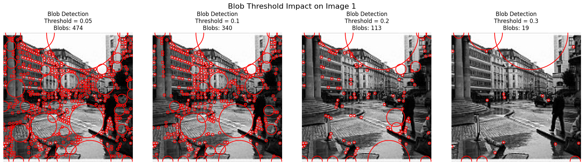 
  <em>Figure 17a: Histogram of statistics for contour detection on image 1</em>

  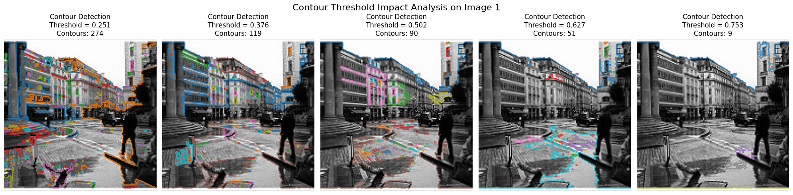 
  <em>Figure 17b: Histogram of statistics for contour detection on image 1</em>

The performance of both blob and contour detection methods is sensitive to parameters like threshold values and filter sizes.\
In blob detection, adjusting the `threshold` controls the sensitivity.\
Lower thresholds detect more blobs but increase false positives, while higher thresholds reduce noise but may miss subtle features. Similarly, the choice of `max_sigma` and `num_sigma` affects the scale range and granularity of detected blobs.\
For contour detection, the threshold used in binarization critically impacts which features are segmented, a too low threshold may merge objects or include noise, while too high may fragment or miss contours.\
Additionally, morphological operations like removing small objects depend on filter sizes that balance noise reduction against losing small meaningful contours.

###  7. Provide examples where one technique might be more suitable than the other.

Blob detection is more suitable in applications where the target objects are roughly circular and uniformly bright or dark against the background.\
For example, detecting cells in microscopy images, stars in astronomical images, or bubbles in fluid simulations.\
Its strength lies in quick localization and size estimation of round features across different scales.\
In contrast, contour detection is ideal when precise object boundaries and shape details are essential, such as in medical image analysis, character recognition, or analyzing irregularly shaped objects like leaves or cracks.\
It enables detailed morphological analysis, making it preferable when shape complexity and boundary accuracy matter more than speed or rough position.

