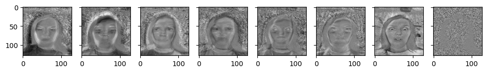
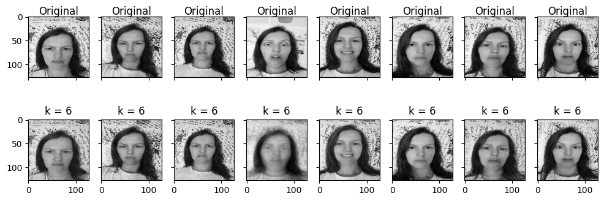
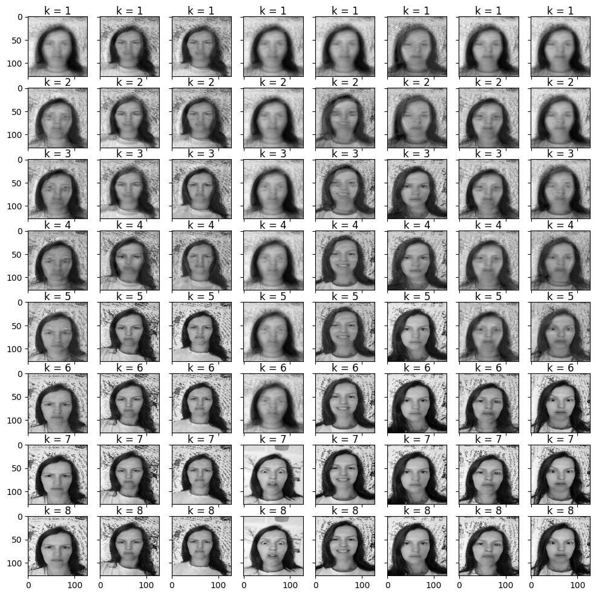
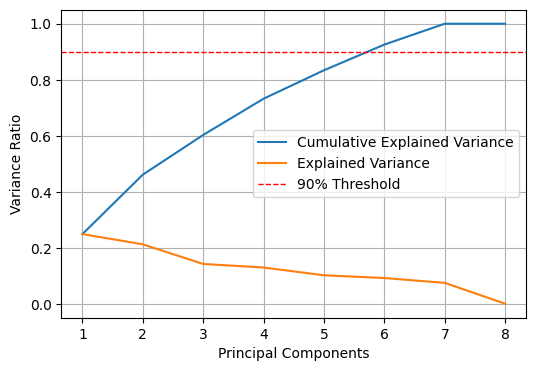
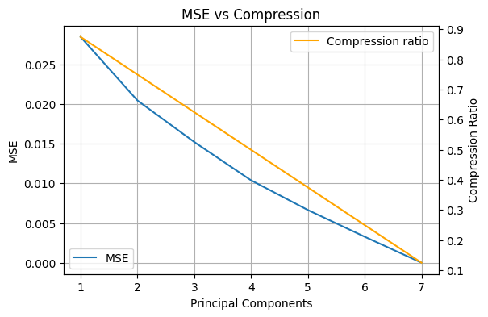

### PCA

PCA (25 points)
Select a set of grayscale images (e.g., faces, landscapes, or any other category).
Normalize the images by scaling pixel values to a range [0, 1].
PCA Implementation:
Write a Python function to perform PCA on the images.
Implement the following steps:
1. Convert the image into a 2D matrix where each row represents an image and each column represents a pixel value.
   
2. Compute the covariance matrix of the image data.
   
3. Calculate the eigenvalues and eigenvectors of the covariance matrix.
   
4. Sort the eigenvectors based on the eigenvalues in descending order.
   
5. Select the top k eigenvectors to form the principal components.
   
6. Project the original images onto the lower-dimensional subspace defined by the selected principal components.

   
  <em>Figure "1": Components</em>

Reconstruction of Images:

1. Using the selected principal components, reconstruct the images.

   
  <em>Figure "2": Images reconstructed with k = 6</em>

2. Compare the reconstructed images with the original images to observe the effects of
dimensionality reduction.

   
  <em>Figure "3": Original images vs reconstructed images with k = 6</em>

Experimentation:
1. Vary the number of principal components (k) and observe the impact on the quality of the
reconstructed images.

   
  <em>Figure "4": Images reconstructed with different K's</em>

We experimented with different k's for the reconstruction of the original images. This figure ilustrates how the reconstruction increasingly aporaches an aproximation of the original images with every aditional increase of k.

2. Plot the variance explained by the principal components and determine the optimal number of components that balances compression and quality.

   
  <em>Figure "5": Plot for cumulative variance and individual variance per component </em>

With a threshold of 90% we see that six prinicple components would be needed to reach this level. As seen in figure 4 the images reconstructed with less than six components are considerably more blurry. Given that our dataset is a facial emotions dataset would mean that blurry images are detrimental to the intended purpose of the dataset. However, using all seven components would aproximate a full reconstruction of the original images and would constitute little compression. It can therefore be argued that in our case, if we want to compress our images we could only use six priniciple componets before it would make the subjects emotions difficult to recognize.

Visual Analysis:
1. Display the original images alongside the reconstructed images for different values of k.

   
  <em>Figure "6": Orignal images comapred to reconstructed images with k = 6</em>

2. Comment on the visual quality of the images and how much information is lost during
compression.

As seen in figure "k6 vs original" the reconstructed images are fairly close to the original with the exeption of image nr 4(from the left). 

Error Analysis:

   
  <em>Figure "7": Orignal images comapred to reconstructed images with k = 6</em>

1. Compute the Mean Squared Error (MSE) between the original and reconstructed images.

2. Analyze the trade-off between compression and reconstruction error.

In figure 7 we can see that the MSE is continually decreasing from 0.028 (k=1) to 0.0033 (k=6), and becomes aproximally 0 at k=7, which is in line with the dataset being rank n-1=7. We chose k=6 as a balance between compression and quality(PSNR ≈ 25 dB at a [0,1]-scale)