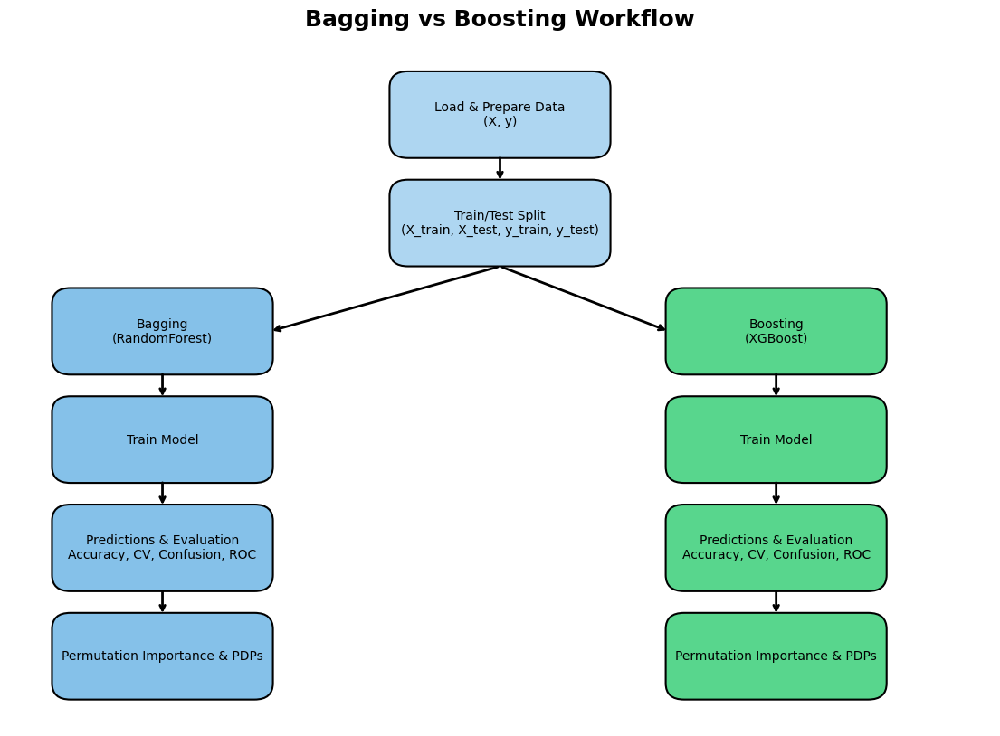
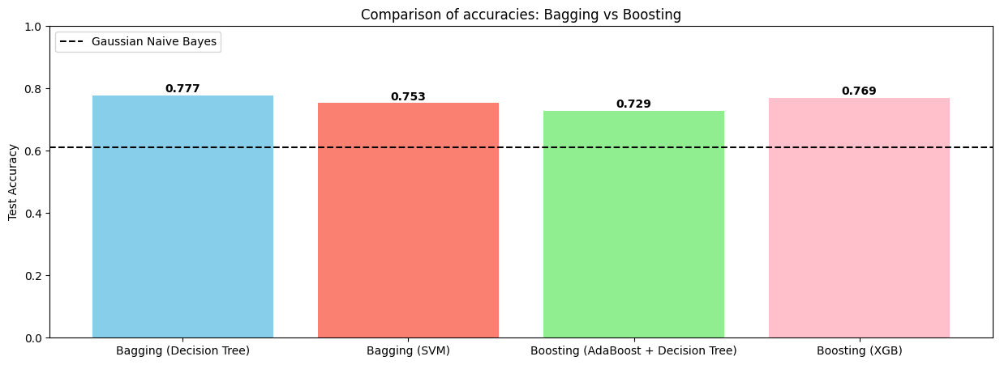

# IT3212 Assignment 3: Basic modelling

## Table of Contents

- [1. Develop a problem statement (real world and machine learning)](#1-problem-statement)
  - [a. This is one of the most important skills that a Machine Learning Engineer Scientist should have. Select a dataset and frame a machine learning problem and then connect this machine learning problem to the real world scenario. ](#problem-statement-section-1)
- [2. Implement the preprocessing and justify the preprocessing steps](#2-preprocessing)
- [3. Extract features and justify the methods used](#3-extract-features)
- [4. Select features and justify the methods used](#4-select-feactures)
- [5. Implement five out of the following algorithms and justify the choice](#5-implement-algorithms)
  - [a. Logistic regression](#implement-algorithms-section-1)
  - [b. Additive model](#implement-algorithms-section-2)
  - [c. Random forest](#implement-algorithms-section-3)
  - [d. SVM with kernels](#implement-algorithms-section-4)
  - [e. Neural Network](#implement-algorithms-section-5)
- [6. Compare the performance of the five algorithms with respect to your problem, explain the results](#6-compare-performance)
- [7. Implement boosting and bagging with your choice of base models and explain all the steps](#7-boosting-bagging)
- [8. Implement one instance of transfer learning (find a related bigger dataset online) and explain all the steps](#8-transfer-learning)
  - [a. Explain the bigger dataset with visualization and summary statistics.](#transfer-learning-section-1)

- [9. Compare the performance of the algorithms (basic VS boosting VS bagging VS transfer) with respect to your machine learning problem and explain the results](#7-compare-performance)

##  1. Develop a problem statement (real world and machine learning)

###  a. This is one of the most important skills that a Machine Learning Engineer/Scientist should have. Select a dataset and frame a machine learning problem and then connect this machine learning problem to the real world scenario.

**Real World Problem** \
As the education sector becomes more data-driven, collected data can unlock substansial value. Universities want to reduce first-year dropout and capture students who are likely to still be enrolled beyond the normal time to degree, so insititutions can allocate extra resources proactively and help students gets back on track. This improves student success and workforce readiness, strengthens institutional outcomes, and generates insights useful for policymakers.

**Machine Learning Problem** \
With this in mind, we selected the Student Graduation dataset, which records students across multiple undergraduate programs and includes socio-economic factors, prior academic background, and performance at the end of the first and second semesters. Our goal is to train machine learning models that predict three outcomes: dropout, extended enrollment beyond the normal time, or successful completion of the first year. These predictions directly support the real-world problem by enabling early, targeted interventions for students at risk.

##  2. Implement the preprocessing and justify the preprocessing steps

##  3. Extract features and justify the methods used

##  4. Select features and justify the methods used

##  5. Implement five out of the following algorithms and justify the choice

###  a. Logistic regression 

**How it works**

Multinomial logistic regression models the log odds of each class as a linear function of the inputs and uses a softmax layer to output class probabilities.

**Why we chose it**

It is a strong baseline for multiclass classification, works well with our one-hot encoded categorical features, and is easy to interpret through its coefficients. This makes it easy to evaluate the reliability of the model by confirming that it captures reasonable relationships between social-economic factors and the student's academic performance. A known limitation is the linearity assumption, which can miss non-linear socio-economic patterns.

###  b. Additive model

**How it works**

A generalized additive model (GAM) represents the log odds as a sum of smooth functions of each feature, often via splines, which captures nonlinear shapes without manual feature engineering.

**Why we chose it**

Variables such as age at enrollment, admission grade, and approved units often have curved and thresholded effects. GAMs model these patterns directly while remaining interpretable, which improved our classification.

###  c. Random forest

**How it works**

A random forest builds many decision trees on bootstrap samples while randomly selecting subsets of features at each split. The final prediction is the majority vote across trees.

**Why we chose it**

It usually delivers higher accuracy than a single tree and handles many attributes well, including our one-hot encoded features and mixed numeric inputs. Although ensembles can be computationally heavier, our dataset is small enough that training is efficient, and we also gain useful feature importance signals.

###  d. SVM with kernels

**How it works**

A support vector machine (SVM) finds a maximum margin boundary. With kernels such as the radial basis function it implicitly maps data to a higher dimensional space to separate complex patterns, relying on support vectors at decision boundaries.

**Why we chose it**

It performs well in high dimensional spaces created by one hot encoding and often gives strong accuracy with good regularization. Prediction is fast compared to Naive Bayes and it use less memory since it only uses a subset of the training points in the decision phase. Training can be slow on very large data, but our dataset size makes it a good fit.

###  e. Neural networks

**How it works**

A feed forward neural network stacks linear layers with nonlinear activations and learns parameters by backpropagation. For multi class outputs it ends with a softmax layer to produce probabilities.

**Why we chose it**

It can learn complex interactions among demographic, financial, and academic features that simpler linear models may miss. With proper scaling, regularization, and early stopping, it complements the other methods by offering a representation learning approach that can raise predictive performance on structured data.

##  6. Compare the performance of the five algorithms with respect to your problem, explain the results

##  7. Implement boosting and bagging with your choice of base models and explain all the steps

We have implemented two ensemble learning methods, **Bagging** and **Boosting**.\
The **Bagging model** employs a `RandomForestClassifier` as its base estimator within a `BaggingClassifier`, where multiple decision trees are trained independently on random subsets of both samples and features.\
This parallel training reduces variance, prevents overfitting and improves model stability.\
The **Boosting model**, based on `XGBClassifier`, builds an ensemble of weak learners sequentially, where each new tree focuses on correcting the misclassifications made by previous ones.\
This reduced bias and improves predictive performance.

**Modified pipeline**\
The data is first split into training and testing sets using stratified sampling to preserve class distribution. Missing values are handled using a `SimpleImputer` with a median strategy.\
Next, a **`GridSearchCV`** is applied for hyperparameter tuning, testing combinations of parameters like the number of estimators, tree depth, learning rate, and subsampling ratios over multiple cross-validation folds.\
Finally, the best-performing model is refit on the training set and evaluated on the test data using accuracy metrics.\
Although computationally intensive, this approach provides a reliable comparison between Bagging and Boosting techniques.

   
  <em>Figure 1: Bagging and Boosting workflow</em>

The figure below shows that bagging gets an accuracy of **0.784** while boosting has an accuracy of **0.775**.\
The Bagging model performed slightly better on this student-graduation dataset.\
Bagging may benefit more from the diverse feature set, where independent trees capture variability in academic, demographic and socioeconomic factors.\
Boosting performed similarly well, suggesting that sequential error-correction adds value, but not enough to outperform the more variance-robust Bagging approach for this dataset.

   
  <em>Figure 2: Bagging vs Boosting test accuracy</em>

##  8. Implement one instance of transfer learning (find a related bigger dataset online) and explain all the steps

###  a. Explain the bigger dataset with visualization and summary statistics.

##  9. Compare the performance of the algorithms (basic VS boosting VS bagging VS transfer) with respect to your machine learning problem and explain the results

