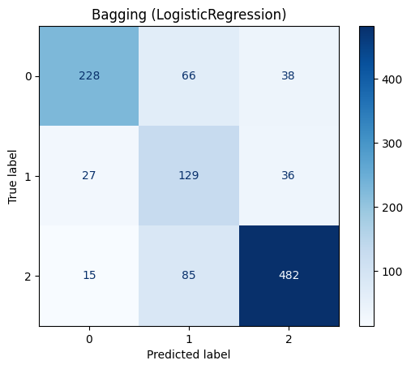
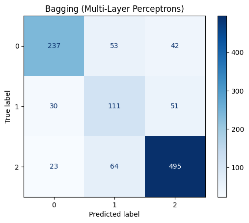
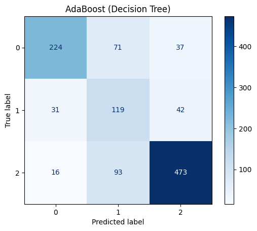
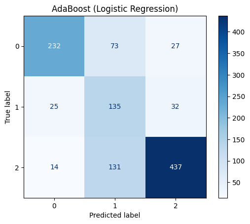

# IT3212 Assignment 3: Basic modelling

## Table of Contents

- [1. Develop a problem statement (real world and machine learning)](#1-problem-statement)
  - [a. This is one of the most important skills that a Machine Learning Engineer Scientist should have. Select a dataset and frame a machine learning problem and then connect this machine learning problem to the real world scenario. ](#problem-statement-section-1)
- [2. Implement the preprocessing and justify the preprocessing steps](#2-preprocessing)
- [3. Extract features and justify the methods used](#3-extract-features)
- [4. Select features and justify the methods used](#4-select-feactures)
- [5. Implement five out of the following algorithms and justify the choice](#5-implement-algorithms)
  - [a. Logistic regression](#implement-algorithms-section-1)
  - [b. Additive model](#implement-algorithms-section-2)
  - [c. Random forest](#implement-algorithms-section-3)
  - [d. SVM with kernels](#implement-algorithms-section-4)
  - [e. Neural Network](#implement-algorithms-section-5)
- [6. Compare the performance of the five algorithms with respect to your problem, explain the results](#6-compare-performance)
- [7. Implement boosting and bagging with your choice of base models and explain all the steps](#7-boosting-bagging)
- [8. Implement one instance of transfer learning (find a related bigger dataset online) and explain all the steps](#8-transfer-learning)
  - [a. Explain the bigger dataset with visualization and summary statistics.](#transfer-learning-section-1)

- [9. Compare the performance of the algorithms (basic VS boosting VS bagging VS transfer) with respect to your machine learning problem and explain the results](#7-compare-performance)

##  1. Develop a problem statement (real world and machine learning)

###  a. This is one of the most important skills that a Machine Learning Engineer/Scientist should have. Select a dataset and frame a machine learning problem and then connect this machine learning problem to the real world scenario.

**Real World Problem** \
As the education sector becomes more data-driven, collected data can unlock substansial value. Universities want to reduce first-year dropout and capture students who are likely to still be enrolled beyond the normal time to degree, so insititutions can allocate extra resources proactively and help students gets back on track. This improves student success and workforce readiness, strengthens institutional outcomes, and generates insights useful for policymakers.

**Machine Learning Problem** \
With this in mind, we selected the Student Graduation dataset, which records students across multiple undergraduate programs and includes socio-economic factors, prior academic background, and performance at the end of the first and second semesters. Our goal is to train machine learning models that predict three outcomes: dropout, extended enrollment beyond the normal time, or successful completion of the first year. These predictions directly support the real-world problem by enabling early, targeted interventions for students at risk.

##  2. Implement the preprocessing and justify the preprocessing steps

##  3. Extract features and justify the methods used

##  4. Select features and justify the methods used

##  5. Implement five out of the following algorithms and justify the choice

###  a. Logistic regression 

**How it works**

Multinomial logistic regression models the log odds of each class as a linear function of the inputs and uses a softmax layer to output class probabilities.

**Why we chose it**

It is a strong baseline for multiclass classification, works well with our one-hot encoded categorical features, and is easy to interpret through its coefficients. This makes it easy to evaluate the reliability of the model by confirming that it captures reasonable relationships between social-economic factors and the student's academic performance. A known limitation is the linearity assumption, which can miss non-linear socio-economic patterns.

###  b. Additive model

**How it works**

A generalized additive model (GAM) represents the log odds as a sum of smooth functions of each feature, often via splines, which captures nonlinear shapes without manual feature engineering.

**Why we chose it**

Variables such as age at enrollment, admission grade, and approved units often have curved and thresholded effects. GAMs model these patterns directly while remaining interpretable, which improved our classification.

###  c. Random forest

**How it works**

A random forest builds many decision trees on bootstrap samples while randomly selecting subsets of features at each split. The final prediction is the majority vote across trees.

**Why we chose it**

It usually delivers higher accuracy than a single tree and handles many attributes well, including our one-hot encoded features and mixed numeric inputs. Although ensembles can be computationally heavier, our dataset is small enough that training is efficient, and we also gain useful feature importance signals.

###  d. SVM with kernels

**How it works**

A support vector machine (SVM) finds a maximum margin boundary. With kernels such as the radial basis function it implicitly maps data to a higher dimensional space to separate complex patterns, relying on support vectors at decision boundaries.

**Why we chose it**

It performs well in high dimensional spaces created by one hot encoding and often gives strong accuracy with good regularization. Prediction is fast compared to Naive Bayes and it use less memory since it only uses a subset of the training points in the decision phase. Training can be slow on very large data, but our dataset size makes it a good fit.

###  e. Neural networks

**How it works**

A feed forward neural network stacks linear layers with nonlinear activations and learns parameters by backpropagation. For multi class outputs it ends with a softmax layer to produce probabilities.

**Why we chose it**

It can learn complex interactions among demographic, financial, and academic features that simpler linear models may miss. With proper scaling, regularization, and early stopping, it complements the other methods by offering a representation learning approach that can raise predictive performance on structured data.

##  6. Compare the performance of the five algorithms with respect to your problem, explain the results

##  7. Implement boosting and bagging with your choice of base models and explain all the steps

We implemented several ensemble learning methods: **Bagging with Logistic Regression, MLPs, SVMs, and Decision Trees**, as well as **AdaBoost with Logistic Regression and Decision Trees**, using a slightly *modified pipeline*.

**Bagging models** train multiple independent base learners on bootstrap samples, each using random subsets of observations and features. The ensemble prediction is generated through majority voting, reducing variance and improving stability. Logistic Regression, MLPs, SVMs, and Decision Trees serve as base learners, with Decision Trees contributing flexible, non-linear decision boundaries that benefit strongly from variance reduction through bagging.

**AdaBoost models** build ensembles sequentially, reweighting misclassified samples so that later learners focus on harder cases. Using Logistic Regression and Decision Trees as weak learners, AdaBoost reduces bias by combining their weighted predictions.

The *modified pipeline* handles missing values with a median-based `SimpleImputer`, integrates preprocessing directly with model training, and tunes hyperparameters using `GridSearchCV` over settings such as learning rate, number of estimators, and sampling ratios. Each ensemble is refitted with optimal parameters and evaluated using accuracy and balanced accuracy on the test set.

  <figure style="text-align: center; margin: 25 5px 25 0;">
    
    <figcaption><em>Figure 2.a: Confusion matrix (Bagging with Decision Trees)</em></figcaption>
  </figure>
  <figure style="text-align: center; margin: 25 5px 25 0;">
    
    <figcaption><em>Figure 2.b: Confusion matrix (Bagging with Support Vector Machines)</em></figcaption>
  </figure>
   <figure style="text-align: center; margin: 25 5px 25 0;">
    
    <figcaption><em>Figure 2.b: Confusion matrix (Bagging with Logistic Regression)</em></figcaption>
  </figure>

  <figure style="text-align: center; margin: 25 5px 25 0;">
    
    <figcaption><em>Figure 2.a: Confusion matrix (Bagging with Multi-Layer Perceptrons)</em></figcaption>
  </figure>
  <figure style="text-align: center; margin: 25 5px 25 0;">
    
    <figcaption><em>Figure 2.b: Confusion matrix (AdaBoost with Decision Trees)</em></figcaption>
  </figure>
    <figure style="text-align: center; margin: 25 5px 25 0;">
    
    <figcaption><em>Figure 2.b: Confusion matrix (AdaBoost with Logistic Regression)</em></figcaption>
  </figure>

As seen in the confusion matrices aboves, the number of correct predictions each model makes varies greatly with bagging and boosting.

When it comes to bagging, using it on Decision Trees seems to work best. The other models perform relatively well as well.

Boosting, on the other hand, performs overall worse than bagging. Decision Trees once again performed best. Boosting with Logistic Regression performed the worst.

Bagging tends to outperform boosting on student data because these datasets are often noisy and moderately predictive, causing boosting to overfit misclassified or ambiguous cases. Bagging instead reduces variance by averaging multiple independent models, making it more robust and better suited to the structure and quality of student-related features.

Despite the usage of boosting or bagging, the best performing models are still biased towards class 2 (Graduate).

 
<em>Figure 3a: Bagging vs Boosting accuracy</em>

 
<em>Figure 3b: Bagging vs Boosting balanced accuracy</em>

 
<em>Figure 3c: Bagging vs Boosting macro precision accuracy</em>

By **Accuracy** we mean the percentage of all predictions that were correct.\
From ***Figure 3a***, we notice that **accuracy** ranges from 0.435 to 0.778 across al models. The best model, `Bagging DT` (Bagging with Decision Trees), correctly predicts ~78% of students. The worst model is `AdaBoost LR` with 0.727 accuracy.

However, accuracy can be misleading because the classes are unbalanced (many students are "graduates").\
To resolve this, we have also used **Balanced Accuracy**. This is the mean recall across all classes, which gives each class equal weight.\
**Balanced accuracy** goes from 0.702 to 0.718 which is lower than raw accuracy.\
This indicates that the models predict class 2 (Graduate) well, but  struggle with class 1 (Enrolled). Interestingly, `AdaBoost LR` performed best here, despite being the worst in terms of **accuracy**. This is explained by the confusion matrix: AdaBoost with Logistic Regression focuses heavily on misclassified minority-class cases, which improves balanced accuracy but often reduces overall accuracy by causing more errors on the majority class.

Finally, **Macro precision** measures correctness per class, averaged equally. It goes from 0.7 up to 0.73. Once again, `Bagging DT` perfomed the best. This means that when the model predicts a class, it is correct roughly 73% of the time.\
`AdaBoost DT` performed the worst, because its weak learners cannot model the complexity of our imbalanced dataset, causing more misclassifications and therefore more false positives in multiple classes.

 
<em>Figure 4: ROC graphs for all models</em>

**ROC-AUC** measures how well the model separates classes. Our models go from 0.7995 to 0.9045 which is good.\
`Bagging LR` show the best class separation with 0.9045. This is because it combines several logistic regression models trained on different subsets of students which reduces the impact of noisy or student records, stabilizing probability predictions for outcomes like pass/fail or performance categories.

**Bagging Decision Trees** performs best overall, while Bagging MLPs and SVMs do well, and Bagging Logistic Regression excels in ROC-AUC. AdaBoost models overfit minority cases, with AdaBoost LR having low accuracy but high balanced accuracy. Bagging is generally more robust on noisy student data.

##  8. Implement one instance of transfer learning (find a related bigger dataset online) and explain all the steps

###  a. Explain the bigger dataset with visualization and summary statistics.

##  9. Compare the performance of the algorithms (basic VS boosting VS bagging VS transfer) with respect to your machine learning problem and explain the results

