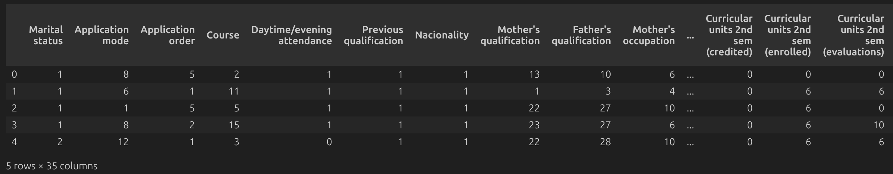
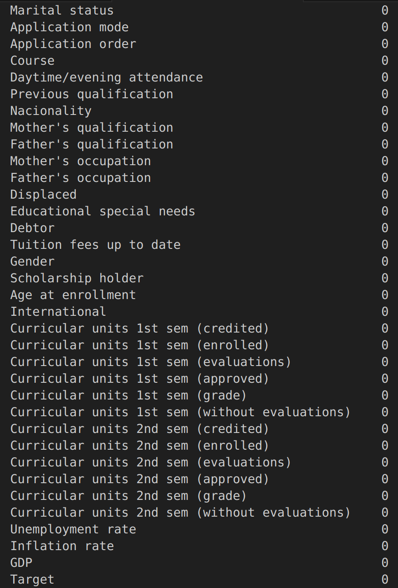
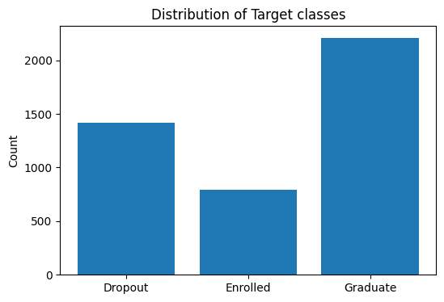

# IT3212 Assignment 3: Basic modelling

## Table of Contents

- [1. Develop a problem statement (real world and machine learning)](#1-problem-statement)
  - [a. This is one of the most important skills that a Machine Learning Engineer Scientist should have. Select a dataset and frame a machine learning problem and then connect this machine learning problem to the real world scenario. ](#problem-statement-section-1)
- [2. Implement the preprocessing and justify the preprocessing steps](#2-preprocessing)
- [3. Extract features and justify the methods used](#3-extract-features)
- [4. Select features and justify the methods used](#4-select-feactures)
- [5. Implement five out of the following algorithms and justify the choice](#5-implement-algorithms)
  - [a. Logistic regression](#implement-algorithms-section-1)
  - [b. Additive model](#implement-algorithms-section-2)
  - [c. Random forest](#implement-algorithms-section-3)
  - [d. SVM with kernels](#implement-algorithms-section-4)
  - [e. Neural Network](#implement-algorithms-section-5)
- [6. Compare the performance of the five algorithms with respect to your problem, explain the results](#6-compare-performance)
- [7. Implement boosting and bagging with your choice of base models and explain all the steps](#7-boosting-bagging)
- [8. Implement one instance of transfer learning (find a related bigger dataset online) and explain all the steps](#8-transfer-learning)
  - [a. Explain the bigger dataset with visualization and summary statistics.](#transfer-learning-section-1)

- [9. Compare the performance of the algorithms (basic VS boosting VS bagging VS transfer) with respect to your machine learning problem and explain the results](#7-compare-performance)

##  1. Develop a problem statement (real world and machine learning)

###  a. This is one of the most important skills that a Machine Learning Engineer/Scientist should have. Select a dataset and frame a machine learning problem and then connect this machine learning problem to the real world scenario.

**Real World Problem** \
As the education sector becomes more data-driven, collected data can unlock substansial value. Universities want to reduce first-year dropout and capture students who are likely to still be enrolled beyond the normal time to degree, so insititutions can allocate extra resources proactively and help students gets back on track. This improves student success and workforce readiness, strengthens institutional outcomes, and generates insights useful for policymakers.

**Machine Learning Problem** \
With this in mind, we selected the Student Graduation dataset, which records students across multiple undergraduate programs and includes socio-economic factors, prior academic background, and performance at the end of the first and second semesters. Our goal is to train machine learning models that predict three outcomes: dropout, extended enrollment beyond the normal time, or successful completion of the first year. These predictions directly support the real-world problem by enabling early, targeted interventions for students at risk.

##  2. Implement the preprocessing and justify the preprocessing steps

We first looked at the data to try to find out what preprocessing steps were necessary. Since we had the source of the data, https://archive-beta.ics.uci.edu/dataset/697/predict+students+dropout+and+academic+success, we had a description available for every column.

 
<em>Figure 1: First 5 rows of our data</em>

 
<em>Figure 2: Description of data columns</em>

All categorical columns are label encoded, and has a mapping from number to category in the data description, but we found the numbers didn't match what was described in the data source. Assuming we were supposed to use the provided dataset over data directly from the source, we couldn't know what each class in the column meant.

From looking at the data source, we knew the dataset had been  performed rigorous data preprocessing on to handle data from anomalies, unexplainable outliers, and missing values. Still, we decided to see ourself if there were anomalies or outliers. 

 
<em>Figure 3: Null values in dataset</em>

There were no null values in the dataset, as seen in figure 3. We also found that all cagegorical columns had as many values as expected, and all value columns, like age and curricular units, had expected values.

The first step in our preprocessing is one hot encoding on categorical columns. We use one hot encoding over label encoding for this dataset, because the categorical columns don't have any real order, meaning a higher or lower value when label encoded wouldn't mean anything, only the exact numbers. To prevent creating an order where there is none, we use one hot encoding.

One problem with using one hot encoding on our dataset is that our categorical columns have many categories, turning the dataset from having 35 to having 246 columns. This makes our dataset more sparse, making each column contain less information, which can be harmful to some models. We prioritized not creating a non-existent order, and will instead remove excess features later.

We then split the dataset into a train and test set. This was done with a 75-25 split.

Then we min-max scaled the dataset, ensuring no feature is weighted too highly based on having higher values than the others.

 
<em>Figure 4: Distribution of target classes</em>

As seen in figure 4, our dataset had very imbalanced target classes. With one class making up half the dataset, we had to modify it so the classes would be weighted fairly. To do this, we chose oversampling. We randomly selected rows in the training set of the underpopulated classes, and duplicated them until each class had the same number of rows.

Oversampling will improve the performance of the models, especially for predicting students with `Enrolled` in the target column. This column made up less than a fifth of the dataset, making it vulnerable to being mostly ingored by models seeking accuracy by prioritizing the more populated `Graduate` class, since they also have very similar data distributions, as seen in figure 3 and #. 

We chose oversampling instead undersampling because we thought our dataset wasn't large enought to justify removing almost half of it to balance the classes. We also thought it was more important to correclty predict graduate and dropout over enrolled, as our main goal with the model is to figure out which students are at risk of dropping out.

##  3. Extract features and justify the methods used

For feature extraction, we used PCA. PCA creates principal components that are linearly independent, meaning a lot of the variance in the dataset can be explained using much fewer components. The components are also sorted by which explain most of the variance in the dataset. This can be seen in figure 5, where the total explained variance increases quickly with few components while the explained variance per principal component quickly approaches 0.

 
<em>Figure 5: Graph of explained variance for PCA</em>

We can get a lot of the information from this dataset using much less than all our components by selecting all components up until they explain 95% of the total variance in the dataset. Selecting components up to 95% explained variance will use 66 of our components. This threshold and our chosen principal components can be seen in figure 6. Removing most of our components while still keeping 95% variance should make our models have similar performance while cutting down training time.

 
<em>Figure 6: Graph of chosen principal components at 95% variance threshold</em>

PCA is also very useful for visualizing data, as it can show a lot of variance in the first few components, with the drawback of it being hard to understand what the visualization is supposed to represent in the actual dataset. A visualization of our data using PCA can be seen in figure 7.

 
<em>Figure 7: Distribution of data using PCA</em>

##  4. Select features and justify the methods used

For feature selection, we decided to use our preprocessed dataset and remove one hot encoded columns with a low frequency of rows containing `true`. There are 2 reasons for this. The first is that it should prevent overfitting, as one hot encoded columns with very few rows containing `true` could all be of one target category in the training data, leading to the feature being incorrectly correlated with a certain category. Doing this should improve model performance as they won't be overfitting on the one hot encoded columns.

Another reason to remove columns with a low frequency of `true` is that it will make the dataset less sparse by getting rid of the columns containing the least information. It will reduce the amount of columns in our dataset to something similar to our 95% threshold of explained variance in PCA. This will reduce training by removing a lot of our sparse columns.

We decided to remove columns with a frequency of `true` less than 3%, as this requires ~100 rows containing it. This will definitely prevent overfitting on one hot encoded columns, while also removing a large chunk of our columns without much data.

We can also look at the distribution of our target categories using the columns chosen from our feature selection, even though the variance of the data can't be visualized as clearly as with PCA in figure 3. This visualization is shown in figure 8.

 
<em>Figure 8: Distribution of data using features sorted by highest variance</em>

To decide whether to use our dataset after feature extraction using PCA or after feature selection, we trained one of the models that don't take that long to train, SVM, with all the variations of our dataset.

 
<em>Figure 9: Confusion matrix for SVM (PCA, all principal components)</em>

Figure 9 shows the confusion matrix for SVM using all principal components from our PCA. It has an accuracy of 73.6%, taking 1 minute and 57 seconds to train.

 
<em>Figure 10: Confusion matrix for SVM (PCA, 95% explained variance threshold)</em>

Figure 10 shows the confusion matrix for SVM using the principal components from the 95% explained variance threshold after PCA. It has an accuracy of 71.2%, taking 32 seconds to train.

 
<em>Figure 11: Confusion matrix for SVM (all features)</em>

Figure 11 shows the confusion matrix for SVM using all features. It has an accuracy of 74.8%, taking 1 minute and 40 seconds to train.

 
<em>Figure 12: Confusion matrix for SVM (feature selection)</em>

Figure 12 shows the confusion matrix for SVM using features kept after feature selection. It has an accuracy of 76.8%, taking 41 seconds to train.

As expected, feature selection has both better performance and takes less time to train than with all features, but we found it surprising how much better it performed than using PCA. After looking at the results, we decided to use feature selection over PCA, as it has much better performance and the features are more understandable.

##  5. Implement five out of the following algorithms and justify the choice

###  a. Logistic regression 

**How it works**

Multinomial logistic regression models the log odds of each class as a linear function of the inputs and uses a softmax layer to output class probabilities.

**Why we chose it**

It is a strong baseline for multiclass classification, works well with our one-hot encoded categorical features, and is easy to interpret through its coefficients. This makes it easy to evaluate the reliability of the model by confirming that it captures reasonable relationships between social-economic factors and the student's academic performance. A known limitation is the linearity assumption, which can miss non-linear socio-economic patterns.

###  b. Additive model

**How it works**

A generalized additive model (GAM) represents the log odds as a sum of smooth functions of each feature, often via splines, which captures nonlinear shapes without manual feature engineering.

**Why we chose it**

Variables such as age at enrollment, admission grade, and approved units often have curved and thresholded effects. GAMs model these patterns directly while remaining interpretable, which improved our classification.

###  c. Random forest

**How it works**

A random forest builds many decision trees on bootstrap samples while randomly selecting subsets of features at each split. The final prediction is the majority vote across trees.

**Why we chose it**

It usually delivers higher accuracy than a single tree and handles many attributes well, including our one-hot encoded features and mixed numeric inputs. Although ensembles can be computationally heavier, our dataset is small enough that training is efficient, and we also gain useful feature importance signals.

###  d. SVM with kernels

**How it works**

A support vector machine (SVM) finds a maximum margin boundary. With kernels such as the radial basis function it implicitly maps data to a higher dimensional space to separate complex patterns, relying on support vectors at decision boundaries.

**Why we chose it**

It performs well in high dimensional spaces created by one hot encoding and often gives strong accuracy with good regularization. Prediction is fast compared to Naive Bayes and it use less memory since it only uses a subset of the training points in the decision phase. Training can be slow on very large data, but our dataset size makes it a good fit.

###  e. Neural networks

**How it works**

A feed forward neural network stacks linear layers with nonlinear activations and learns parameters by backpropagation. For multi class outputs it ends with a softmax layer to produce probabilities.

**Why we chose it**

It can learn complex interactions among demographic, financial, and academic features that simpler linear models may miss. With proper scaling, regularization, and early stopping, it complements the other methods by offering a representation learning approach that can raise predictive performance on structured data.

##  6. Compare the performance of the five algorithms with respect to your problem, explain the results

##  7. Implement boosting and bagging with your choice of base models and explain all the steps

We implemented several ensemble learning methods: **Bagging with Logistic Regression, MLPs, SVMs, and Decision Trees**, as well as **AdaBoost with Logistic Regression and Decision Trees**, using a slightly *modified pipeline*.

**Bagging models** train multiple independent base learners on bootstrap samples, each using random subsets of observations and features. The ensemble prediction is generated through majority voting, reducing variance and improving stability. Logistic Regression, MLPs, SVMs, and Decision Trees serve as base learners, with Decision Trees contributing flexible, non-linear decision boundaries that benefit strongly from variance reduction through bagging.

**AdaBoost models** build ensembles sequentially, reweighting misclassified samples so that later learners focus on harder cases. Using Logistic Regression and Decision Trees as weak learners, AdaBoost reduces bias by combining their weighted predictions.

The *modified pipeline* handles missing values with a median-based `SimpleImputer`, integrates preprocessing directly with model training, and tunes hyperparameters using `GridSearchCV` over settings such as learning rate, number of estimators, and sampling ratios. Each ensemble is refitted with optimal parameters and evaluated using accuracy and balanced accuracy on the test set.

  <figure style="text-align: center; margin: 25 5px 25 0;">
    
    <figcaption><em>Figure 2.a: Confusion matrix (Bagging with Decision Trees)</em></figcaption>
  </figure>
  <figure style="text-align: center; margin: 25 5px 25 0;">
    
    <figcaption><em>Figure 2.b: Confusion matrix (Bagging with Support Vector Machines)</em></figcaption>
  </figure>
   <figure style="text-align: center; margin: 25 5px 25 0;">
    
    <figcaption><em>Figure 2.b: Confusion matrix (Bagging with Logistic Regression)</em></figcaption>
  </figure>

  <figure style="text-align: center; margin: 25 5px 25 0;">
    
    <figcaption><em>Figure 2.a: Confusion matrix (Bagging with Multi-Layer Perceptrons)</em></figcaption>
  </figure>
  <figure style="text-align: center; margin: 25 5px 25 0;">
    
    <figcaption><em>Figure 2.b: Confusion matrix (AdaBoost with Decision Trees)</em></figcaption>
  </figure>
    <figure style="text-align: center; margin: 25 5px 25 0;">
    
    <figcaption><em>Figure 2.b: Confusion matrix (AdaBoost with Logistic Regression)</em></figcaption>
  </figure>

As seen in the confusion matrices aboves, the number of correct predictions each model makes varies greatly with bagging and boosting.

When it comes to bagging, using it on Decision Trees seems to work best. The other models perform relatively well as well.

Boosting, on the other hand, performs overall worse than bagging. Decision Trees once again performed best. Boosting with Logistic Regression performed the worst.

Bagging tends to outperform boosting on student data because these datasets are often noisy and moderately predictive, causing boosting to overfit misclassified or ambiguous cases. Bagging instead reduces variance by averaging multiple independent models, making it more robust and better suited to the structure and quality of student-related features.

Despite the usage of boosting or bagging, the best performing models are still biased towards class 2 (Graduate).

 
<em>Figure 3a: Bagging vs Boosting accuracy</em>

 
<em>Figure 3b: Bagging vs Boosting balanced accuracy</em>

 
<em>Figure 3c: Bagging vs Boosting macro precision accuracy</em>

By **Accuracy** we mean the percentage of all predictions that were correct.\
From ***Figure 3a***, we notice that **accuracy** ranges from 0.435 to 0.778 across al models. The best model, `Bagging DT` (Bagging with Decision Trees), correctly predicts ~78% of students. The worst model is `AdaBoost LR` with 0.727 accuracy.

However, accuracy can be misleading because the classes are unbalanced (many students are "graduates").\
To resolve this, we have also used **Balanced Accuracy**. This is the mean recall across all classes, which gives each class equal weight.\
**Balanced accuracy** goes from 0.702 to 0.718 which is lower than raw accuracy.\
This indicates that the models predict class 2 (Graduate) well, but  struggle with class 1 (Enrolled). Interestingly, `AdaBoost LR` performed best here, despite being the worst in terms of **accuracy**. This is explained by the confusion matrix: AdaBoost with Logistic Regression focuses heavily on misclassified minority-class cases, which improves balanced accuracy but often reduces overall accuracy by causing more errors on the majority class.

Finally, **Macro precision** measures correctness per class, averaged equally. It goes from 0.7 up to 0.73. Once again, `Bagging DT` perfomed the best. This means that when the model predicts a class, it is correct roughly 73% of the time.\
`AdaBoost DT` performed the worst, because its weak learners cannot model the complexity of our imbalanced dataset, causing more misclassifications and therefore more false positives in multiple classes.

 
<em>Figure 4: ROC graphs for all models</em>

**ROC-AUC** measures how well the model separates classes. Our models go from 0.7995 to 0.9045 which is good.\
`Bagging LR` show the best class separation with 0.9045. This is because it combines several logistic regression models trained on different subsets of students which reduces the impact of noisy or student records, stabilizing probability predictions for outcomes like pass/fail or performance categories.

**Bagging Decision Trees** performs best overall, while Bagging MLPs and SVMs do well, and Bagging Logistic Regression excels in ROC-AUC. AdaBoost models overfit minority cases, with AdaBoost LR having low accuracy but high balanced accuracy. Bagging is generally more robust on noisy student data.

##  8. Implement one instance of transfer learning (find a related bigger dataset online) and explain all the steps

###  a. Explain the bigger dataset with visualization and summary statistics.

##  9. Compare the performance of the algorithms (basic VS boosting VS bagging VS transfer) with respect to your machine learning problem and explain the results

