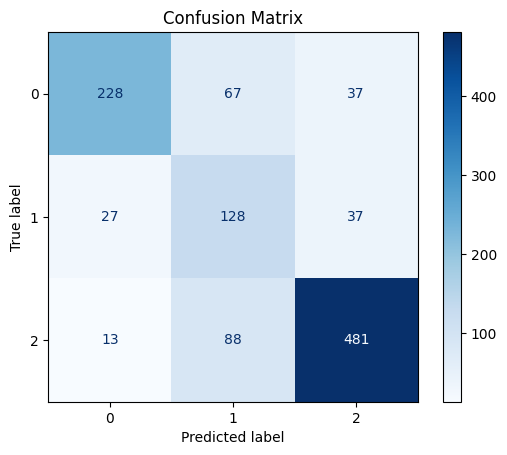
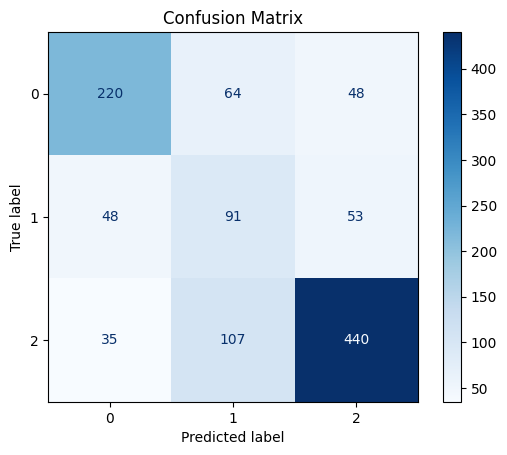
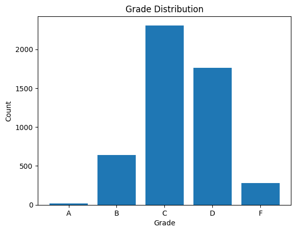
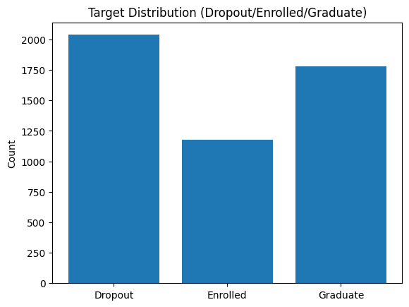

# IT3212 Assignment 3: Basic modelling

## Table of Contents

- [IT3212 Assignment 3: Basic modelling](#it3212-assignment-3-basic-modelling)
  - [Table of Contents](#table-of-contents)
  - [ 1. Develop a problem statement (real world and machine learning)](#-1-develop-a-problem-statement-real-world-and-machine-learning)
    - [ a. This is one of the most important skills that a Machine Learning Engineer/Scientist should have. Select a dataset and frame a machine learning problem and then connect this machine learning problem to the real world scenario.](#-a-this-is-one-of-the-most-important-skills-that-a-machine-learning-engineerscientist-should-have-select-a-dataset-and-frame-a-machine-learning-problem-and-then-connect-this-machine-learning-problem-to-the-real-world-scenario)
  - [ 2. Implement the preprocessing and justify the preprocessing steps](#-2-implement-the-preprocessing-and-justify-the-preprocessing-steps)
  - [ 3. Extract features and justify the methods used](#-3-extract-features-and-justify-the-methods-used)
  - [ 4. Select features and justify the methods used](#-4-select-features-and-justify-the-methods-used)
  - [ 5. Implement five out of the following algorithms and justify the choice](#-5-implement-five-out-of-the-following-algorithms-and-justify-the-choice)
    - [ a. Logistic regression](#-a-logistic-regression)
    - [ b. Decision trees](#-b-decision-trees)
    - [ c. Random forest](#-c-random-forest)
    - [ d. SVM with kernels](#-d-svm-with-kernels)
    - [ e. Neural networks](#-e-neural-networks)
  - [ 6. Compare the performance of the five algorithms with respect to your problem, explain the results](#-6-compare-the-performance-of-the-five-algorithms-with-respect-to-your-problem-explain-the-results)
  - [ 7. Implement boosting and bagging with your choice of base models and explain all the steps](#-7-implement-boosting-and-bagging-with-your-choice-of-base-models-and-explain-all-the-steps)
  - [ 8. Implement one instance of transfer learning (find a related bigger dataset online) and explain all the steps](#-8-implement-one-instance-of-transfer-learning-find-a-related-bigger-dataset-online-and-explain-all-the-steps)
    - [ a. Explain the bigger dataset with visualization and summary statistics.](#-a-explain-the-bigger-dataset-with-visualization-and-summary-statistics)
  - [ 9. Compare the performance of the algorithms (basic VS boosting VS bagging VS transfer) with respect to your machine learning problem and explain the results](#-9-compare-the-performance-of-the-algorithms-basic-vs-boosting-vs-bagging-vs-transfer-with-respect-to-your-machine-learning-problem-and-explain-the-results)

##  1. Develop a problem statement (real world and machine learning)

###  a. This is one of the most important skills that a Machine Learning Engineer/Scientist should have. Select a dataset and frame a machine learning problem and then connect this machine learning problem to the real world scenario.

**Real World Problem** \
As the education sector becomes more data-driven, collected data can unlock substansial value. Universities want to reduce first-year dropout and capture students who are likely to still be enrolled beyond the normal time to degree, so insititutions can allocate extra resources proactively and help students gets back on track. This improves student success and workforce readiness, strengthens institutional outcomes, and generates insights useful for policymakers.

**Machine Learning Problem** \
With this in mind, we selected the Student Graduation dataset, which records students across multiple undergraduate programs and includes socio-economic factors, prior academic background, and performance at the end of the first and second semesters. Our goal is to train machine learning models that predict three outcomes: dropout, extended enrollment beyond the normal time, or successful completion of the first year. These predictions directly support the real-world problem by enabling early, targeted interventions for students at risk.

##  2. Implement the preprocessing and justify the preprocessing steps

##  3. Extract features and justify the methods used

##  4. Select features and justify the methods used

##  5. Implement five out of the following algorithms and justify the choice

###  a. Logistic regression 

**How it works**

Multinomial logistic regression models the log odds of each class as a linear function of the inputs and uses a softmax layer to output class probabilities.

**Why we chose it**

It is a strong baseline for multiclass classification, works well with our one-hot encoded categorical features, and is easy to interpret through its coefficients. This makes it easy to evaluate the reliability of the model by confirming that it captures reasonable relationships between social-economic factors and the student's academic performance. A known limitation is the linearity assumption, which can miss non-linear socio-economic patterns.

###  b. Decision trees

**How it works**

A generalized additive model (GAM) represents the log odds as a sum of smooth functions of each feature, often via splines, which captures nonlinear shapes without manual feature engineering.

**Why we chose it**

Variables such as age at enrollment, admission grade, and approved units often have curved and thresholded effects. GAMs model these patterns directly while remaining interpretable, which improved our classification.

###  c. Random forest

**How it works**

A random forest builds many decision trees on bootstrap samples while randomly selecting subsets of features at each split. The final prediction is the majority vote across trees.

**Why we chose it**

It usually delivers higher accuracy than a single tree and handles many attributes well, including our one-hot encoded features and mixed numeric inputs. Although ensembles can be computationally heavier, our dataset is small enough that training is efficient, and we also gain useful feature importance signals.

###  d. SVM with kernels

**How it works**

A support vector machine (SVM) finds a maximum margin boundary. With kernels such as the radial basis function it implicitly maps data to a higher dimensional space to separate complex patterns, relying on support vectors at decision boundaries.

**Why we chose it**

Support vector machines performs well in the high-dimensional feature spaces created by one-hot encoding and often achieves strong accuracy when appropriately regularized. At prediction time it is efficient and reasonably memory-friendly, since the decision function only depends on a subset of the training points (the support vectors). Training can be slow on very large datasets, but for our dataset size this trade-off is acceptable.

###  e. Neural networks

**How it works**

A feed forward neural network stacks linear layers with nonlinear activations and learns parameters by backpropagation. For multi class outputs it ends with a softmax layer to produce probabilities.

**Why we chose it**

Our probmlem is a multi class classification problem with three categories to categorize. As a result we chose to implement our neural network with a MLPClassifier from sklearn as they are designed for mulit class problems. Furthermore, neural nets can also learn complex interactions amone demographic, financial, and academic features that simpler linear models might miss. As a result we chose neural network to be among the machine learning models to implement.

##  6. Compare the performance of the five algorithms with respect to your problem, explain the results

 
<em>Figure 13: Confusion matrix for logistic regression</em>

Accuracy 

Here we can se the confusion matric of our logistic regression model. It correctly predicted a majority of the students that Graduate. It performed worse in regards to predicting dropout, but was still accurate in most cases. However, when predicting students that would still be enrolled beyond normal completion time it misses 50% of the time.

 
<em>Figure 13: Confusion matrix for decision tree</em>

##  7. Implement boosting and bagging with your choice of base models and explain all the steps

##  8. Implement one instance of transfer learning (find a related bigger dataset online) and explain all the steps

First we looked online to find a dataset related to our student-graduation dataset. We were only able to find a single larger dataset related to student graduation/performance. The dataset we found was Student Performance & Behavior Dataset found on Kaggle at https://www.kaggle.com/datasets/mahmoudelhemaly/students-grading-dataset. 

Unfortunatly this dataset shares very few features with our dataset, but as previously stated it was the only somewhat related and larger dataset we could access. This meant we had to map seemingly correlated features between the dataset based on our own intuiton on what makes sense. The features where we could not make any sensible mappings had to be dropped so only the set of overlapping features between the dataset were used for this transfer learning. 

Since we had to drop the non overlapping features from the new dataset, this meant the pretrained model was trained on a small fraction of the original data. As a result, not even this pretrained model reached a desirable accuraccy. When transfering this pretrained model over to our original dataset (with only overlapping features) the accuracy got even worse. This was probably because what we considered to be the most logical mappings between the dataset features were not very accurate. 

Due to these limitations we consider tranfer learning to be an unsuitable training approach for a model predicting our dataset (given the other dataset we were able to find). 

###  a. Explain the bigger dataset with visualization and summary statistics.

Age and gender were features in both datasets so they were kept as they were.

Our main dataset had two features named "Curricular units 1st sem (grade)" & "Curricular units 2nd sem (grade)". We chose to use the "Quizzes_Avg" feature in our found dataset to map to these features based on the intuition that higher average score on quizzes would correspond to higher grades in the student's semesters.  We transformed the value range of this feature from 0-100 to the range 0-20. 

We also chose to map the feature "Family_Income_Level" in our found dataset over to the "Debtor" feature in our main dataset. Choosing families with low income as debtors.

Furthermore, we also mapped the feature "Family_Income_Level" == 'High' in the found dataset over to "Tuition fees up to date" in the original based on the assumption that if a student comes from a high erarning family they would have payed all tuition fees on time.

Finally, the "Grade" feature in the found dataset was chosen to become the "Target" column where A & B grades where mapped to graduate, C to enrolled if the students stress level was above 5 and graduate if it was below, D & F to dropout. This was based on the assumption that the poorer(D & F) grades would be an accurate mapping of dropout students, and the best grades(A & B) would be an accurate mapping to graduate. We also made an assumption that a C grade would be graduate if they were adequatly calm as measured by the self reported lower stress levels. Cosequently, we also thought they would be enrolled if they had higher stress levels indecating they where struggeling to maintain a C grade. We do concede that these assumptions are flawed, but we thougth this to be the most sensible way split the data to maintain a reasonable distribution of the target classes. 

   
  <em>Figure 1: Distribution of grades</em>

   
  <em>Figure 1: Distribution of target without splitting C grade</em>

   
  <em>Figure 1: Distribution of target with split of C grade</em>

    

##  9. Compare the performance of the algorithms (basic VS boosting VS bagging VS transfer) with respect to your machine learning problem and explain the results

