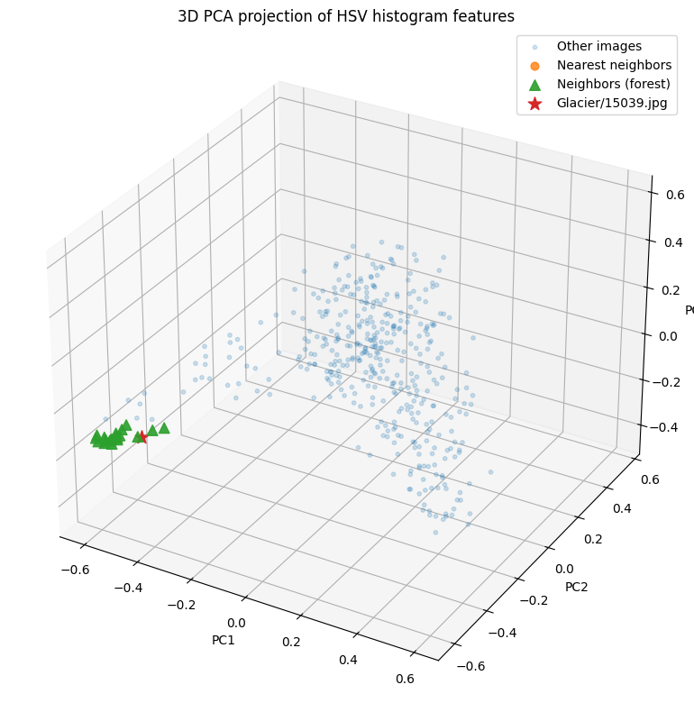
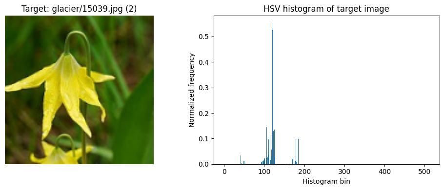
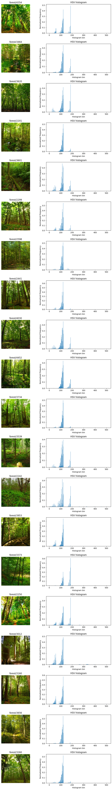

# IT3212 Assignment 1: Deep learning and unsupervised learning

## Table of Contents

- [Task 1](#task-1)
  - [Pick any image based dataset from the list, implement the preprocessing and justify the preprocessing steps, extract features and justify the methods used, select features and justify the methods used. Some of this is done already in one of the previous assignments. You can reuse things](#task-1-a)
  - [Implement (using the selected features) one basic machine learning algorithm for classification and justify your choice 20 (without justification 10).](#task-1-b)
  - [Implement (using the selected features) one advanced machine learning algorithm for classification and justify your choice 20 (without justification 10).](#task-1-c)
  - [Implement a CNN with hyperparameter tuning (for this you can directly use the data after the preprocessing) (30)](#task-1-d)
  - [Compare and Explain the results in terms of both the computation time and the performance of the classification algorithms. (30)](#task-1-e)
- [Task 2](#task-2)
  - [Pick any dataset from the list, implement the preprocessing and justify the preprocessing steps,extract features and justify the methods used, select features and justify the methods used. Some of this is done already in one of the previous assignments. You can reuse things.](#task-2-a)
  - [Implement three clustering methods out of the following and justify your choices (30)](#task-2-b)
    - [K-means](#k-means)
    - [Hierarchical clustering](#hierarchical-clustering)
    - [Fuzzy C-means](#fuzzy-c-means)
    - [DBSCAN](#dbscan)
    - [Gaussian mixture models](#gaussian-mixture-models)
    - [Self-organizing maps](#self-organizing-maps)
  - [Compare and Explain the results (30)](#task-2-c)

##  Task 1

###  Pick any image based dataset from the list, implement the preprocessing and justify the preprocessing steps, extract features and justify the methods used, select features and justify the methods used. Some of this is done already in one of the previous assignments. You can reuse things

We use the Intel Image Classification dataset for this task. It contains natural scene images labeled into six categories: buildings, forest, glacier, mountain, sea, and street. These category labels are the targets our models predict. The table below summarizes the number of images in the provided training and test sets. 

| Category   | Training images | Test images |
|-----------|-----------------|------------|
| **Buildings** | 2 191           | 437        |
| **Forest**    | 2 271           | 474        |
| **Glacier**   | 2,404           | 553        |
| **Mountain**  | 2 512           | 525        |
| **Sea**       | 2 274           | 510        |
| **Street**    | 2 382           | 501        |
| **Total**     | 14 034          | 3 000      |

<em>Table 1: Number of training and test images per category.</em>

In total, we removed 78 images from the training set, approximately 0.5% of all training images, a negligible proportion that can be discarded without meaningfully reducing the available information. Table 2 summarizes how many images were removed at each preprocessing stage, which will be described in the following sections.

| Method                    | Removed images  | Share      |
|---------------------------|-----------------|------------|
| **Exact Duplicates**      | 5               | 0.04%      |
| **Perceptual Duplicates** | 10              | 0.07%      |
| **Misplaced Images**      | 63              | 0.4%       |
| **Total**                 | 78              | 0.6%       |

<em>Table 2: Number of removed images from training set.</em>

Figure 1 and 2 show some sample images from each category in the training and test set.

   
  <em>Figure 1: Sample images for the training set</em>

   
  <em>Figure 2: Sample images for the test set</em>

#### Preprocessing

The preprocessing stage combined algorithms for detecting corrupted or low-quality images with manual inspection to ensure data quality. This approach minimized the risk of incorrectly discarding valid training images.

**Duplicate Images**

We detected exact duplicates by computing an MD5 hash (a short, fixed-length “fingerprint” of the image data) of each image’s raw pixel values and grouped images with identical hashes. The resulting duplicates pairs are shown in figure 3 and 4.

On closer inspection, some duplicate images appear in different categories (e.g., mountain/glacier and building/street), as shown in Figure 4. We treat these as intentional overlaps, since mountains can naturally contain glaciers and buildings often appear in street scenes, so these duplicates were kept. However, duplicates within the same category folder (e.g., forest, sea, street), as shown in Figure 3, are clearly redundant and were removed. There were only five such duplicates in the entire training set, which is a negligible fraction of the dataset, so removing them is unlikely to affect the results.

   
  <em>Figure 3: Exact duplicates with same category detected in the training set</em>

   
  <em>Figure 4: Exact duplicates with different categories detected in the training set</em>

In addition, we identified perceptual duplicates by computing a perceptual hash for each image and grouping images with identical hashes. Unlike exact duplicates, which rely on MD5 and only catch bit-for-bit identical files, perceptual hashing groups images that look the same, even if they differ slightly in encoding or minor edits. The results are shown in figure 5 and 6, where many image pairs are nearly indistinguishable to the human eye, though some differ slightly in lighting or saturation.

This method identified some of the same images as the exact-duplicate search, but also uncovered images that had been slightly modified. Perceptually duplicate images that appeared in multiple categories were retained for the same reasons as the exact duplicates, but those occurring within the same category folder were removed to eliminate redundant information. In total, we removed 10 perceptual duplicates. These duplicates with slight modifications could be seen as intented data augmentation, but we removed them so that we can control the augmentation process ourselves. This will be described further.

   
  <em>Figure 5: Perceptual duplicates with same category detected in the training set</em>

   
  <em>Figure 6: Perceptual duplicates with different categories detected in the training set</em>

**Not recognizable images**

We also examined whether the dataset contained blurry, empty/low-edge, almost constant, or overly noisy images. Empty or low-edge images were detected using edge detectors to flag cases with very few visible structures, almost constant images were identified by measuring how little the pixel intensities vary, blurry images were found by checking for a lack of fine detail using a Laplacian-based sharpness measure, and overly noisy images were characterized by excessively strong high-frequency responses.

We applied these checks to identify foggy, grainy, blurry, and otherwise unrepresentative images that would be difficult to classify reliably and could introduce noise into the model. In practice, we found only a small number of blurry and empty/low-edge images (Figures 7 and 8), and visual inspection showed that they are still sufficiently clear and structured to represent their categories, so we decided to keep them in the training set. 

   
  <em>Figure 7: Blurry images detected in the training set</em>

   
  <em>Figure 8: Empty/Low edge images detected in the training set</em>

**Misplaced Images**

We also used a modified K-nearest-neighbors algorithm (KNN) on HSV color-histogram features to identify potentially misplaced images, flagging those whose nearest neighbors mostly shared a different, but mutually consistent, class label. 

We also used a modified K-nearest-neighbors algorithm (KNN) with euclidean distance on HSV color-histogram (distribution of hue, saturation and value) features to identify potentially misplaced images, flagging those whose nearest neighbors mostly shared a different, but mutually consistent, class label. Here, each image was represented by an HSV color histogram, chosen instead of an RGB histogram because HSV separates color from lighting, making color comparisons more robust to the substantial illumination differences in our data and thus more effective for detecting mislabeled images across the categories. We used the following parameters:

- **K (k)**: Number of nearest neighbors to examine for each image (excluding the image itself). We set this to 20 to obtain a neighborhood that is both local and statistically stable.
- **Neigboor difference threshold (neighbor_diff_threshold)**: Minimum fraction of neighbors that must have a different label than the image to flag it as suspicious. We set this to 80% so that only cases with strong disagreement are flagged.
- **Minimum alternative fraction (min_alt_frac)**: Among the disagreeing neighbors, the minimum fraction that must agree on the same alternative class. We set this to 60% to avoid scattered disagreements and only flag images when there is a clear consensus on a different label.

Figure 9 illustrates how the KNN-based check flagged a mislabeled image (glacier/15039.jpg): in the 3D PCA projection of the HSV feature space, the flower image labeled as glacier (red star) lies among neighbors consistently labeled as forest (green markers), so we removed it from the dataset. Figure 10 shows the HSV histogram computed for the image.

   
  <em>Figure 9: PCA projection of HSV features highlighting a mislabeled glacier image</em>

   
  <em>Figure 10: HSV histogram for the mislabeled glacier image</em>

The neighbors used to detect the mislabeled image and their HSV histograms are shown below in Figure 11. These are joint 3D HSV histograms, where each bin counts pixels for a specific combination of hue, saturation, and value, so once flattened the x-axis shows bin indices rather than separate H, S, or V channels. The forest images have strong peaks around bin index ~100 on the x-axis, meaning many pixels share similar greenish HSV values characteristic of dense foliage.

   
  <em>Figure 11: HSV histograms of forest images</em>

Figure 11 shows the number of potentially misplaced images detected by the algorithm in each category. Figures 12–17 show 40 flagged images per category. Despite that KNN flagged 149 suspisious images in the mountains category, a closer look revealed an especially large number of suspicious images in the glacier class as shown in figure 12. We therefore manually inspected the glacier folder and removed X images from this category. 

We could have experimented with other parameter settings to detect additional suspicious images, but we chose not to, since this method was only intended as a tool to highlight categories that might require manual inspection. Our goal was to identify where misplacements were likely, not to develop a fully optimized automatic detector, so further tuning of the algorithm was unnecessarily demanding

In total, we removed 63 misplaced images from the glacier category, most of which were images of flowers, animals, forest scenes, indoor environments, or lakes, and some are shown in figure 12. We are aware that some noisy or mislabeled data may still remain in the dataset, but we consider this acceptable given that the KNN-based signals indicate only a small number of additional suspicious cases and that further cleaning would require substantial manual effort. We also chose not to reassign the removed glacier images to other categories, since many did not clearly belong to any of the predefined classes and they represent only a very small fraction of the overall dataset.

   
  <em>Figure 11: Potentially misplaced images detected by K-Nearest-Neighboor</em>

   
  <em>Figure 12: Potentially misplaced images in buildings category</em>

   
  <em>Figure 13: Potentially misplaced images in forest category
  </em>

   
  <em>Figure 14: Potentially misplaced images in glacier category</em>

   
  <em>Figure 15: Potentially misplaced images in mountain category</em>

   
  <em>Figure 16: Potentially misplaced images in sea category</em>

   
  <em>Figure 17: Potentially misplaced images in street category</em>

#### Extract and Select Features

###  Implement (using the selected features) one basic machine learning algorithm for classification and justify your choice 20 (without justification 10).

###  Implement (using the selected features) one advanced machine learning algorithm for classification and justify your choice 20 (without justification 10).

###  Implement a CNN with hyperparameter tuning (for this you can directly use the data after the preprocessing) (30)

###  Compare and Explain the results in terms of both the computation time and the performance of the classification algorithms. (30)

##  Task 2

###  Pick any dataset from the list, implement the preprocessing and justify the preprocessing steps,extract features and justify the methods used, select features and justify the methods used. Some of this is done already in one of the previous assignments. You can reuse things.

###  Implement three clustering methods out of the following and justify your choices (30)

####  Hierarchical clustering

####  Fuzzy C-means

####  DBSCAN

####  Gaussian mixture models

####  Self-organizing maps

###  Compare and Explain the results (30)
