# IT3212 Assignment 4: Deep learning and unsupervised learning

## Table of Contents

- [IT3212 Assignment 4: Deep learning and unsupervised learning](#it3212-assignment-4-deep-learning-and-unsupervised-learning)
  - [ Task 1](#-task-1)
    - [ Pick any image based dataset from the list, implement the preprocessing and justify the preprocessing steps, extract features and justify the methods used, select features and justify the methods used. Some of this is done already in one of the previous assignments. You can reuse things](#-pick-any-image-based-dataset-from-the-list-implement-the-preprocessing-and-justify-the-preprocessing-steps-extract-features-and-justify-the-methods-used-select-features-and-justify-the-methods-used-some-of-this-is-done-already-in-one-of-the-previous-assignments-you-can-reuse-things)
    - [ Implement (using the selected features) one basic machine learning algorithm for classification and justify your choice.](#-implement-using-the-selected-features-one-basic-machine-learning-algorithm-for-classification-and-justify-your-choice)
    - [Random forest](#randomforest)
    - [ Implement (using the selected features) one advanced machine learning algorithm for classification and justify your choice.](#-implement-using-the-selected-features-one-advanced-machine-learning-algorithm-for-classification-and-justify-your-choice)
    - [XGBoost](#xgboost)
    - [ Implement a CNN with hyperparameter tuning (for this you can directly use the data after the preprocessing)](#-implement-a-cnn-with-hyperparameter-tuning-for-this-you-can-directly-use-the-data-after-the-preprocessing)
    - [ Compare and Explain the results in terms of both the computation time and the performance of the classification algorithms.](#-compare-and-explain-the-results-in-terms-of-both-the-computation-time-and-the-performance-of-the-classification-algorithms)
  - [ Task 2](#task-2)
    - [ Pick any dataset from the list, implement the preprocessing and justify the preprocessing steps,extract features and justify the methods used, select features and justify the methods used.](#-pick-any-dataset-from-the-list-implement-the-preprocessing-and-justify-the-preprocessing-stepsextract-features-and-justify-the-methods-used-select-features-and-justify-the-methods-used)
    - [ Implement three clustering methods out of the following and justify your choices](#-implement-three-clustering-methods-out-of-the-following-and-justify-your-choices)
      - [ K-means](#k-means)
      - [ Fuzzy C-means](#fuzzy-c-means)
      - [ Gaussian mixture models](#gaussian-mixture-models)
    - [ Compare and Explain the results](#-compare-and-explain-the-results)
      - [ K-means](#compare-k-means)
      - [ Fuzzy C-means](#compare-fuzzy-c-means)
      - [ Gaussian mixture models](#compare-gaussian-mixture-models)

##  Task 1

###  Pick any image based dataset from the list, implement the preprocessing and justify the preprocessing steps, extract features and justify the methods used, select features and justify the methods used. Some of this is done already in one of the previous assignments. You can reuse things

We used the Intel Image Classification dataset for this task. It contains natural scene images labeled into six categories: buildings, forest, glacier, mountain, sea, and street. These category labels are the targets our models predict. The table below summarizes the number of images in the provided training and test sets. 

| Category      | Training images | Test images |
|---------------|-----------------|-------------|
| **Buildings** | 2 191           | 437         |
| **Forest**    | 2 271           | 474         |
| **Glacier**   | 2,404           | 553         |
| **Mountain**  | 2 512           | 525         |
| **Sea**       | 2 274           | 510         |
| **Street**    | 2 382           | 501         |
| **Total**     | 14 034          | 3 000       |

<em>Table 1: Number of training and test images per category.</em>

In total, we removed 78 images from the training set, approximately 0.5% of all training images, a negligible proportion that can be discarded without meaningfully reducing the available information. Table 2 summarizes how many images were removed at each preprocessing stage, which will be further described in the following sections.

| Method                    | Removed images  | Share      |
|---------------------------|-----------------|------------|
| **Exact Duplicates**      | 5               | 0.04%      |
| **Perceptual Duplicates** | 10              | 0.07%      |
| **Miscategorized Images** | 63              | 0.4%       |
| **Total**                 | 78              | 0.6%       |

<em>Table 2: Number of removed images from training set.</em>

Figure 1 and 2 show some sample images from each category in the training and test set.

  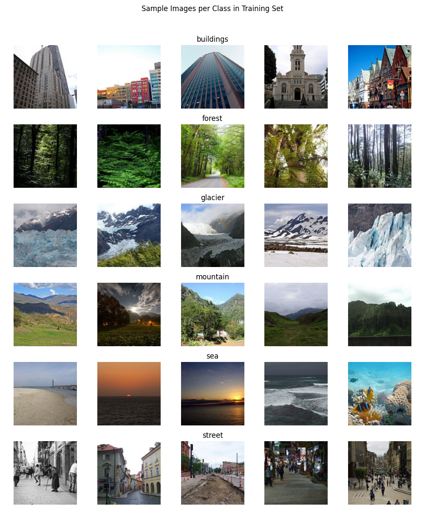 
  <em>Figure 1: Sample images for the training set</em>

  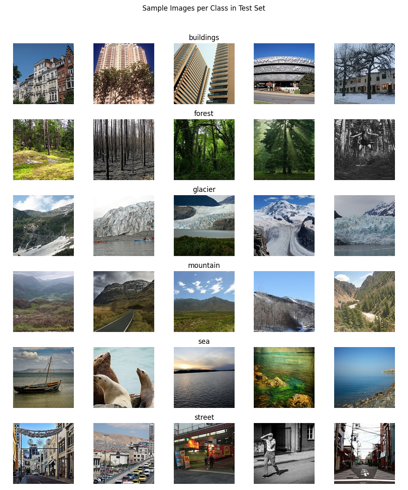 
  <em>Figure 2: Sample images for the test set</em>

#### Preprocessing

The preprocessing stage combined algorithms for detecting corrupted or low-quality images with manual inspection to ensure data quality. This approach minimized the risk of incorrectly discarding valid training images.

**Duplicate Images**

We detected exact duplicates by computing an MD5 hash (a short, fixed-length “fingerprint” of the image data) of each image’s raw pixel values and grouped images with identical hashes. The resulting duplicates pairs are shown in figure 3 and 4.

On closer inspection, some duplicate images appear in different categories (e.g., mountain/glacier and building/street), as shown in Figure 4. We treat these as intentional overlaps, since mountains can naturally contain glaciers and buildings often appear in street scenes, so these duplicates were kept. However, duplicates within the same category folder (e.g., forest, sea, street), as shown in Figure 3, are clearly redundant and were removed. There were only five such duplicates in the entire training set, which is a negligible fraction of the dataset, so removing them is unlikely to affect the results.

  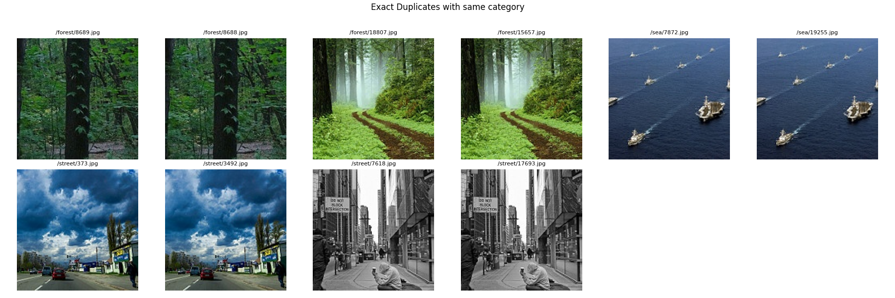 
  <em>Figure 3: Exact duplicates with same category detected in the training set</em>

  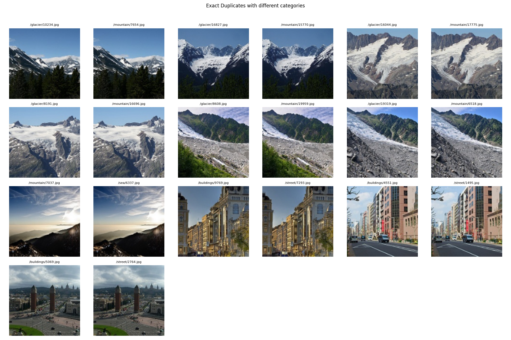 
  <em>Figure 4: Exact duplicates with different categories detected in the training set</em>

In addition, we identified perceptual duplicates by computing a perceptual hash for each image and grouping images with identical hashes. Unlike exact duplicates, which rely on MD5 and only catch bit-for-bit identical files, perceptual hashing groups images that look the same, even if they differ slightly in encoding or minor edits. The results are shown in figure 5 and 6, where many image pairs are nearly indistinguishable to the human eye, though some differ slightly in lighting or saturation.

This method identified some of the same images as the exact-duplicate search, but also uncovered images that had been slightly modified. Perceptually duplicate images that appeared in multiple categories were retained for the same reasons as the exact duplicates, but those occurring within the same category folder were removed to eliminate redundant information. In total, we removed 10 perceptual duplicates. These duplicates with slight modifications could be seen as intented data augmentation, but we removed them so that we can control the augmentation process ourselves. This will be described further in the next sections.

   
  <em>Figure 5: Perceptual duplicates with same category detected in the training set</em>

  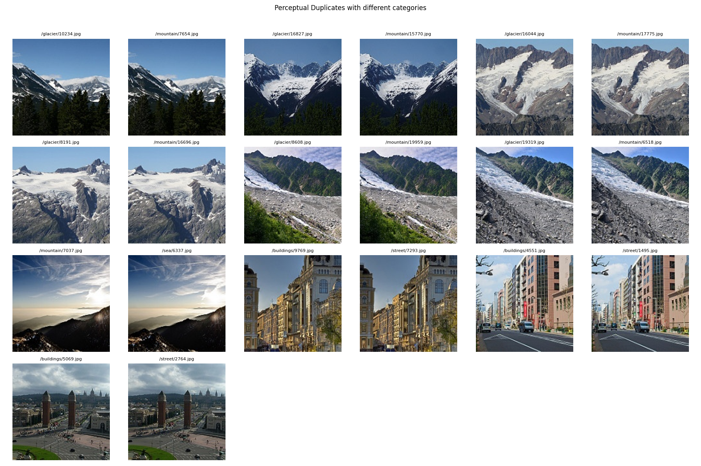 
  <em>Figure 6: Perceptual duplicates with different categories detected in the training set</em>

<h2 style="color: green;">TODO: Nevne at vi fjerner perceptual duplicates, fordi vi ønsker å kontrollere data augmentation selv
- Refere til bilder og ta med eksakte tall.
</h2>

**Not recognizable images**

We also examined whether the dataset contained blurry, empty/low-edge, almost constant, or overly noisy images. Empty or low-edge images were detected using edge detectors to flag cases with very few visible structures, almost constant images were identified by measuring how little the pixel intensities vary, blurry images were found by checking for a lack of fine detail using a Laplacian-based sharpness measure, and overly noisy images were characterized by excessively strong high-frequency responses.

We applied these checks to identify foggy, grainy, blurry, and otherwise unrepresentative images that would be difficult to classify and could introduce noise into the model. In practice, we found only a small number of blurry and empty/low-edge images shown in figure 7 and 8, and visual inspection showed that they are still sufficiently clear and structured to represent their categories, so we decided to keep them in the training set. 

   
  <em>Figure 5: Blurry images detected in the training set</em>

   
  <em>Figure 6: Empty/Low edge images detected in the training set</em>

<h2 style="color: green;">TODO: nevne at vi ønsker å se etter bilder som er blurry, har få edges, noisy etc og hvorfor vi gjorde? hva vi hadde ønsket å finne
- bildene er tåkete
</h2>

**Misplaced Images**

We also used a modified K-nearest-neighbors algorithm (KNN) with Euclidean distance to identify potentially miscategorized images, flagging those whose nearest neighbors mostly shared a different, but mutually consistent, class label. By miscategorized, we refer to training images that have been assigned the wrong class label. For example a building being labeled as a forest. By suspicious, we mean training images that the algorithm suggests may be incorrectly labeled, but which require manual inspection to confirm.

In detail, each image was represented using an HSV color histogram, where each pixel is defined by its hue (dominant color), saturation (color intensity), and value (brightness), and the histogram captures the number of pixels falling into discrete bins across these three components. This was chosen over RGB because HSV separates color from lighting, making color comparisons more robust to the substantial illumination differences in our data and thus more effective for detecting mislabeled images across the categories. We used the following parameters:

- **K (k)**: Number of nearest neighbors to examine for each image (excluding the image itself). We set this to 20 to obtain a neighborhood that is both local and statistically stable.
- **Neigboor difference threshold (neighbor_diff_threshold)**: Minimum fraction of neighbors that must have a different label than the image to flag it as suspicious. We set this to 80% so that only cases with strong disagreement are flagged.
- **Minimum alternative fraction (min_alt_frac)**: Among the disagreeing neighbors, the minimum fraction that must agree on the same alternative class. We set this to 60% to avoid scattered disagreements and only flag images when there is a clear consensus on a different label.

Figure 9 shows how the KNN-based method flagged a potentially miscategorized image, specifically a flower that had been mislabeled as a glacier (glacier/15039.jpg). In the 3D PCA projection of the HSV feature space, the image labeled as glacier (red star) appears among neighbors consistently labeled as forest (green markers). Figure 10 shows the HSV histogram for this image. This illustrates our procedure of identifying images the algorithm marks as potentially miscategorized and manually inspecting them to verify their labels. 

  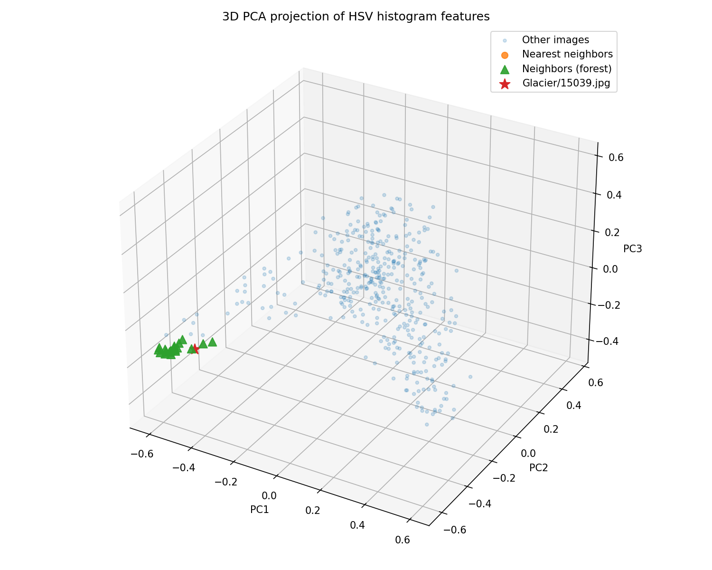 
  <em>Figure 9: PCA projection of HSV features highlighting a mislabeled glacier image</em>

  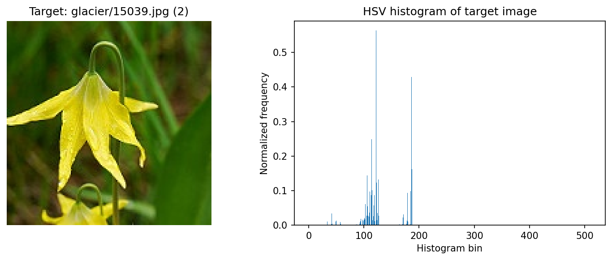 
  <em>Figure 10: HSV histogram for the mislabeled glacier image</em>

The neighbors used to detect the mislabeled image in Figure 10 and their HSV histograms are shown in Figure 11. These are joint 3D HSV histograms, where each bin counts pixels for a specific combination of hue, saturation, and value; once flattened, the x-axis therefore indexes bins rather than separate hue, saturation, or value channels. The forest images exhibit strong peaks around bin index 100, indicating many pixels share similar greenish HSV values characteristic of dense foliage. The HSV histogram of the miscategorized image in Figure 10 closely matches this distribution, which explains why the forest images in Figure 11 were selected as its nearest neighbors.

   
  <em>Figure 11: HSV histograms of forest images</em>

Table 3 shows how many potentially miscategorized images the algorithm detected in each category. Figures 12–17 show, for each category, the 40 images whose labels disagree most with their neighbors according to the KNN-based neigboor difference threshold explained earlier. This means that those images are most likely to differ from their assigned class label. These are the images most likely to be mislabeled relative to their assigned class. Despite KNN flagging 149 suspicious images in the mountains category, closer inspection revealed an even larger number of truly miscategorized images in the glacier class, as shown in Figure 12. We therefore manually inspected the glacier folder and removed 63 images from this category. 

We could have experimented with other parameter setting to detect more suspicious images, but we chose not to, since this method was only intended as a tool to highlight candidates for manual inspection. Our goal was to identify which types of miscategorized images appeared most frequently, not to develop a fully optimized automatic detector, so further tuning of the algorithm would have been unnecessarily demanding. The method suggested that miscategorized images were most prevalent in the glacier category.

In total, we removed 63 miscategorized images from the glacier category, most of which were images of flowers, animals, forest scenes, indoor environments, or lakes, and some are shown in figure 12. We acknowledge that some noisy or mislabeled data may still remain in the dataset, but we consider this acceptable given that the KNN results suggest only a small number of additional suspicious cases in the other categories, and that further cleaning would require substantial manual effort. We also chose not to reassign the removed glacier images to other categories, since many did not clearly belong to any of the predefined classes and they represent only a very small fraction of the overall dataset.

| **Class**     | **Total images** | **Suspicious images** | **Share suspicious** |
|---------------|------------------|------------------------|---------------------|
| **Buildings** | 2 191            | 103                    | 4.70%               |
| **Forest**    | 2 271            | 15                     | 0.66%               |
| **Glacier**   | 2 404            | 48                     | 2.00%               |
| **Mountain**  | 2 512            | 149                    | 5.93%               |
| **Sea**       | 2 274            | 112                    | 4.93%               |
| **Street**    | 2 382            | 60                     | 2.52%               |
| **Total**     | 14 034           | 537                    | 3.5%                |

<em>Table 3: Potentially miscategorized images detected by K-Nearest-Neighboor.</em>

   
  <em>Figure 12: Potentially miscategorized images in buildings category</em>

   
  <em>Figure 13: Potentially miscategorized images in forest category
  </em>

   
  <em>Figure 14: Potentially miscategorized images in glacier category</em>

   
  <em>Figure 15: Potentially miscategorized images in mountain category</em>

   
  <em>Figure 16: Potentially miscategorized images in sea category</em>

   
  <em>Figure 17: Potentially miscategorized images in street category</em>

<h2 style="color: green;">TODO: 
- kommenterer bildene
- nevn valgte hyperparametere
- forklar hvorfor vi ikke valgte prøvde flere hyperparametere
</h2>

**Data Augmentation**

To increase robustness and expand the effective training set, we applied three forms of data augmentation to the training images: horizontal flipping, affine skewing, and central cropping followed by resizing. These augmentations are particularly relevant for our scene-classification task involving the categories buildings, forest, glacier, mountain, sea, and street, since natural scene images often appear with variations in viewpoint, framing, and orientation. Some examples of augmented images are shown in figure 18.

- **Horizontal flipping** helps the model become invariant to left–right orientation, which is common in landscapes and urban environments (e.g., coastlines, tree lines, or streets viewed from opposite angles).
- **Affine skewing** simulates changes in camera angle or perspective, which frequently occur in scenes such as buildings, mountains, and forests where the viewer's position can vary widely.
- **Central cropping** encourages the model to remain robust to shifts in zoom or framing, reflecting real-world variation in how scenes are captured.

  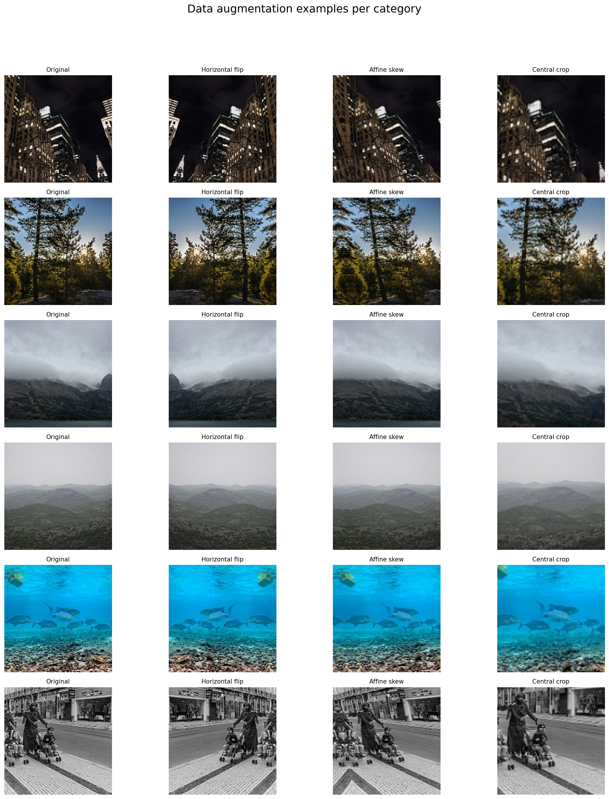 
  <em>Figure 18: Data augmented images</em>

**Resizing Images**

All images were originally 150×150 pixels but were resized to 128×128 during preprocessing. A fixed input size is required for the CNN and greatly simplifies feature extraction for the Random Forest, XGBoost, and stacking ensemble models. The 128×128 resolution offers a good balance between preserving visual detail and keeping the computational cost low, enabling efficient training while maintaining sufficient image quality for all models. Figure 19 shows that the clear structure and overall quality of each image are preserved at this lower resolution, indicating that 128×128 is sufficient for subsequent modelling.

   
  <em>Figure 19: Images before and after resizing.</em>

**Normalizing Images**

After resizing, we normalized all images by scaling pixel values from the original 0–255 range to 0–1. This keeps the overall pixel distribution intact as shown in figure 20 but puts all inputs on a common scale, which stabilizes training for the CNN and makes the features more comparable for the Random Forest, XGBoost, and stacking ensemble models.

  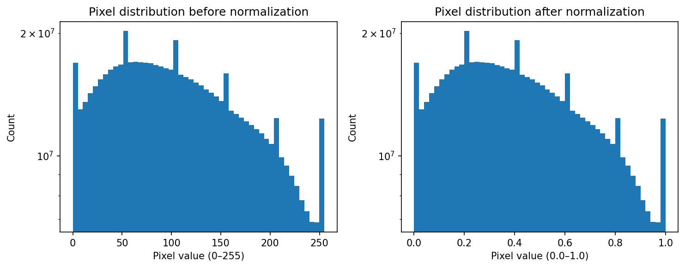 
  <em>Figure 20: Images before and after resizing.</em>

#### Extract and Select Features

<h2 style="color: green;">TODO: 
- legg til intro
- forklaring på hva, hvorfor, hvordan for alle feature extraction methodene
- only data aug for CNN, not for HOG, LBP
</h2>

###  Implement (using the selected features) one basic machine learning algorithm for classification and justify your choice.

<h2 style="color: green;">TODO: 
- legg til intro
- forklaring på hva, hvorfor, hvordan randomforest, svm
</h2>

### RandomForest

    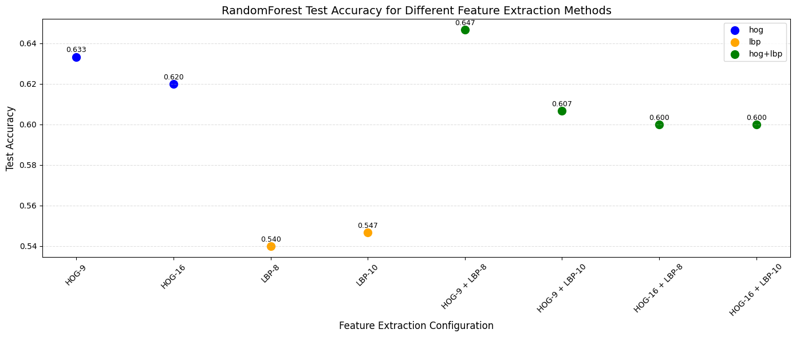

| Label example      | Meaning                              |
| ------------------ | ------------------------------------ |
| **HOG-9**      | HOG with 9 orientations   |
| **HOG-16**     | HOG with 16 orientations  |
| **LBP-8**      | LBP with 8 points              |
| **LBP-10**     | LBP with 10 points             |
| **HOG-9 + LBP-8** | HOG with 16 bins + LBP with 8 points |

The parameter sweep and resulting accuracy plot clearly show that **HOG features consistently outperform LBP features** when used independently with a RandomForest classifier. HOG with either 9 or 16 orientation bins produces test accuracies in the range of **0.62–0.63**, which is notably higher than the LBP configurations, which remain around **0.54–0.55** regardless of whether 8 or 10 sampling points are used. This difference reflects the fact that HOG captures richer gradient-based spatial structure, edges, shapes, and contours, while LBP focuses primarily on local texture micro-patterns.

LBP on its own underperforms because RandomForests tend to benefit from moderately high-dimensional, discriminative features that capture variation at different spatial scales, whereas LBP produces relatively coarse binary patterns that emphasize uniform local texture. Even with different P values (8 vs. 10 sampling points), the performance remains tightly clustered around 0.54–0.55, indicating that changing the radius or number of neighbors does not significantly increase discriminative power for this dataset. This suggests that the dataset’s class boundaries are not strongly explained by micro-textures alone, and LBP’s invariance properties may also reduce useful variation that the classifier could exploit.

The combined **HOG+LBP** features perform between the individual methods: better than LBP alone, but not always exceeding HOG alone. Their accuracies cluster around **0.60–0.65**, with the best combination (HOG-9 + LBP-8) reaching the highest overall accuracy of roughly **0.647**. This indicates that LBP contributes some complementary information, but not enough to consistently improve upon HOG alone. RandomForests may also struggle with the increased dimensionality when HOG and LBP are concatenated, especially if some dimensions are redundant or noisy. Overall, the results show that HOG is the most useful individual descriptor, while combining it with LBP can offer moderate improvements but is not uniformly beneficial across parameter settings.

<h2 style="color: green;">TODO: 
- forklar hva p values er
- nevn at vi bruker LBP Histogram, i stedet for LBP
</h2>

###  Implement (using the selected features) one advanced machine learning algorithm for classification and justify your choice.

<h2 style="color: green;">TODO: 
- legg til intro
- forklaring på hva, hvorfor, hvordan for xgboost og stacking
</h2>

# XGBoost

    

| Method    | HOG Orientations | LBP Points (P) | Test Accuracy |
| --------- | ---------------- | -------------- | ------------- |
| HOG       | 9                | -              | 0.653         |
| HOG       | 16               | -              | 0.620         |
| LBP       | -                | 8              | 0.520         |
| LBP       | -                | 10             | 0.487         |
| HOG + LBP | 9                | 8              | 0.707         |
| HOG + LBP | 9                | 10             | 0.713         |
| HOG + LBP | 16               | 8              | 0.687         |
| HOG + LBP | 16               | 10             | 0.627         |

Effect of HOG parameters on accuracy

The HOG-only feature extraction results show that using 9 orientations outperforms 16 orientations (65.3% vs. 62.0%). This suggests that increasing the number of orientations beyond a certain point might add noise to our features, reducing model generalization. The simpler configuration with fewer orientations is enough to capture key shape and edge features relevant for classifying these image classes. Thus, a moderate HOG parameter setting helps maintain good performance without unnecessary complexity.

Effect of LBP parameters on accuracy

The LBP-only features yield lower accuracy overall compared to HOG, with 8 sampling points performing better than 10 points (52.0% vs. 48.7%). Increasing the number of points in LBP may introduce more local texture detail but can also increase noise or variability, which might reduce classifier accuracy. LBP is known to capture fine texture patterns, but for this dataset and XGBoost model, simpler LBP parameters seem more effective than higher complexity.

Combining HOG and LBP features

Combining HOG and LBP features consistently improves accuracy over either method alone. The highest accuracy (71.3%) is achieved with HOG-9 orientations combined with LBP-10 points, demonstrating complementary benefits of capturing both shape and texture information. Interestingly, increasing HOG orientations to 16 while combining with LBP yields slightly lower accuracy, reflecting the previous trend that higher HOG complexity is less helpful. Overall, feature fusion provides richer information for XGBoost to leverage, significantly boosting classification performance across the diverse image classes.

This analysis highlights how tuning feature extraction parameters impacts model accuracy, balancing complexity and representational richness for optimal image classification.

<h2 style="color: green;">TODO: 
- nevn at vi bruker mye enklere versjoner av modelene på 10% av data slik at feature parameter sweep ikke tar uendelig mye tid.
- nevn at vi har brukt hyperparameter tuning på randomforest
</h2>

###  Implement a CNN with hyperparameter tuning (for this you can directly use the data after the preprocessing)

Convolutional Neural Networks (CNNs) are a class of deep learning models specifically designed to exploit the spatial structure in image data. Instead of treating each pixel as an independent feature (as in traditional machine learning models), CNNs use convolutional filters and pooling operations to learn hierarchical feature representations directly from the raw image. This makes them particularly well suited for image classification, compared to models such as Random Forests, XGBoost, or stacking ensembles which typically rely on hand-crafted and/or pre-computed features.

In our experiments, we implemented a CNN in TensorFlow/Keras and trained it on the preprocessed image data before feature extraction. The model consisted of several convolutional and max-pooling layers followed by fully connected layers and a final softmax output over the six classes. To increase robustness and enlarge the effective training set, we applied data augmentation to the training images (horizontal flipping, affine “skewing”, and central cropping followed by resizing). Importantly, this augmentation step was the only additional preprocessing performed for the CNN; we did not perform separate feature extraction as we did for the basic and advance models.

The baseline CNN (with a fixed architecture and reasonable default hyperparameters) trained on the full augmented dataset in approximately 15 minutes on CPU. To investigate the effect of hyperparameters, we then performed a grid search over multiple CNN configurations. This hyperparameter tuning was substantially more expensive: even when using only 10% of the training data, the grid search took more than two hours to complete. The tuned model also showed clear signs of overfitting: it achieved a validation accuracy of 67.8%, while the final test accuracy dropped to 61%. This suggests that the hyperparameter search found a configuration that fit the validation split too closely, without improving generalization to unseen data.

By contrast, when we trained our “standard” CNN model (without the heavy grid search) on 100% of the available data, we obtained a substantially higher test accuracy of 83%. This underlines two important points: (i) CNNs can leverage larger amounts of raw image data effectively thanks to their ability to learn features end-to-end, and (ii) hyperparameter tuning must be done carefully to avoid overfitting to a particular validation set, especially when the tuning budget is large compared to the size of the dataset.

<h2 style="color: green;">TODO: 
- 3. avsnitt: skriv om det vi først satt opp en CNN med default hyperparametere, og fikk 83% accuracy som tok ca. 23 min
- så gjorde vi en GridSearch og tok beste resultat
- nevn hvilke parametere de blir gjort gridsearch på
- forklar hvorfor vi valgte hver metode i data augmentation
</h2>

###  Compare and Explain the results in terms of both the computation time and the performance of the classification algorithms.

When comparing the different classification algorithms, both computation time and predictive performance showed clear differences between the CNN and the traditional machine learning models (Random Forest, XGBoost, and the stacking ensemble).

For the basic and advanced models, we did not feed raw images directly. Instead, we first computed feature representations for each image. This feature extraction pipeline took roughly 30 minutes to run. On top of this, training the basic and advanced models on just 20% of the data exceeded the total training time of the CNN on the full dataset, even with data augmentation.

There are several plausible reasons why Random Forest, XGBoost, and the stacking ensemble required more computation time than the CNN:

Extra preprocessing cost:
The feature extraction step for RF and XGBoost is a separate stage that must be applied to every image before training. In contrast, the CNN learns features directly from the raw pixels, and the only additional preprocessing, data augmentation, is done before its given to the model.

Algorithmic differences:
Tree-based methods build many decision trees. Each tree involves repeated splitting of the data based on feature values, which is relatively expensive on CPUs. A CNN, on the other hand, mainly convolutions and matrix multiplications, which libraries like TensorFlow optimize heavily, using parallelization.

Model complexity over multiple models (stacking):
The stacking model combines predictions from several base learners (e.g., Random Forest and SVM) into a meta-model (logistic regression). This effectively multiplies the training cost: each base model must be trained, predictions must be computed, and then the meta-model must be fitted. This multi-stage procedure is naturally more time-consuming than training a single CNN end-to-end. However it performed better than its base learners. Stacking can have the benefit of better accuracy by learning from the predictions of its base learners, thereby making its predictions more reliable. Furthermore, stacking allows the meta model to make use of its base learners strengths, and recognize their mistakes. Lastly, stacking is also highly flexible to different problems. However, as in our case, it is computationally heavy, even with only two base learners. If a problem requires a quick solution and deployment, this strategy would not be adviced.

In terms of classification performance, the CNN clearly outperformed both Random Forest and XGBoost on this image classification task. While the tuned CNN variant overfitted and achieved only 61% test accuracy, our main CNN model trained on 100% of the data reached 83% accuracy, compared to substantially lower accuracies for the tree-based models.

This performance gap can be explained by how the models use information in the data:

Exploiting spatial structure:
CNNs operate directly on 2D image grids with multiple channels and use convolutional filters to capture local patterns such as edges, textures, and shapes. Deeper layers combine these into higher-level concepts. This hierarchical feature learning is very effective for images. We think that maybe the features that the cnn extracts on its own, might be better features compared to the ones we precomputed for our other models.

Information loss in feature extraction:
Furthermore, for Random Forest, XGBoost ans the stacking ensemble, we reduced each image to a small set of hand-crafted features (three feature extractions per image). While this drastically reduces dimensionality and makes the models easier to train, it also loses spatial and textural information present in the original images. If the chosen features are not expressive enough, the models are simply not given sufficient information to match the CNN’s performance.

Model capacity and flexibility:
The CNN has a high capacity to approximate complex decision boundaries directly in pixel space, while the tree-based models are constrained to operate on a small, fixed feature vector. Even powerful ensemble methods like XGBoost will be limited by the quality and richness of those features. In our experiments, this likely led to a situation where the CNN could capture more nuanced visual patterns and therefore generalize better on the test set.

Overall, the results show that despite the common perception that deep learning models are always slower and more resource-intensive, a reasonably sized CNN can be competitive or even faster than traditional methods when using GPU. This is especially the case when traditional methods depend on expensive feature extraction pipelines. At the same time, the CNN achieved clearly superior classification performance on this image dataset, which is consistent with its architectural advantages for image-based tasks.

<h2 style="color: green;">TODO: 
- legg til SVM in sammenligningen
</h2>

##  Task 2

###  Pick any dataset from the list, implement the preprocessing and justify the preprocessing steps, extract features and justify the methods used, select features and justify the methods used.

We picked the social media dataset for clustering. The dataset contains data about online news, such as categories they fit into, sentiment analysis, and their popularity. 

An actual use case for clustering on this dataset is to group online news together with others that are similar, preferring to show users that engage more with news from a particular cluster other news within the same cluster. By showing users news similar to those they usually engage with, it's likely total engagement and user retention would increase.

  <table style="margin-left:auto; margin-right:auto">
    <tr>
      <td>url</td><td>timedelta</td><td>n_tokens_title</td><td>n_tokens_content</td>
    </tr>
    <tr>
      <td>n_unique_tokens</td><td>n_non_stop_words</td><td>n_non_stop_unique_tokens</td><td>num_hrefs</td>
    </tr>
    <tr>
      <td>num_self_hrefs</td><td>num_imgs</td><td>num_videos</td><td>average_token_length</td>
    </tr>
    <tr>
      <td>num_keywords</td><td>data_channel_is_lifestyle</td><td>data_channel_is_entertainment</td><td>data_channel_is_bus</td>
    </tr>
    <tr>
      <td>data_channel_is_socmed</td><td>data_channel_is_tech</td><td>data_channel_is_world</td><td>kw_min_min</td>
    </tr>
    <tr>
      <td>kw_max_min</td><td>kw_avg_min</td><td>kw_min_max</td><td>kw_max_max</td>
    </tr>
    <tr>
      <td>kw_avg_max</td><td>kw_min_avg</td><td>kw_max_avg</td><td>kw_avg_avg</td>
    </tr>
    <tr>
      <td>self_reference_min_shares</td><td>self_reference_max_shares</td><td>self_reference_avg_sharess</td><td>weekday_is_monday</td>
    </tr>
    <tr>
      <td>weekday_is_tuesday</td><td>weekday_is_wednesday</td><td>weekday_is_thursday</td><td>weekday_is_friday</td>
    </tr>
    <tr>
      <td>weekday_is_saturday</td><td>weekday_is_sunday</td><td>is_weekend</td><td>LDA_00</td>
    </tr>
    <tr>
      <td>LDA_01</td><td>LDA_02</td><td>LDA_03</td><td>LDA_04</td>
    </tr>
    <tr>
      <td>global_subjectivity</td><td>global_sentiment_polarity</td><td>global_rate_positive_words</td><td>global_rate_negative_words</td>
    </tr>
    <tr>
      <td>rate_positive_words</td><td>rate_negative_words</td><td>avg_positive_polarity</td><td>min_positive_polarity</td>
    </tr>
    <tr>
      <td>max_positive_polarity</td><td>avg_negative_polarity</td><td>min_negative_polarity</td><td>max_negative_polarity</td>
    </tr>
    <tr>
      <td>title_subjectivity</td><td>title_sentiment_polarity</td><td>abs_title_subjectivity</td><td>abs_title_sentiment_polarity</td>
    </tr>
    <tr>
      <td>shares</td><td></td><td></td><td></td>
    </tr>
  </table>
   
  <em>Figure #: All columns in the dataset</em>

To start off with preprocessing the dataset, we looked at all the columns to get an understanding of what the data represents. The columns are showin in figure #. Features with names starting with `kw_` represent the amount of shares gained by articles assigned each keyword, looking at the min, average, and max shares for the best, average, and worst keywords associated with the article. Features starting with `LDA_` represent closeness to a given LDA topic (abstract topics/themes decided by another machine learning algorithm). Many of the features, such as `global_sentiment_polarity` and `title_subjectivity` are based on sentiment analysis.

The dataset contains several columns that are not useful for our selected use case. The first we removed was `url`, as it's useless for clustering. This is because it's unique and categorical, making it impossible to create clusters from.

We also decided to remove all time-related columns, being `weekday_is_monday`, ..., `weekday_is_sunday`, `is_weekend`, and `timedelta`. The reason for deleting these columns even though they might be useful for clustering is that using clustering with them don't make much sense given our theoretical use case. When recommending similar online news to what you engage with, it wouldn't make sense to take into account which day the news were posted, as recommendations on online platforms should almost always prefer recent news. It doesn't matter what day something was posted if you're recommending something posted within ~2 days anyway.

Using this logic, it might make sense to include `timedelta`, which refers to the days between the article publication and dataset aquisition. The reason we didn't include this column is because this value can range from a few days to several years, which is a much larger range than what would be expected when recommending online news. If we were to create a recommendation algorithm based on our clustering results, we would put an external limitation that would heavily prefer recent articles instead of including `timedelta` when clustering. 

`timedelta` does have an effect on `shares`, as older articles have more time to accumulate shares, but we still chose to includes `shares` when clustering. This is because all data points have a `timedelta` of at least 8 days, so we think all articles have had some time to get a number of shares that would be highly correlated with the number of shares they would have after a few days (This assumes articles gain the most traction/shares when they are recently released, meaning even if older articles have much more time to gain shares, most shares are gained within the first few days of release).

After removing some columns, we are left with the features showin in figure #, along with their some data on their distributions. We can also see from this figure that there are no missing values, as each column contains the same count as the total number of rows.

  <table style="margin-left:auto; margin-right:auto">
    <tr>
      <th>Feature</th><th>Count</th><th>Mean</th><th>Std</th><th>Min</th><th>25%</th><th>50%</th><th>75%</th><th>Max</th>
    </tr>
    <tr><td>n_tokens_title</td><td>39644</td><td>10.398749</td><td>2.114037</td><td>2</td><td>9</td><td>10</td><td>12</td><td>23</td></tr>
    <tr><td>n_tokens_content</td><td>39644</td><td>546.514731</td><td>471.107508</td><td>0</td><td>246</td><td>409</td><td>716</td><td>8474</td></tr>
    <tr><td>n_unique_tokens</td><td>39644</td><td>0.548216</td><td>3.520708</td><td>0</td><td>0.470870</td><td>0.539226</td><td>0.608696</td><td>701</td></tr>
    <tr><td>n_non_stop_words</td><td>39644</td><td>0.996469</td><td>5.231231</td><td>0</td><td>1</td><td>1</td><td>1</td><td>1042</td></tr>
    <tr><td>n_non_stop_unique_tokens</td><td>39644</td><td>0.689175</td><td>3.264816</td><td>0</td><td>0.625739</td><td>0.690476</td><td>0.754630</td><td>650</td></tr>
    <tr><td>num_hrefs</td><td>39644</td><td>10.883690</td><td>11.332017</td><td>0</td><td>4</td><td>8</td><td>14</td><td>304</td></tr>
    <tr><td>num_self_hrefs</td><td>39644</td><td>3.293638</td><td>3.855141</td><td>0</td><td>1</td><td>3</td><td>4</td><td>116</td></tr>
    <tr><td>num_imgs</td><td>39644</td><td>4.544143</td><td>8.309434</td><td>0</td><td>1</td><td>1</td><td>4</td><td>128</td></tr>
    <tr><td>num_videos</td><td>39644</td><td>1.249874</td><td>4.107855</td><td>0</td><td>0</td><td>0</td><td>1</td><td>91</td></tr>
    <tr><td>average_token_length</td><td>39644</td><td>4.548239</td><td>0.844406</td><td>0</td><td>4.478404</td><td>4.664082</td><td>4.854839</td><td>8.041534</td></tr>
    <tr><td>num_keywords</td><td>39644</td><td>7.223767</td><td>1.909130</td><td>1</td><td>6</td><td>7</td><td>9</td><td>10</td></tr>
    <tr><td>data_channel_is_lifestyle</td><td>39644</td><td>0.052946</td><td>0.223929</td><td>0</td><td>0</td><td>0</td><td>0</td><td>1</td></tr>
    <tr><td>data_channel_is_entertainment</td><td>39644</td><td>0.178009</td><td>0.382525</td><td>0</td><td>0</td><td>0</td><td>0</td><td>1</td></tr>
    <tr><td>data_channel_is_bus</td><td>39644</td><td>0.157855</td><td>0.364610</td><td>0</td><td>0</td><td>0</td><td>0</td><td>1</td></tr>
    <tr><td>data_channel_is_socmed</td><td>39644</td><td>0.058597</td><td>0.234871</td><td>0</td><td>0</td><td>0</td><td>0</td><td>1</td></tr>
    <tr><td>data_channel_is_tech</td><td>39644</td><td>0.185299</td><td>0.388545</td><td>0</td><td>0</td><td>0</td><td>0</td><td>1</td></tr>
    <tr><td>data_channel_is_world</td><td>39644</td><td>0.212567</td><td>0.409129</td><td>0</td><td>0</td><td>0</td><td>0</td><td>1</td></tr>
    <tr><td>kw_min_min</td><td>39644</td><td>26.106801</td><td>69.633215</td><td>-1</td><td>-1</td><td>-1</td><td>4</td><td>377</td></tr>
    <tr><td>kw_max_min</td><td>39644</td><td>1153.951682</td><td>3857.990877</td><td>0</td><td>445</td><td>660</td><td>1000</td><td>298400</td></tr>
    <tr><td>kw_avg_min</td><td>39644</td><td>312.366967</td><td>620.783887</td><td>-1</td><td>141.750000</td><td>235.500000</td><td>357</td><td>42827.857143</td></tr>
    <tr><td>kw_min_max</td><td>39644</td><td>13612.354102</td><td>57986.029357</td><td>0</td><td>0</td><td>1400</td><td>7900</td><td>843300</td></tr>
    <tr><td>kw_max_max</td><td>39644</td><td>752324.066694</td><td>214502.129573</td><td>0</td><td>843300</td><td>843300</td><td>843300</td><td>843300</td></tr>
    <tr><td>kw_avg_max</td><td>39644</td><td>259281.938083</td><td>135102.247285</td><td>0</td><td>172846.875</td><td>244572.222</td><td>330980</td><td>843300</td></tr>
    <tr><td>kw_min_avg</td><td>39644</td><td>1117.146610</td><td>1137.456951</td><td>-1</td><td>0</td><td>1023.635611</td><td>2056.781032</td><td>3613.039819</td></tr>
    <tr><td>kw_max_avg</td><td>39644</td><td>5657.211151</td><td>6098.871957</td><td>0</td><td>3562.101631</td><td>4355.688836</td><td>6019.953968</td><td>298400</td></tr>
    <tr><td>kw_avg_avg</td><td>39644</td><td>3135.858639</td><td>1318.150397</td><td>0</td><td>2382.448566</td><td>2870.074878</td><td>3600.229564</td><td>43567.659946</td></tr>
    <tr><td>self_reference_min_shares</td><td>39644</td><td>3998.755396</td><td>19738.670516</td><td>0</td><td>639</td><td>1200</td><td>2600</td><td>843300</td></tr>
    <tr><td>self_reference_max_shares</td><td>39644</td><td>10329.212662</td><td>41027.576613</td><td>0</td><td>1100</td><td>2800</td><td>8000</td><td>843300</td></tr>
    <tr><td>self_reference_avg_sharess</td><td>39644</td><td>6401.697580</td><td>24211.332231</td><td>0</td><td>981.1875</td><td>2200</td><td>5200</td><td>843300</td></tr>
    <tr><td>LDA_00</td><td>39644</td><td>0.184599</td><td>0.262975</td><td>0</td><td>0.025051</td><td>0.033387</td><td>0.240958</td><td>0.926994</td></tr>
    <tr><td>LDA_01</td><td>39644</td><td>0.141256</td><td>0.219707</td><td>0</td><td>0.025012</td><td>0.033345</td><td>0.150831</td><td>0.925947</td></tr>
    <tr><td>LDA_02</td><td>39644</td><td>0.216321</td><td>0.282145</td><td>0</td><td>0.028571</td><td>0.040004</td><td>0.334218</td><td>0.919999</td></tr>
    <tr><td>LDA_03</td><td>39644</td><td>0.223770</td><td>0.295191</td><td>0</td><td>0.028571</td><td>0.040001</td><td>0.375763</td><td>0.926534</td></tr>
    <tr><td>LDA_04</td><td>39644</td><td>0.234029</td><td>0.289183</td><td>0</td><td>0.028574</td><td>0.040727</td><td>0.399986</td><td>0.927191</td></tr>
    <tr><td>global_subjectivity</td><td>39644</td><td>0.443370</td><td>0.116685</td><td>0</td><td>0.396167</td><td>0.453457</td><td>0.508333</td><td>1</td></tr>
    <tr><td>global_sentiment_polarity</td><td>39644</td><td>0.119309</td><td>0.096931</td><td>-0.39375</td><td>0.057757</td><td>0.119117</td><td>0.177832</td><td>0.727841</td></tr>
    <tr><td>global_rate_positive_words</td><td>39644</td><td>0.039625</td><td>0.017429</td><td>0</td><td>0.028384</td><td>0.039023</td><td>0.050279</td><td>0.155488</td></tr>
    <tr><td>global_rate_negative_words</td><td>39644</td><td>0.016612</td><td>0.010828</td><td>0</td><td>0.009615</td><td>0.015337</td><td>0.021739</td><td>0.184932</td></tr>
    <tr><td>rate_positive_words</td><td>39644</td><td>0.682150</td><td>0.190206</td><td>0</td><td>0.600000</td><td>0.710526</td><td>0.800000</td><td>1</td></tr>
    <tr><td>rate_negative_words</td><td>39644</td><td>0.287934</td><td>0.156156</td><td>0</td><td>0.185185</td><td>0.280000</td><td>0.384615</td><td>1</td></tr>
    <tr><td>avg_positive_polarity</td><td>39644</td><td>0.353825</td><td>0.104542</td><td>0</td><td>0.306244</td><td>0.358755</td><td>0.411428</td><td>1</td></tr>
    <tr><td>min_positive_polarity</td><td>39644</td><td>0.095446</td><td>0.071315</td><td>0</td><td>0.050</td><td>0.100</td><td>0.100</td><td>1</td></tr>
    <tr><td>max_positive_polarity</td><td>39644</td><td>0.756728</td><td>0.247786</td><td>0</td><td>0.600</td><td>0.800</td><td>1.000</td><td>1</td></tr>
    <tr><td>avg_negative_polarity</td><td>39644</td><td>-0.259524</td><td>0.127726</td><td>-1</td><td>-0.328383</td><td>-0.253333</td><td>-0.186905</td><td>0</td></tr>
    <tr><td>min_negative_polarity</td><td>39644</td><td>-0.521944</td><td>0.290290</td><td>-1</td><td>-0.700000</td><td>-0.500000</td><td>-0.300000</td><td>0</td></tr>
    <tr><td>max_negative_polarity</td><td>39644</td><td>-0.107500</td><td>0.095373</td><td>-1</td><td>-0.125000</td><td>-0.100000</td><td>-0.050000</td><td>0</td></tr>
    <tr><td>title_subjectivity</td><td>39644</td><td>0.282353</td><td>0.324247</td><td>0</td><td>0.000000</td><td>0.150000</td><td>0.500000</td><td>1</td></tr>
    <tr><td>title_sentiment_polarity</td><td>39644</td><td>0.071425</td><td>0.265450</td><td>-1</td><td>0.000000</td><td>0.000000</td><td>0.150000</td><td>1</td></tr>
    <tr><td>abs_title_subjectivity</td><td>39644</td><td>0.341843</td><td>0.188791</td><td>0</td><td>0.166667</td><td>0.500000</td><td>0.500000</td><td>0.5</td></tr>
    <tr><td>abs_title_sentiment_polarity</td><td>39644</td><td>0.156064</td><td>0.226294</td><td>0</td><td>0.000000</td><td>0.000000</td><td>0.250000</td><td>1</td></tr>
    <tr><td>shares</td><td>39644</td><td>3395.380184</td><td>11626.950749</td><td>1</td><td>946</td><td>1400</td><td>2800</td><td>843300</td></tr>
  </table>
   
  <em>Figure #: Distribution statistics for all used features</em>

#### Scaling
After removing the columns we don't want to include in clustering, it's time to scale the data. It's important to scale our data so the features with a larger range of values won't be preferred over those with smaller ranges based only on their larger range. Looking at the distribution of the data in figure #, we can see columns referring to shares, like `shares` and `kw_avg_max` have a much larger range than the rest, meaning they would be likely to overpower the other features. Scaling the data will make all our features have the same scale so each feature's importance will be decided fairly.

We chose to use min-max scaling, mostly because it's results are easier to understand for columns like `shares` and `num_imgs`, and it preserves the distribution of our data. The results being easier to understand is not really the case for columns representing sentiment analysis, like `global_sentiment_polarity` and `title_subjectivity`, as we don't have an intuitive understanding of what a specific value means, other than in relation to other values. We still chose to use min-max scaling here to keep the same scaling method for all our features, and again to preserve the distribution of all our features. Looking at the distribution of the scaled data in figure #, we can see the distributions now look much more even than before scaling in figure #, which should give better results when clustering.

<table align="center">
  <tr>
    <td align="center">
      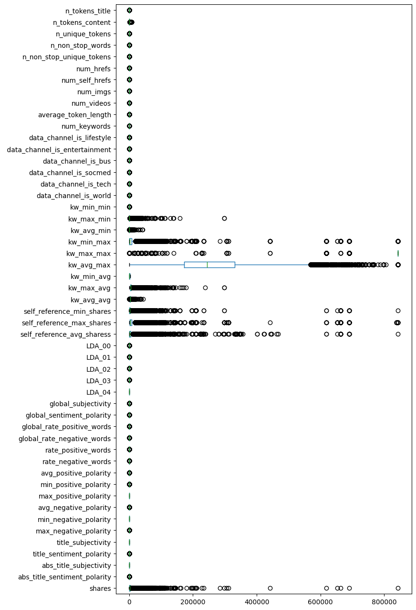 
      <em>Figure #: Distribution of data before scaling</em>
    </td>
    <td align="center">
      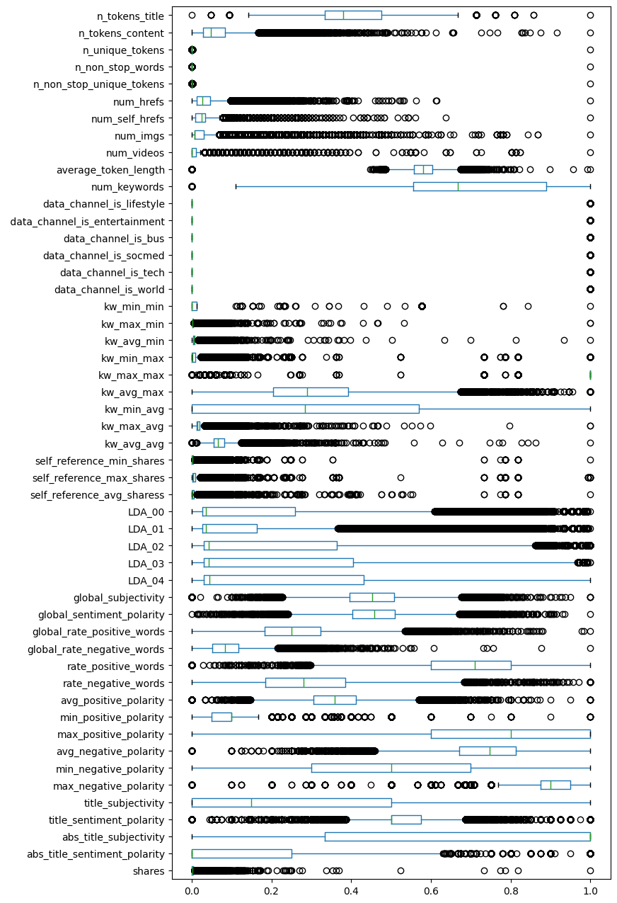 
      <em>Figure #: Distribution of data after scaling</em>
    </td>
  </tr>
</table>

#### Outlier detection
The first outliers we checked for were values outside the possible range for each feature. We found negative values in `kw_min_min`, `kw_avg_min`, and `kw_min_avg`, as seen in figure #. This is not possible as each of these columns refer to an amount of shares articles with a given keyword has received. Since shares can't be negative, we decided to cap the lower value of these columns to 0.

When removing outliers based on distribution from our data, we chose between using z-score and IQR. We decided to use IQR as we can see in figure # that the distribution of almost every column is not normally distributed, but skewed. After some testing, we noticed removing outliers using IQR on all non-categorical columns would remove way more rows than expected. To keep a larger portion of the dataset, we had to select which features to use for outlier detection and removal.

We decided not to use outlier detection on columns referencing shares or sentiment analysis, as shares are more extremely skewed than other features in the dataset, which intuitively makes sense, since some articles become way more popular than others. Features referencing shares include `shares` and `kw_avg_max`. We also decided not to remove outliers using features based on sentiment analysis, as it would be very hard for us to tell if a very high or low value is actually outside the range of what's likely a real data point. Detecting outliers based on a column we don't know a real range of would not be a good idea, as the goal of handling outliers is removing or changing values not generated by the same method as the others.

Performing outlier detection on the remaining columns (not categorical, referencing shares, or based on sentiment analysis), such as `n_tokens_title` and `num_videos`, we were able to find `5465` outliers. Looking at some of these outliers, they contain things like there being `91` videos or `116` images in an article. This is about 13.7% of our dataset, which has a total of `39644` rows. We decided to remove the data points containing the outliers, because even though it's a sizable portion of our dataset, our chosen clustering algorithms don't include outlier detection themselves, and using 86.3% of the data is still plenty for clustering.

In figure #, you can see the distribution of our features after removing outliers, while figure # shows the distribution after re-scaling our dataset between 0 and 1. These figures show the scaled versions of our features for visualization only, and outliers were removed from the original unscaled dataset. The numerical distributions of the features used in outlier detection are also shown before in figure #, and after in figure #.

<table align="center">
  <tr>
    <td align="center">
      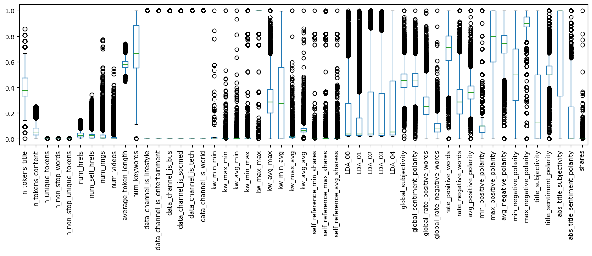 
      <em>Figure #: Distribution of data after removing outliers</em>
    </td>
    <td align="center">
      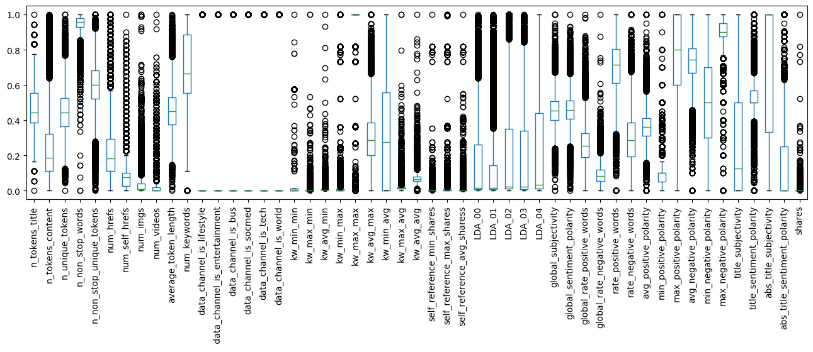 
      <em>Figure #: Distribution of data after removing outliers and re-scaling</em>
    </td>
  </tr>
</table>

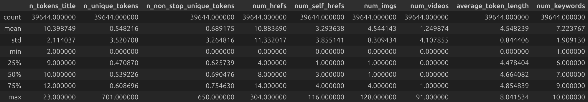 
<em>Figure #: Numerical distribution of data before removing outliers</em>

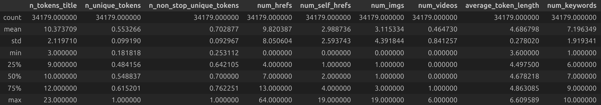 
<em>Figure #: Numerical distribution of data after removing outliers</em>

#### Dimensionality reduction
We decided to reduce the dimensions of our dataset, as we think it will improve the performance of our clustering methods, as well as giving us a better visualization of our data. Our biggest reason for thinking reducing dimensions will give better performance when clustering is that distance between points becomes less useful the more dimensions are used. Due to how euclidian distance is calculated, the distance between every point converges as dimensions increase, meaning the more dimensions there are in the dataset, the less variation there is in the distance between each point. If every point is almost the same distance from eachother, it becomes very hard to seperate them into meaningful clusters. This problem is a bit exaggerated as it has a much more noticable impact with 100+ dimensions, but it's still better to reduce the dimensions to minimize this effect.

For dimensionality reduction, we thought about using PCA and t-SNE. PCA focuses on keeping as much of the variance in the data as possible, while t-SNE tries to keep higher-dimensional neighbors close even in lower dimensions. While t-SNE sound like a good fit for our dataset, it has a problem which makes it unsuitable for our selected use case. t-SNE finds similarities between all points in the dataset, which works well for preserving neighborhoods, but makes no mapping function that can be used for future data points. This means that if we want to add a new data point (such as a new article being created), we would have to redo our dimensionality reduction on all our data. Due to this, we chose to use PCA for dimensionality reduction, keeping enough principal components to preserve 95% of the variance of the data. This leaves us with 22 out of the 51 original features remaining, as seen in figure #.

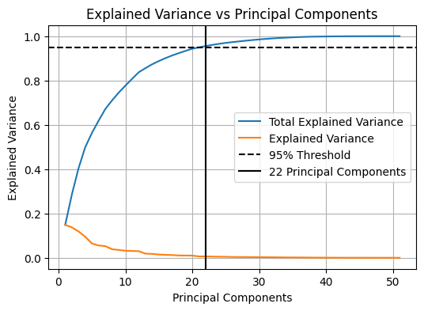 
<em>Figure #: Explained variance by principal components</em>

The other advantage of PCA is being useful for visualizing data. We can see the visualization of the dataset using the first 3 principal components in both 2d, in figure #, and in 3d, in figure #.

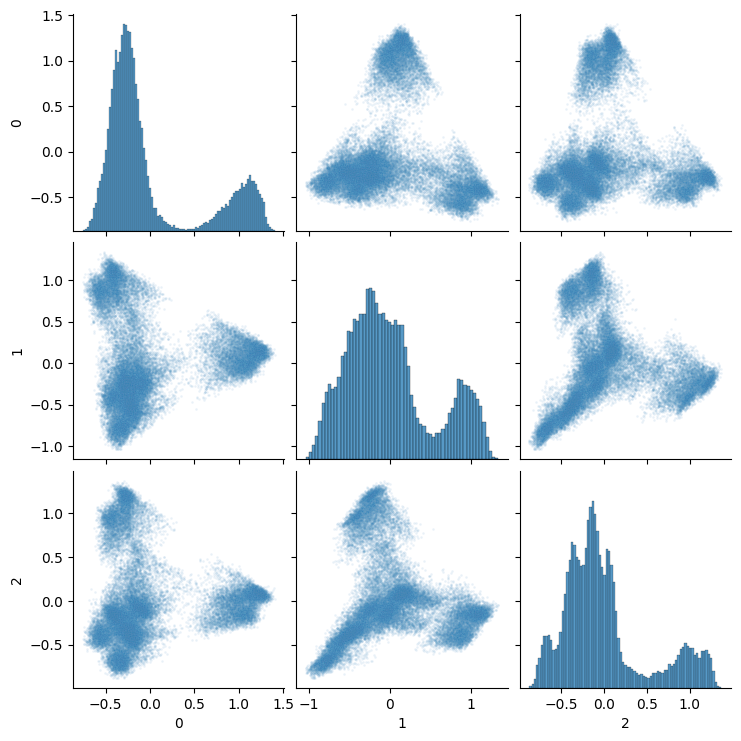 
<em>Figure #: Pairplot of first 3 principal components</em>

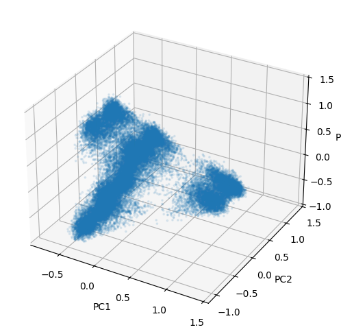 
<em>Figure #: 3D plot of first 3 principal components</em>

###  Implement three clustering methods out of the following and justify your choices

There are several different types of clustering algorithms to choose from, each with different properties. There are several types of clustering algorithms to choose from, but we mainly looked at centroid-based, density-based and distribution-based clustering algorithms.\
The simplest are centroid-based algorithms that create cluster centers and assign data points to clusters based on their distance from the cluster centers. Examples of this are K-means and fuzzy C-means.\
Density-based algorithms define clusters based on the density of data points. This fits well for finding clusters of different shapes, but won't work well for clusters with varying densities. DBSCAN is an example of a density-based clustering algorithm.\
Distribution-based algorithms assume clusters are generated by probability distributions, which work well for clusters of different (but not too complicated) shapes and densities, but it does assume data is generated in a specific distribution. An example of distribution-based clustering algorithms is Gaussian Mixture Models.

####  K-means

K-means was chosen mainly because it's the easiest clustering algorithm to understand. A problem with K-means and other centroid based algorithms is that it works best for clusters that are approximately spherical and similar in size, which is not the case for this dataset. This could have a negative impact on the performance of the clustering if the data points don't seperate well with centroid based clustering algorithms.

####  Fuzzy C-means

Fuzzy C-means works almost like an improved version of K-means for this dataset. The biggest difference between them is that fuzzy C-means assigns each data point a membership value for every cluster, meaning it would be better for our use case. Even though articles are seperated into clusters, we don't want to make it impossible for articles that fit better in another cluster to be recommended to users, just less likely. Using fuzzy C-means, we can assign how likely an article is to be recommended to users based on its membership value to each cluster. Aside from that, it works very similarly to K-means as both are centroid-based clustering algorithms.

####  Gaussian mixture models

Gaussian Mixture Models were chosen because they offer a more flexible way to cluster the data. As opposed to centroid-based clustering algorithms which assume roughly spherical clusters of similar size, GMM is a distribution-based clustering algorithm that assumes each cluster has a shape and spread in the data, which means clusters don’t have to be perfectly round or all the same size. This fits better for our dataset, as we think it better matches the distribution of the clusters we can visualize from figure #. The reason we chose GMM over other clustering algorithms is that we thought a distribution-based clustering method would be best for our dataset, as clusters can have different shapes and densities, making it more suited to guess .

Like fuzzy C-means, GMM assigns a probability to each article for belonging to every cluster. This way, this clustering algorithm doens't force articles that could belong to multiple clusters into just one.

A problem shared between all our selected clustering algorithms is that you have to specify the amount of clusters created for each of them. While it would be nice to use a clustering method that doesn't depend on the amount of clusters, we think we were able to pick a good value for the by seeing how different values performed on certain metrics for each clustering algorithm.

###  Compare and Explain the results

####  K-means

To decide the amount of clusters to use for K-means, we found 2 common clusterings metrics to see their performance for each value of k in what we though was a reasonable range based on the visualization, 3-6. The metrics we chose to use were silhouette score and Davies-Bouldin index. Silhouette score measures how similar points within a cluster are to eachother, ranging from 1 to -1. Scores near 1 mean data points are very similar within a cluster compared to data points in other clusters, while scores near -1 are likely misclassified. David-Bouldin index measures how well defined clusters are, comparing their compactness and separation. A value close to 0 means clusters are well separated and compact, while high scores imply overlapping or scattered clusters.

<table align="center">
  <tr>
    <td align="center">
      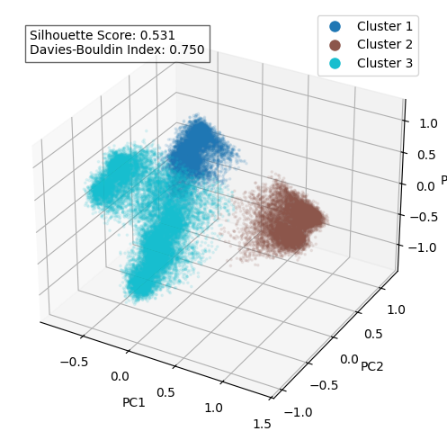 
      <em>Figure #: K-means clustering with k=3</em>
    </td>
    <td align="center">
      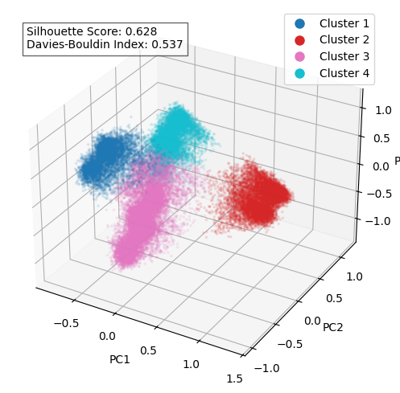 
      <em>Figure #: K-means clustering with k=4</em>
    </td>
  </tr>
  <tr>
    <td align="center">
      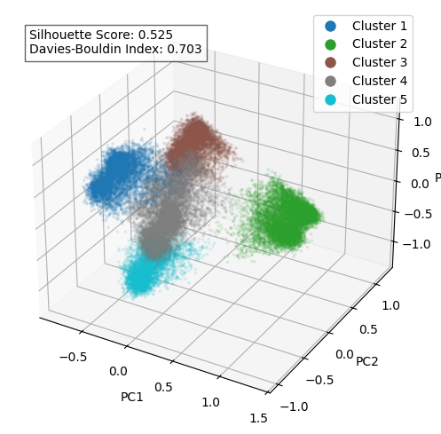 
      <em>Figure #: K-means clustering with k=5</em>
    </td>
    <td align="center">
      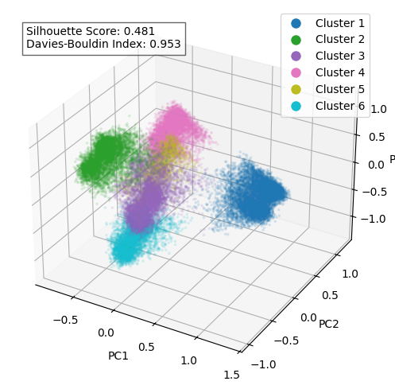 
      <em>Figure #: K-means clustering with k=6</em>
    </td>
  </tr>
</table>

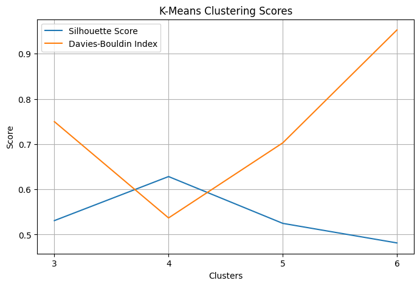 
<em>Figure #: K-means clustering scores with different k</em>

We can see from figure # that the best performing amount of clusters is 4, both maximizing its silhouette score and minimizing its Davies-Bouldin index. Using this value, we find the final clustered dataset using K-means in figure #.

 
<em>Figure #: Visualization of K-means clustering</em>

We can also tell which features from our dataset have the largest effect on placing data points into clusters, the most influential features for clustering can be seen in figure #.

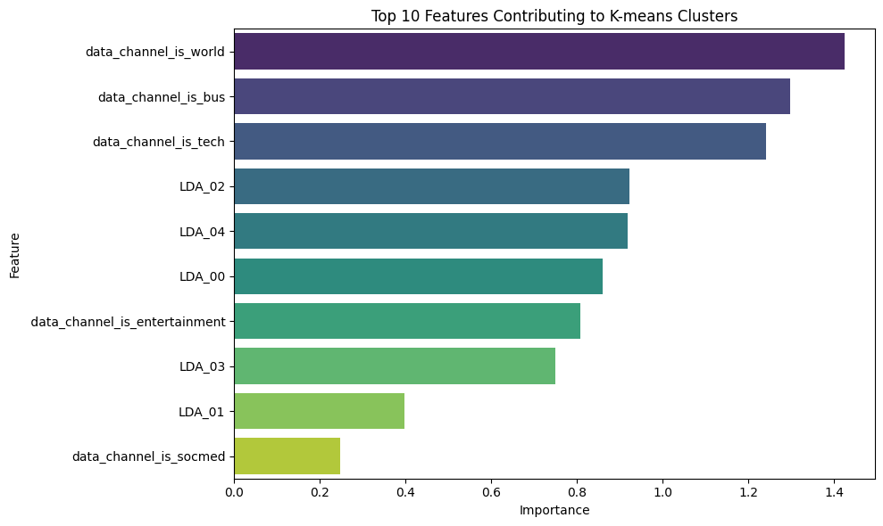 
<em>Figure #: Top features contributing to K-means clustering</em>

####  Fuzzy C-means

<table align="center">
  <tr>
    <td align="center">
       
      <em>Figure #: Fuzzy C-means clustering with 3 clusters</em>
    </td>
    <td align="center">
      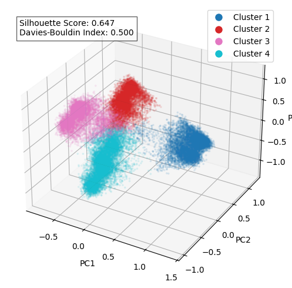 
      <em>Figure #: Fuzzy C-means clustering with 4 clusters</em>
    </td>
  </tr>
  <tr>
    <td align="center">
      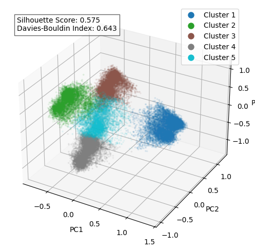 
      <em>Figure #: Fuzzy C-means clustering with 5 clusters</em>
    </td>
    <td align="center">
      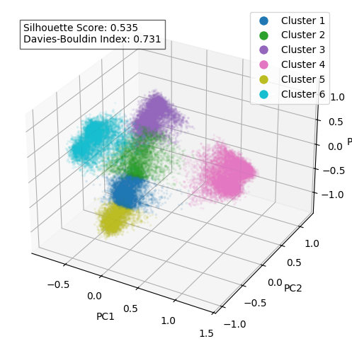 
      <em>Figure #: Fuzzy C-means clustering with 6 clusters</em>
    </td>
  </tr>
</table>

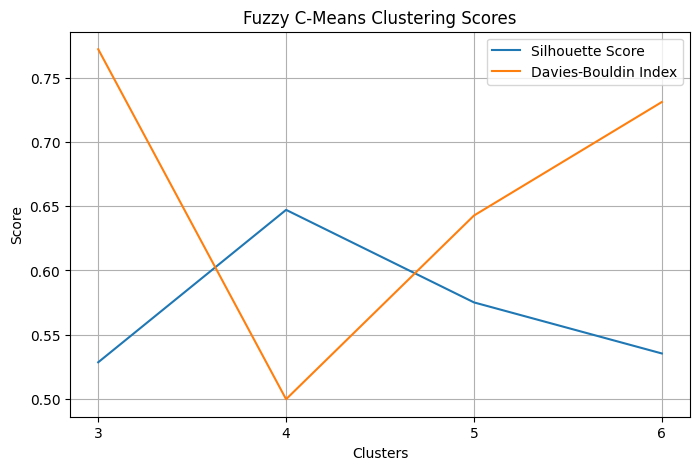 
<em>Figure #: Fuzzy C-means clustering scores with different amounts of clusters</em>

We also found 4 clusters to be the optimal amount for fuzzy C-means, as seen in figure #, which is to be expected since it works very similarly to K-means, both being centroid-based clustering algorithms. The visualization of the optimal fuzzy C-means clustering is seein in figure #.

 
<em>Figure #: Visualization of fuzzy C-means clustering</em>

 
<em>Figure #: Top features contributing to fuzzy C-means clustering</em>

####  Gaussian mixture models

<table align="center">
  <tr>
    <td align="center">
      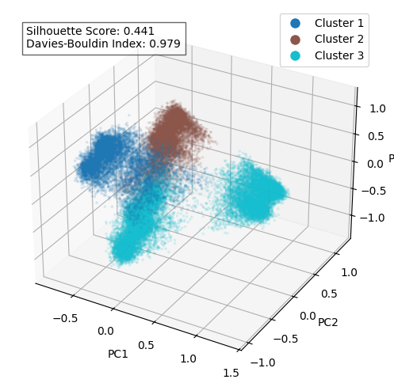 
      <em>Figure #: GMM clustering with 3 clusters</em>
    </td>
    <td align="center">
      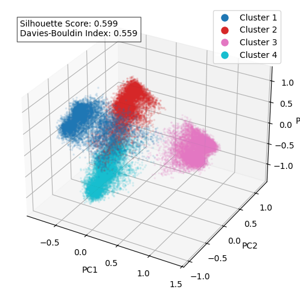 
      <em>Figure #: GMM clustering with 4 clusters</em>
    </td>
  </tr>
  <tr>
    <td align="center">
      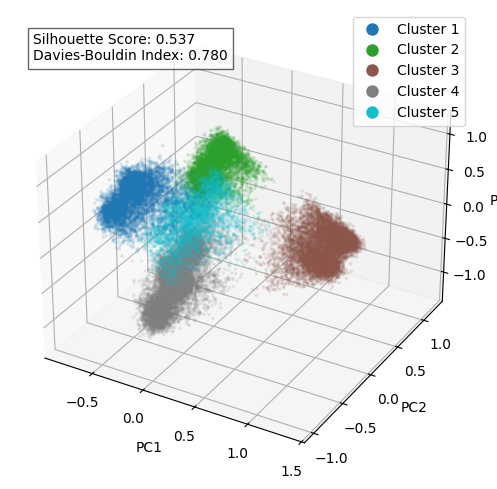 
      <em>Figure #: GMM clustering with 5 clusters</em>
    </td>
    <td align="center">
      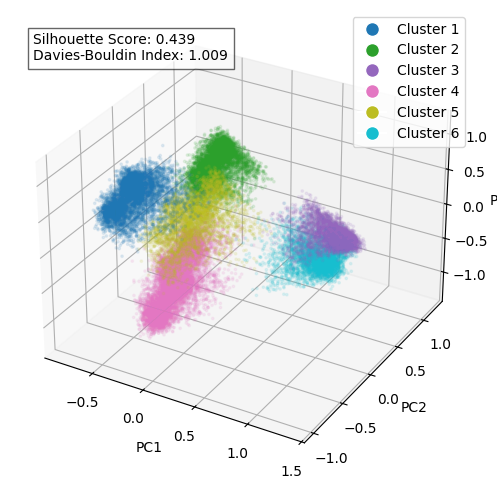 
      <em>Figure #: GMM clustering with 6 clusters</em>
    </td>
  </tr>
</table>

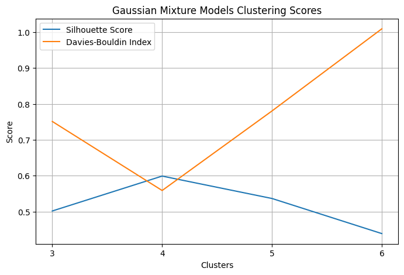 
<em>Figure #: GMM clustering scores with different amounts of clusters</em>

We also found 4 as the optimal number of clusters for GMM, seen in figure #. After finding this, we created the visualization of GMM using 4 clusters shown in figure #.

 
<em>Figure #: Visualization of GMM clustering</em>

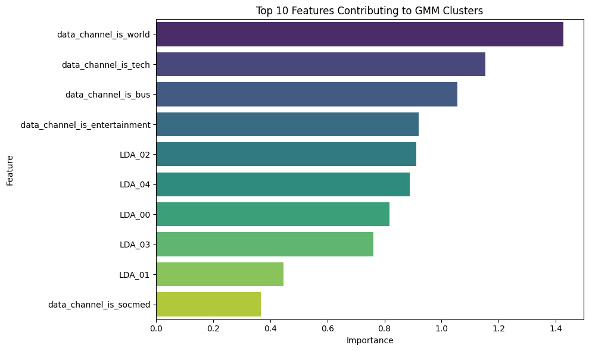 
<em>Figure #: Top features contributing to GMM clustering</em>

All our chosen clustering algorithms had very similar visualizations, but the differences are more clear when looking at the clustering metrics. Fuzzy C-means had the best performance, reaching a silhouette score of 0.647 and a Davies-Bouldin index of 0.500. This is a slight performance increase from K-means, and a larger jump from GMM. Part of the reason for this result is likely that both silhouette score and Davies-Bouldin index favor centroid-based clustering, as they both rely on euclidian distance, favoring compact spherical clusters. Both metrics are still valid metrics for GMM and some of the easier to understand among clustering metrics. They also have the advantage of being possible to measure for all our chosen clustering algorihtms, which isn't the case for all metrics.

It's also important to remember that fuzzy C-means and GMM has the additional advantage of giving points membership values instead of placing them only on one cluster, which we think make both of these algorightms a better fit for our use case than K-means, even if looking at the clustering metrics, it has better performance than GMM.

We can also see the top features contributing to the selection of clusters by each algorithm. The results here are very similar to eachother, mainly focusing on categories like `data_channel_is_world` and `LDA_00`. The weights for each feature is different between the algorithms, but there are no major changes.

A lot of the similarity here likely come from how the original features were translated into princial components when doing PCA, and you might see a more varied set of contributiong features if using the base data. Even if the results are very similar and mostly using the same few features to base a data point's cluster on, this actually fits very well for our use case. Splitting articles mainly by categories and topics makes the most sense to create a useful recommendation algorithm. Had our results been that clusters were mainly decided by `shares` and similar features, this would probably not show users articles they are as interested in as with our current main clustering factors.

From looking at our performance metrics, we chose to select fuzzy C-means as our preferred clustering algorithm for this dataset. After selecting our preferred clustering algorithml, we took a look at some of the data points most confidentally placed in each cluster to see how similar they were. The top 10 contributing features for 5 points in each cluster can be seen in figure #. It's clear from the points that the clustering has worked well, placing data points in clusters along with other points that are very similar to them in multiple columns.

 
<em>Figure #: The 5 most confidently placed data points in each cluster</em>

